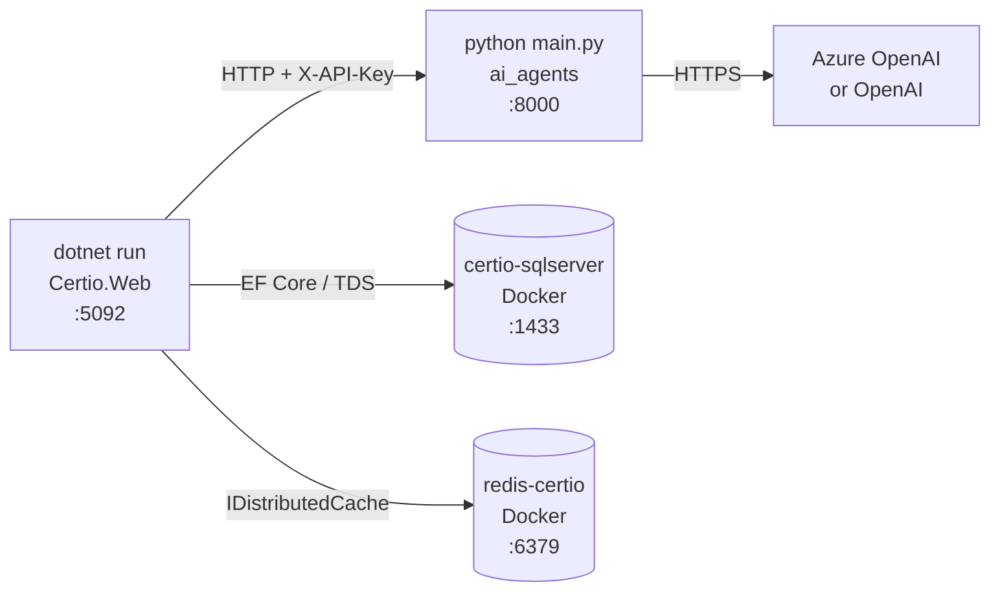
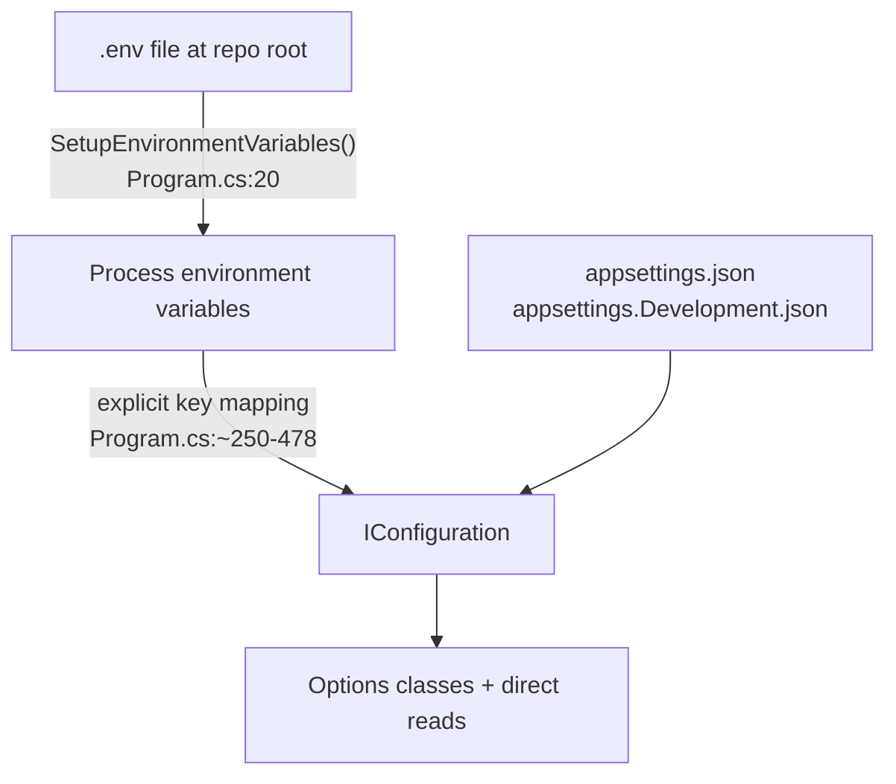
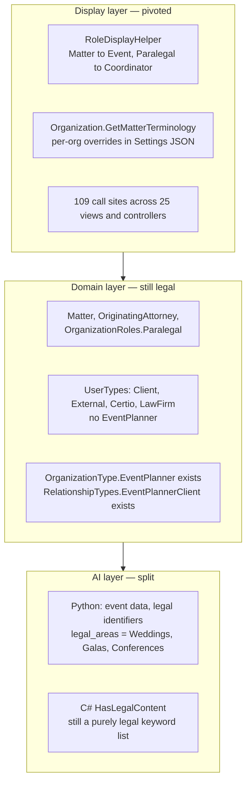

# Module 00 — Orientation

**Time:** 45 minutes. **Prerequisite:** none.

## Objectives

By the end you can:

- Start the full local stack and explain what each process does
- Navigate to any subsystem in under 30 seconds from a feature name
- Explain the Certio/Notal naming split and why it still matters at runtime
- **Translate between the events vocabulary users see and the legal vocabulary the code uses**
- Explain how configuration reaches the app, and why startup can fail in ways that look like a code bug

## Read this first

In order:

1. `docker-compose.yml` — the whole runtime topology in 87 lines
2. `start_services.bat` — the actual dev launch sequence
3. `Certio.Web/Helpers/RoleDisplayHelper.cs` — all 190 lines. This is the pivot in one file.
4. `Certio.Domain/Organizations/Organization.cs:130-216` — per-organization terminology overrides
5. `Certio.Web/Program.cs:19-98` — environment loading
6. `Certio.Web/Program.cs:100-160` — the "smart" connection string selection
7. `Certio.sln` — project list

---

## The runtime topology

Four processes on your machine, only one of which is your code most days.

Start it with `start_services.bat`, which does four things in sequence (`start_services.bat:17-82`):
start SQL Server via Docker, start Redis via Docker, activate the Python venv and launch
`main.py`, then `dotnet run` in `Certio.Web`.

Three things about that script are worth knowing before they cost you an hour:

**The Redis container names disagree.** `start_services.bat:43` looks for and creates a container
called `redis-certio`. `docker-compose.yml:40` names it `certio-redis`. If you have ever run
`docker-compose up -d`, the batch script will not find that container and will try to create a
second one on the same port, which fails. Pick one path and stay on it.

**Redis is optional, and off by default.** `Program.cs:613-639` only wires real Redis when a
connection string is present *and* either `Caching:UseRedis=true`, `USE_REDIS=true`, or the host name
contains `.redis.cache.windows.net`. Otherwise you silently get `AddDistributedMemoryCache()`. So
"Redis started" in the console output does not mean the app is using it. This matters for module 07
(SignalR scale-out) and module 04 (permission caching).

**The AI service is launched with `start /B python main.py`.** No reload, no supervisor. If you edit
Python, you must find and kill that process yourself. There is no lifespan or startup handler in
`ai_agents/main.py`, so a crash on import is silent from the .NET side; you will just get fallback
responses in chat.

---

## Configuration: three sources, one of them unusual

The unusual part is the middle step. Rather than relying on the standard environment-variable
configuration provider with its `Section__Key` convention, `Program.cs` reads specific environment
variables and writes them into `builder.Configuration` by hand, one at a time, for hundreds of lines.
For example `Program.cs:470-477` maps `SMTP_PASSWORD` and `SMTP_FROM_EMAIL` into
`Security:TwoFactorEmail:*`.

**Why it is built this way — pragmatic.** The team wanted a single `.env` file shared by the Python
service (which uses `python-dotenv`) and the .NET app (which does not read `.env` natively). Hand-mapping
was the fastest path. The cost is that adding a setting now requires editing `Program.cs`, and a
typo in the mapping fails silently at runtime rather than loudly at startup. The idiomatic
alternative — `builder.Configuration.AddEnvironmentVariables()` plus `Section__Key` naming, or a
`DotNetEnv` package — would have removed the whole block.

Two startup behaviors that look like bugs but are intentional:

- `ValidateProductionConfiguration` (`Program.cs:55-95`) throws on startup in Production if the email
  webhook secrets are missing or `USE_AZURE_SQL != "true"`. Fail-fast, deliberately.
- `GetConnectionStringAsync` (`Program.cs:101`) is *async and awaited during startup*, and in
  development it can attempt to start the Docker SQL container. So `Program.cs` is partly an ops
  script. Convenient locally; unusual for a production ASP.NET app, where the host normally provides
  a connection string and nothing more.

There are **no migrations applied and no seeding at startup.** Nothing in `Program.cs` calls
`Migrate()` or `EnsureCreated()`. You must run `dotnet ef database update` yourself, and the target
project is `Certio.Web` even though the migration files live in `Certio.Infrastructure/Migrations`.

---

## Navigating the tree

The mapping from "feature name" to "where the code lives" is mostly predictable, with a few traps.

| If you are looking for | Go to |
|---|---|
| An HTTP endpoint that renders a page | `Certio.Web/Controllers/*.cs` |
| A JSON API endpoint | `Certio.Web/Controllers/Api/*.cs`, but also several in the non-`Api` folder |
| Business logic for matters, tasks, billing, calendar, documents, AI orchestration | `Certio.Application/Services/` |
| Business logic for chat, DMs, email, notifications, channels, change notices, 2FA | `Certio.Web/Services/` (see below) |
| An entity or the `Permission` enum | `Certio.Domain/<Area>/` |
| Schema, indexes, relationships, query filters | `Certio.Infrastructure/Data/ApplicationDbContext.cs` (1,700+ lines) |
| Automatic audit logging | `Certio.Infrastructure/Interceptors/AuditInterceptor.cs` |
| Authorization attributes and handlers | `Certio.Web/Security/` |
| Real-time | `Certio.Web/Hubs/` |
| **The events-vs-legal wording a user sees** | `Certio.Web/Helpers/RoleDisplayHelper.cs` |
| LLM prompts, RAG, agent behavior | `ai_agents/main.py` (4,283 lines) |

The trap in that table is row four. **Roughly a third of the application's business logic lives in
`Certio.Web/Services/`, not `Certio.Application/Services/`**, including chat, direct messaging,
email, notifications, and channel management. Several of those classes implement interfaces that are
declared in `Certio.Application/Interfaces/` — the contract is in the Application layer and the
implementation is in the Web layer. `IChatService`, `INotificationService`, `IEmailService`,
`IDirectMessageService`, `IChangeNoticeService`, and `IChannelManagementService` all work this way.

**Why — accidental.** Nothing about chat requires being in the Web project. These classes were most
likely written first as helpers for controllers and hubs, then had interfaces extracted upward when
the Application layer was introduced, without moving the implementation. The cost is that
`Certio.Application.MatterService` takes an optional `IChannelManagementService`
(`MatterService.cs:20`) whose implementation it can never see, so the dependency is nullable and its
absence is handled with a log warning at `MatterService.cs:139`.

---

## Certio, Notal, matters, and events: the vocabulary you must translate

Two separate things are going on, and conflating them will confuse you for a week. One is a **product
rename** (Certio to Notal). The other is a **domain pivot** (legal practice to event planning). They left
different kinds of sediment.

### The rename: Certio and Notal

| Layer | What it says |
|---|---|
| Solution, namespaces, DB | `Certio` |
| Azure Web Apps, CI workflow names | `Notal-app`, `notal-ai` |
| `docker-compose.yml:85` network | `notal-network` |
| Python LLM system prompts | "Notal event planning platform" |

Rule of thumb: **`Certio` in source, `Notal` in infrastructure.** Use `Certio` in a class name, `Notal`
in a deploy conversation.

### The pivot: legal practice to event planning

The product is being repositioned for the **events industry, starting with event planners and their
clients**. The codebase records the full history: it began as project management (migrations
`RenameProjectToMatter`, `RenameProjectIdsToMatterIds`), was built out as a legal practice management
platform, and is now moving to events.

The pivot has reached three layers at three different speeds. Knowing which layer you are in tells you
which vocabulary to expect.

**The display layer is genuinely done.** `RoleDisplayHelper` (190 lines) maps every legal term to an
events term when `OrganizationType == EventPlanner`:

| Stored value | Shown to an event planner |
|---|---|
| `ManagingPartner` | Managing Director |
| `Partner` | Director |
| `Associate` | Planner |
| `Paralegal` | Coordinator |
| `Matter` / `Matters` | Event / Events |
| "Legal Team" | "Events Team" |

There are **109 call sites across 25 files**, so this is a real, systematic effort rather than a
prototype. Organizations can also override the terms per-tenant via a `Settings` JSON blob
(`Organization.cs:182-206`), so a client running a chapter-based program can display "Chapters" instead
of "Events".

**Why a display-layer mapping instead of renaming the entities — deliberate, and correct.** Renaming
`Matter` to `Event` means a migration over every foreign key, every index, and every one of 72 existing
migrations, on production data — and `Event` collides with `CalendarEvent` concepts already in the
schema. Mapping at render time gets the user-visible win immediately at near-zero risk, and the
per-organization override is a genuine feature that a rename would not have given you.

The cost is a permanent translation layer in your head:

- **You cannot grep for what users see.** A bug report saying "the Event page is broken" means
  `Views/Matter/`. Searching for `Event` finds calendar code.
- **Role strings in the database lie about the job.** A row saying `Paralegal` is a Coordinator. Any SQL
  report, export, or admin tool that does not go through `RoleDisplayHelper` shows legal titles.
- **Two terminology sources disagree.** `Organization.GetMatterTerminology()` defaults to **"Event" for
  every organization** (`Organization.cs:208-216`), while
  `RoleDisplayHelper.GetMatterTerminology(OrganizationType)` returns "Matter" unless the type is
  `EventPlanner`. Whichever overload a view happens to call decides what the user sees. That is a real
  inconsistency, not a subtlety.

**The domain layer is where the pivot is incomplete**, and one gap has teeth:
`OrganizationType.EventPlanner` and `RelationshipTypes.EventPlannerClient` both exist, but **`UserTypes`
has only `Client`, `External`, `Certio`, and `LawFirm`** (`UserOrganization.cs:75-81`). Cross-organization
access is gated on `UserType == UserTypes.LawFirm` in eleven places. Module 03 works through what that
means; the short version is that event planner staff must still be stored as `LawFirm` for the product's
central access model to function.

**The AI layer is split.** The Python service's *data* is fully pivoted — `legal_areas` is actually
`["Weddings", "Corporate Events", "Galas and Fundraisers", "Conferences and Conventions", ...]`
(`ai_agents/main.py:976-979`) and the keyword list is venue, catering, permit, vendor
(`main.py:929-933`) — while its *identifiers* still say `legal_area` and `_count_legal_terms`. The C#
side has not been pivoted at all, and module 08 shows where that actively breaks a feature.

**The general lesson** — which is the reason this section is long — is that a domain pivot is not a
rename. A rename is mechanical and you can finish it. A pivot changes what the *concepts* mean, so it
reaches prompts, keyword lists, permission gates, and seed content, and those cannot be found by
searching for the old name. When you pivot, inventory the places where the old domain is encoded as
**behavior** rather than as a word.

---

## Sharp edges

- **Build output is committed to git.** `git status` shows dozens of modified `bin/` and `obj/`
  artifacts because `.gitignore` does not exclude them consistently. Expect noisy diffs and do not
  be alarmed; do not add more.
- **`Certio.Web` targets net9.0 while the other three target net8.0** (`Certio.Application/Certio.Application.csproj:17`).
  This works, but it means EF Core versions differ between projects (9.0.8 in Web, 8.0.8 in
  Application) and you should be careful when reading NuGet-related errors.
- **Loose files at the repo root** include `commit_comm.cshtml` (77 KB), `discovery.xml` (219 KB, the
  real WOPI discovery document used by `WopiDiscoveryService`), `modal-extract-temp.txt`, and a file
  literally named `how HEAD --name-only`. Only `discovery.xml` is load-bearing.
- **The `.env` file is committed.** It is at the repo root and tracked. Treat any credential in it as
  compromised, and see `docs/operations/MAKE_REPO_PUBLIC_SAFELY.md` before doing anything with
  repository visibility.

---

## Check yourself

1. You add `FEATURE_FLAG_X=true` to `.env` and read it with
   `builder.Configuration["Features:X"]`. It is null. Why, and what are the two ways to fix it?
2. The console prints "Redis started: localhost:6379" and "Cache: Redis connection string not
   provided". Are these contradictory? Which one determines behavior?
3. `dotnet ef migrations add Foo --project Certio.Web` — which directory does the file land in, and
   why is that not the project you named?
4. A user asks the AI "how do I add a vendor to my event?" and gets a confident, detailed, wrong
   answer. Name the two subsystems that could be responsible and how you would tell them apart.
5. Find the business logic for sending a direct message. Which project is it in? Which project
   declares its interface? What does that tell you about the layer boundaries?
6. A planner reports "the Events list is empty." Which folder do you open, and why would searching the
   codebase for `Event` send you to the wrong place?
7. An admin exports the user list to CSV and it says several people are `Paralegal`. The company has no
   paralegals. Explain what happened and name the class that would have prevented it.
8. `Organization.GetMatterTerminology()` and `RoleDisplayHelper.GetMatterTerminology(OrganizationType)`
   can return different values for the same organization. Construct that case, and decide which one you
   would make authoritative.

Answers are derivable from the files listed at the top of this module. Labs in
[`EXERCISES.md`](EXERCISES.md#module-00).
