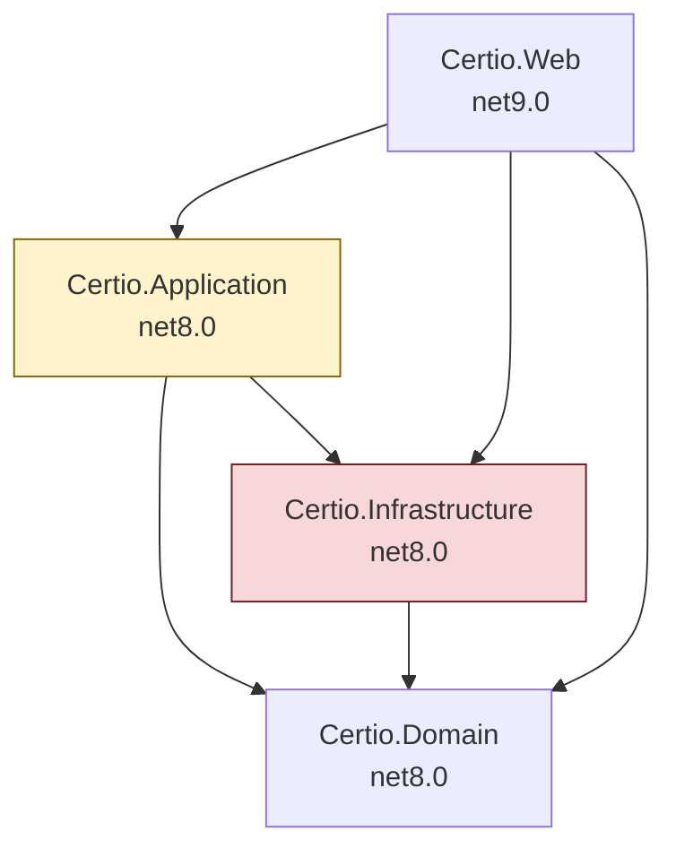
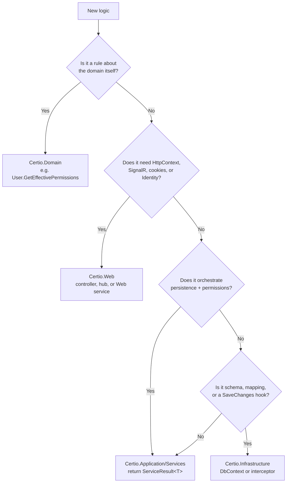

# Module 01 — Architecture and layer boundaries

**Time:** 1 hour. **Prerequisite:** module 00.

## Objectives

By the end you can:

- Draw the intended Clean Architecture graph and the actual one, and name every deviation
- Explain the `Application -> Infrastructure` reference: why it exists, what it buys, what it costs
- Describe the `ServiceResult<T>` contract and the hybrid throw-and-catch pattern layered on top of it
- Decide, for a new piece of logic, which project it belongs in and defend the choice

## Read this first

1. `Certio.Application/Certio.Application.csproj` — 22 lines, and the most consequential file in the repo
2. `Certio.Application/DTOs/ServiceResult.cs` — the whole result contract, 68 lines
3. `Certio.Application/Services/MatterService.cs:38-158` — one method that demonstrates every pattern at once
4. `Certio.Application/Services/BillingService.cs:1-60` — the same layer, none of the same patterns
5. `Certio.Application/Interfaces/IChatRepository.cs` — the road not taken

---

## Intended versus actual

The README and `.cursorrules` both describe Clean Architecture with the dependency rule:
`Domain <- Application <- Infrastructure <- Web`, where nothing points inward-out and the Application
layer depends only on abstractions.

Here is what the project files actually declare:



The red-edged relationship is `Certio.Application.csproj:5`:

```xml
<ProjectReference Include="..\Certio.Infrastructure\Certio.Infrastructure.csproj" />
```

In canonical Clean Architecture this edge points the other way. Persistence abstractions
(`IMatterRepository`, `IUnitOfWork`) would live in Application, and Infrastructure would implement
them. Here, Application takes a hard dependency on the concrete `ApplicationDbContext`, and
**25 of the 28 Application services inject it directly.**

The intent to do it the other way is still visible in the tree.
`Certio.Application/Interfaces/IChatRepository.cs` is a repository interface with **no implementation
anywhere in the solution**. Someone started down the abstraction path and stopped.

### What the shortcut buys

Be honest about this, because the tradeoff is real and it is not obviously wrong for this team.

- **No mapping layer between query and result.** `OrganizationService` projects straight from EF to
  DTO in one `.Select()`. With a repository boundary you either return entities (leaking the model) or
  write a query-object abstraction that reinvents LINQ.
- **`Include`, `AsNoTracking`, and projection stay available.** A repository interface that hides
  `IQueryable` forces either N+1 queries or a proliferation of narrowly-named methods
  (`GetMatterWithAssignmentsAndPermissionsAsync`).
- **Fewer files per feature.** Adding a field touches the entity, the DTO, and one service, not five.

### What it costs

- **Application services cannot be unit tested without a database.** The tests confirm this:
  `Certio.Tests/Services/MatterServiceTests.cs` is 62 lines and
  `Certio.Tests/Services/TaskServiceTests.cs` is 27 lines, both leaning on
  `Microsoft.EntityFrameworkCore.InMemory`. Compare `PermissionServiceTests.cs` at 509 lines — the
  most-tested service is the one whose logic is mostly pure computation over loaded entities.
- **Transaction boundaries have nowhere to live.** There is no `IUnitOfWork` and
  **no `BeginTransaction` call anywhere in the Application layer.** Multi-step operations do
  sequential `SaveChangesAsync()` calls. `MatterService.CreateMatterAsync` saves the matter at
  `MatterService.cs:98`, then saves the permission rows at `MatterService.cs:112`, then calls out to
  create a channel at `MatterService.cs:121`. A failure between those points leaves a matter with no
  permissions and no channel. The code acknowledges this for the channel and swallows the exception
  (`MatterService.cs:131-135`); it does not for the permissions.
- **Layer discipline erodes downward too.** **24 of 34 controllers inject `ApplicationDbContext`
  directly**, including `HomeController`, `MatterController`, and `TasksController`. Once the
  Application layer is not the only door to the database, the Web layer starts writing queries, and
  it did.

**Verdict — pragmatic, with an unpaid bill.** The reference itself is a defensible choice for a small
team shipping fast; plenty of successful codebases put EF in the service layer. The unpaid bill is
transactions. If you fix one architectural thing in this codebase, make it a unit-of-work boundary for
the multi-step writes, not the project reference.

---

## The `ServiceResult<T>` contract

The whole thing is 68 lines (`Certio.Application/DTOs/ServiceResult.cs`):

```csharp
public class ServiceResult<T>
{
    public bool Success { get; set; }
    public T? Data { get; set; }
    public string? ErrorMessage { get; set; }
    public string? ErrorCode { get; set; }
    public Dictionary<string, string[]>? ValidationErrors { get; set; }

    public static ServiceResult<T> SuccessResult(T data) { ... }
    public static ServiceResult<T> FailureResult(string errorMessage, string errorCode = "ERROR") { ... }
    public static ServiceResult<T> ValidationFailureResult(Dictionary<string, string[]> validationErrors) { ... }
}
```

This is a clean, minimal Result type. `ErrorCode` defaults to the string `"ERROR"`, and
`ValidationFailureResult` sets it to `"VALIDATION_ERROR"`. Controllers switch on `Success` and map
`ErrorCode` to an HTTP status.

**Why a Result type instead of exceptions — deliberate, and correct.** Authorization failures and
validation failures are *expected* outcomes in a multi-tenant app, not exceptional ones. Modeling them
as return values makes them visible in the method signature, avoids exception-throwing on a hot path,
and lets a controller distinguish "not allowed" from "crashed" without catching typed exceptions.

### The hybrid that undermines it

Now read `MatterService.CreateMatterAsync` (`MatterService.cs:38-158`) and notice that it does both:

```csharp
if (!isOrgMember && !hasFirmAccess)
{
    throw new UnauthorizedOperationException(userId, "create", "Matter", "Not a member of organization");
}
// ... 90 lines later ...
catch (DomainException ex)
{
    return ServiceResult<MatterDto>.FailureResult(ex.Message, ex.ErrorCode);
}
```

It throws a domain exception, then catches it in the same method and converts it to a
`ServiceResult`. Every ServiceResult-adopting service does this.

**Why — pragmatic.** Throwing lets you bail out of a deeply nested check without threading a result
value back through helper methods, and the outer catch guarantees the public contract holds. It is
control flow by exception inside a function whose signature promises no exceptions.

The cost is subtle and real: the exception type carries information that `ServiceResult` flattens
away. `UnauthorizedOperationException` and `ResourceNotFoundException` become indistinguishable at the
call site unless the caller inspects the `ErrorCode` string. And because the `catch (Exception ex)`
at `MatterService.cs:153` returns a generic message, **a genuine bug (null reference, DB timeout)
returns the same shape as a business rule rejection.** A controller cannot tell "you may not do this"
from "we are broken," so it cannot decide between a 403 and a 500.

### The contract is not universal

Only seven of the 28 Application services return `ServiceResult`: `MatterService`, `TaskService`,
`SubTaskService`, `CalendarService`, `OrganizationService`, `OrganizationRelationshipService`,
`TeamService`. The rest use one of three other conventions:

| Convention | Services | Consequence |
|---|---|---|
| Return raw domain entities | `BillingService`, `AuditService`, `UnifiedInboxService` | No DTO boundary; EF entities reach the view/JSON layer |
| Custom parallel result type | `AgentActionService` returns `AgentActionResult` | Second result vocabulary to learn |
| Return defaults on failure | `AIAgentService` returns empty summaries when the AI service is down | Callers cannot distinguish "no result" from "service down" |

So the honest description of the error-handling architecture is: **four conventions coexist, and which
one applies depends on which service you called.** When you add a service, pick `ServiceResult<T>` and
return failures instead of throwing across the boundary. That is the direction the newer code is
moving.

---

## Where does new logic go?

Use this decision path. It reflects what the codebase does when it is at its best, not what it does
on average.



Two rules that follow from the current state of the code:

- **Do not add new implementations to `Certio.Web/Services/` unless they genuinely need
  `HttpContext`.** That folder already holds business logic that should be one layer down; adding to
  it deepens the problem. `UserPresenceService` and `TwoFactorService` legitimately belong there.
  `ChangeNoticeService` does not.
- **Do not add a new controller that injects `ApplicationDbContext`.** 24 already do; that is the
  pattern to stop, not to follow. Route through a service.

Note also that `Certio.Domain` is not anemic — and that is good. `User.GetEffectivePermissions`
(`Certio.Domain/Users/User.cs:252`) and `OrganizationRelationship.IsValid()` are real domain behavior
living on entities. Module 04 goes deep on the first one.

---

## Sharp edges

- **`Certio.Application/Services/IAIAgentService.cs`** is an interface in the `Services/` folder, not
  `Interfaces/`. `IFileStorageService` is declared inline in
  `Certio.Application/Services/Documents/FileStorageService.cs:12`. When you cannot find an interface, check next to the
  implementation.
- **`Class1.cs` exists in both `Certio.Application` and `Certio.Domain`** — leftover scaffolding from
  `dotnet new classlib`. Harmless, but if you see it in a new project, delete it.
- **`IAuditService` is injected but never called** in `MatterService`, `TaskService`,
  `SubTaskService`, and `OrganizationRelationshipService`. The audit trail those services appear to
  write is actually produced by `AuditInterceptor` at the `SaveChanges` level (module 05). The dead
  dependency is a fossil from before the interceptor existed. There is even a bare comment
  `// Audit log` at `MatterService.cs:142` where the call used to be.
- **`WopiDiscoveryService` and `WopiAccessTokenService` have no interfaces** and are registered as
  concrete types (`Program.cs`). They are only consumed by `WopiController`.

---

## Check yourself

1. `Certio.Application` references `Certio.Infrastructure`. Name a concrete refactor that would remove
   that edge, and state what you would lose. Is it worth it here?
2. `MatterService.CreateMatterAsync` succeeds in creating a matter but the process is killed between
   line 98 and line 112. What does the database look like? What would a unit of work have changed?
3. A controller calls a service and gets `Success = false, ErrorCode = "ERROR"`. List every distinct
   underlying situation that could have produced exactly that. What HTTP status should the controller
   return, and why is that question unanswerable?
4. `BillingService` returns `Invoice` entities directly to `BillingController`. Name two concrete
   problems that causes, one about serialization and one about security.
5. You need to send an email when a task is completed. Which project does the sending live in, which
   project does the decision live in, and how do they communicate given the layer boundaries?

Labs in [`EXERCISES.md`](EXERCISES.md#module-01).
