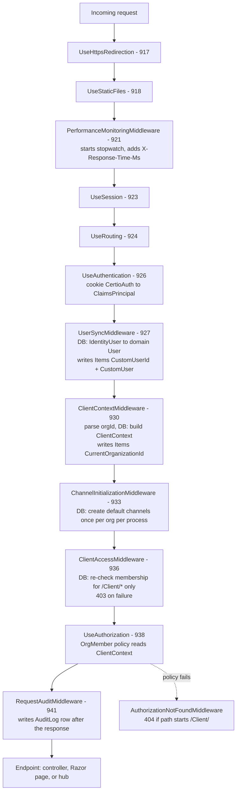
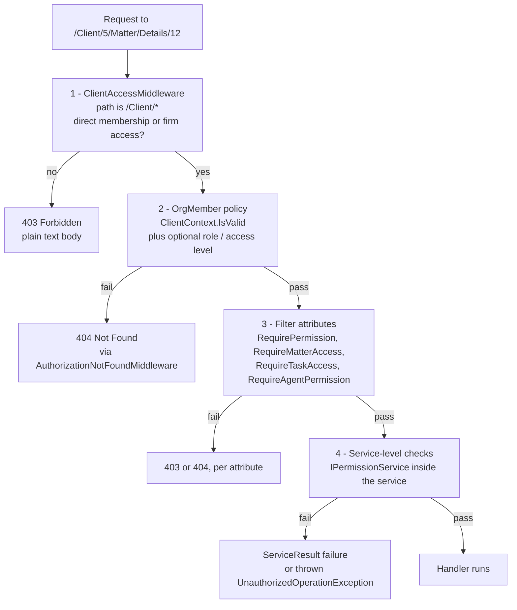

# Module 02 — The request lifecycle

**Time:** 1.5 hours. **Prerequisite:** modules 00, 01.

## Objectives

By the end you can:

- Recite the middleware pipeline in order and say what each stage adds to `HttpContext`
- Explain the four independent authorization mechanisms and when each one fires
- Predict the status code for any denied request, and explain why two of them disagree
- Count the database round trips a single page request makes before the controller runs

## Read this first

1. `Certio.Web/Program.cs:905-968` — the entire pipeline, 60 lines
2. `Certio.Web/Middleware/UserSyncMiddleware.cs` — the first stage that writes to `HttpContext.Items`
3. `Certio.Web/Middleware/ClientContextMiddleware.cs` — org resolution
4. `Certio.Web/Services/ClientContext.cs` — the tenancy decision itself
5. `Certio.Web/Middleware/ClientAccessMiddleware.cs` — the redundant guard
6. `Certio.Web/Security/OrgMemberAuthorizationHandler.cs` — the policy
7. `Certio.Web/Security/AuthorizationNotFoundMiddleware.cs` — 34 lines that change every 403 into a 404

---

## The pipeline



Line numbers are in `Certio.Web/Program.cs`.

### What each stage contributes

| Stage | Reads | Writes | Cost |
|---|---|---|---|
| `PerformanceMonitoringMiddleware` | path, method | response header `X-Response-Time-Ms`, a log line | negligible |
| `UserSyncMiddleware` | `context.User` claims | `Items["CustomUserId"]`, `Items["CustomUser"]` | 1+ DB query per request |
| `ClientContextMiddleware` | path, `?orgId=`, `X-Organization-Id` | `Items["CurrentOrganizationId"]`, `IClientContextAccessor.ClientContext` | 1-3 DB queries |
| `ChannelInitializationMiddleware` | `Items["CurrentOrganizationId"]` | channel rows in DB, static `HashSet<int>` | 1 DB query on first request per org per process |
| `ClientAccessMiddleware` | path, `Items["CustomUser"]` | `Items["CurrentOrganizationId"]` again; 403/redirect | 1-2 DB queries, `/Client/*` only |
| `RequestAuditMiddleware` | route values, `VerboseLogging` cookie, session | an `AuditLog` row | 1 insert on non-GET, or on GET with verbose enabled |

---

## The critical handoff: `CustomUser` and `ClientContext`

Two `HttpContext.Items` keys carry the entire security context of a request, and you will see them
everywhere.

**`Items["CustomUser"]`** is set by `UserSyncMiddleware.cs:50`. ASP.NET Core Identity manages
`AspNetUsers` with string GUID keys; the domain model has its own `Users` table with `int` keys. This
middleware bridges them on every authenticated request by calling
`IUserSyncService.EnsureCustomUserExistsAsync` (`UserSyncMiddleware.cs:39`), creating the domain row
if it is missing. Module 03 covers why there are two user tables at all.

Note the exclusion list at `UserSyncMiddleware.cs:81-88`: registration POSTs are skipped entirely, so
during signup no `CustomUser` exists yet. Any code that assumes `Items["CustomUser"]` is present on an
authenticated request is wrong during the registration flow.

**`IClientContextAccessor.Current`** is set by `ClientContextMiddleware.cs:60`, and the object it holds
is where tenancy is actually decided. `ClientContext.CreateAsync` (`ClientContext.cs:29`) does this:

```csharp
// First, try direct membership
var membership = await db.UserOrganizations
    .Include(uo => uo.Organization)
    .FirstOrDefaultAsync(uo => uo.UserId == customUser.Id && uo.OrganizationId == orgId && uo.IsActive, ct);

if (membership != null) { /* ... populate and return ... */ }

// If no direct membership, check for firm-based access using cache
var hasFirmAccess = await cacheService.HasFirmAccessAsync(customUser.Id, orgId);
```

and the resulting object exposes:

```csharp
public bool IsValid => OrganizationId.HasValue && (Membership != null || IsFirmBasedAccess);
```

That one-line property at `ClientContext.cs:14` is the tenancy check for the whole application. If it
is false, the `OrgMember` policy fails. The comment at `ClientContext.cs:34` — `// invalid;
fail-closed by auth policy` — states the design intent explicitly, and it is the right intent: an
unresolvable context denies access rather than defaulting to something permissive.

### Where org id comes from

`ClientContextMiddleware.cs:19-52` resolves `orgId` from four places, in priority order:

1. The route path `^/Client/(\d+)` — `ClientContextMiddleware.cs:23`
2. The path `^/api/billing/(\d+)` — a hardcoded special case at line 35
3. The query string `?orgId=` on any `/api/` path — line 41
4. The `X-Organization-Id` header on any `/api/` path — line 47

**Why accepting a client-supplied org id is safe here — deliberate, and the key insight of this
module.** It looks alarming that the browser can name its own tenant via a query parameter. It is
safe because the id is only ever a *lookup key*, never a grant: `ClientContext.CreateAsync`
immediately verifies that this user has direct membership or a valid firm relationship in that
organization, and `IsValid` stays false otherwise. The pattern to internalize is *resolve then
verify, in one place, before the endpoint runs.* The danger is the flip side — any endpoint that
reads `orgId` from the request itself instead of from `IClientContextAccessor` has skipped the
verification. That is the single most likely way to introduce a cross-tenant leak in this codebase.

The hardcoded `/api/billing/(\d+)` case at line 35 is a smell: it exists because `BillingController`
puts the org id in the route rather than the query string. Every new API route shape that embeds an
org id needs a new regex here, or it silently gets no context and fails closed with a 404. Confusing
to debug the first time.

---

## Four authorization mechanisms

This is the part people get wrong. Authorization is enforced in four independent places with three
different failure modes.



**Layer 1, `ClientAccessMiddleware`** guards only paths matching `^/Client/(\d+)`. It re-queries
`UserOrganizations` at `ClientAccessMiddleware.cs:47` and re-checks firm access at line 54 — work
that `ClientContextMiddleware` already did one stage earlier. On failure it returns
**403 with a descriptive text body** (line 73-74). It also writes a denial record via
`IFirmAccessAuditService.LogFirmAccessDeniedAsync` (line 63), which layer 2 does not do.

**Layer 2, the `OrgMember` policy**, is defined at `Program.cs:723-727`:

```csharp
builder.Services.AddAuthorization(options =>
{
    options.AddPolicy("OrgMember", policy =>
        policy.RequireAuthenticatedUser()
              .AddRequirements(new OrgMemberRequirement()));
});
```

`OrgMemberAuthorizationHandler` reads `IClientContextAccessor.Current`, requires `IsValid`
(`OrgMemberAuthorizationHandler.cs:26`), and additionally validates the optional
`RequiredRole`/`RequiredAccessLevel` on the requirement and re-checks that a firm relationship has not
expired (line 62). **This is the only layer that guards `/api/*` routes.**

**Layer 3, filter attributes** in `Certio.Web/Security/`: `RequirePermissionAttribute`,
`RequireMatterAccessAttribute`, `RequireMatterOperationAttribute`, `RequireTaskAccessAttribute`,
`RequireAgentPermissionAttribute`. These call into `IPermissionService` per action. They are applied
by hand and are not global, so coverage is uneven.

**Layer 4, service-level checks.** `MatterService.CreateMatterAsync:48-67` checks org membership, firm
access, and the `CreateMatters` permission again, independently of everything above.

### Why four layers — deliberate, then accreted

Defense in depth for a multi-tenant product is a legitimate goal: a single missed check should not
expose another planning company's client events. The service-level check in particular is the right one
to keep,
because it protects code paths that do not come through HTTP at all — hubs, background services, and
the AI action executor.

But layers 1 and 2 are **the same check performed twice, one stage apart, with different failure
semantics**, and that is accretion rather than design. Two concrete consequences:

**The 404-instead-of-403 design is mostly defeated.** `AuthorizationNotFoundMiddleware.cs:19-25`
exists to avoid IDOR disclosure: a policy failure on `/Client/*` becomes a 404 so an attacker cannot
distinguish "this org exists but is not yours" from "this org does not exist." But
`ClientAccessMiddleware` runs *earlier* (line 936 versus line 938) and returns a 403 for the common
case. So the 404 handler only fires in narrower situations: an expired firm relationship, a failed
role requirement, or a non-`/Client/*` policy failure. The two mechanisms are individually reasonable
and jointly incoherent. (The 403 itself does not leak existence — it fires identically for
nonexistent orgs — but the inconsistency means you cannot reason about status codes from the
attribute alone.)

**Per-request cost is high.** A single `/Client/5/Matter/Details/12` request performs, before the
controller body runs: one query to resolve the domain user, one to check direct membership plus up to
two cached firm-relationship lookups, possibly one channel-initialization query, then *another*
membership query and firm check in `ClientAccessMiddleware`. Deleting layer 1 and moving its audit
logging into the policy handler would remove roughly a third of the pre-controller database work with
no loss of security.

### The gap this creates

Because the policy is opt-in per controller, several controllers have **no class-level authorization
at all** and rely on per-action attributes or manual checks: `TasksController` (1,255 lines),
`HomeController`, `BillingController`, `CalendarController`, `HistoryController`,
`AccountController`. In `TasksController`, the `GET` view actions carry
`[Authorize(Policy = "OrgMember")]` but several `POST` actions such as `Create`, `Update`, and
`Delete` do not, relying instead on a manual `GetUserContext()` helper inside the action.

There is no global authorization filter — nothing like
`options.Filters.Add(new AuthorizeFilter("OrgMember"))` in `Program.cs`. **Adding a controller with
no attributes produces an anonymous endpoint, and nothing will warn you.** For new work, put
`[Authorize(Policy = "OrgMember")]` at the class level and add `[AllowAnonymous]` to the exceptions.

---

## Sharp edges

- **`ChannelInitializationMiddleware` holds process-local state.** `_initializedOrganizations` is a
  `static HashSet<int>` (`ChannelInitializationMiddleware.cs:10`) guarded by a `SemaphoreSlim`. It is
  correct within one process and meaningless across instances: every app instance will run the
  initialization query once per org. Worse, it does schema-affecting work (creating channel rows) on a
  *read* request, using "some active member ordered by JoinedAt" as the creator
  (`ChannelInitializationMiddleware.cs:33-36`), which means the audit trail attributes channel
  creation to a user who did not create it. This belongs in the org-creation path, not in middleware.
- **`RequestAuditMiddleware` skips GETs by default.** Auditing of read operations is gated on a
  client-controlled `VerboseLogging` cookie (`RequestAuditMiddleware.cs:34-42`). A user can therefore
  influence whether their reads are audited. Fine as a noise-reduction default; not fine if the audit
  log is meant to be evidentiary.
- **The middleware pipeline runs before `UseAuthorization`, but the audit runs after.** So a request
  denied by `ClientAccessMiddleware` produces a firm-access-denied record but no `AuditLog` row.
- **`UseSession` before `UseRouting`** means session is available everywhere, including static file
  requests that were already short-circuited. Harmless, mildly wasteful.
- **No exception handler in Development.** `UseExceptionHandler("/Error")` is inside the `else` branch
  at `Program.cs:913`. Locally you get the developer exception page, which is intended, but it means
  the `/Error` path is never exercised until production.
- **Health check is `/healthz` returning `{ ok: true }`** (`Program.cs:966`) with no database or Redis
  probe. It reports "healthy" when SQL Server is down.

---

## Check yourself

1. A `GET /api/dm/threads` request arrives with no `orgId` query parameter and no
   `X-Organization-Id` header, from a fully authenticated user. Trace it. What status code comes back
   and which line produced it?
2. A user with a valid but *expired* firm relationship requests `/Client/7/Matter/Details/3`. Which
   layer denies it, and what status code does the browser see? Now answer the same for a user with no
   relationship at all. Why do these differ?
3. You add `POST /api/widgets` in a new `WidgetsController` with no attributes. Who can call it?
   Which of the four authorization layers fires?
4. Count the database round trips for `GET /Client/5/Dashboard` before the controller action body
   begins. Which are redundant, and what would you delete first?
5. `ChannelInitializationMiddleware` runs on a GET request from a read-only external user. What rows
   might it write, and whose `CreatedById` do they carry?

Labs in [`EXERCISES.md`](EXERCISES.md#module-02).
