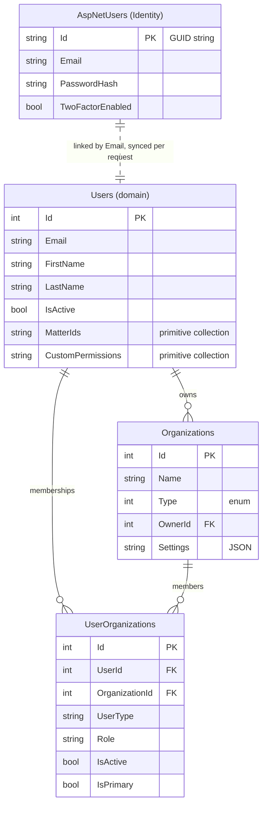
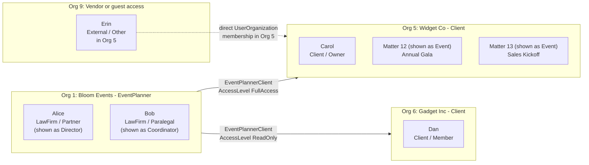
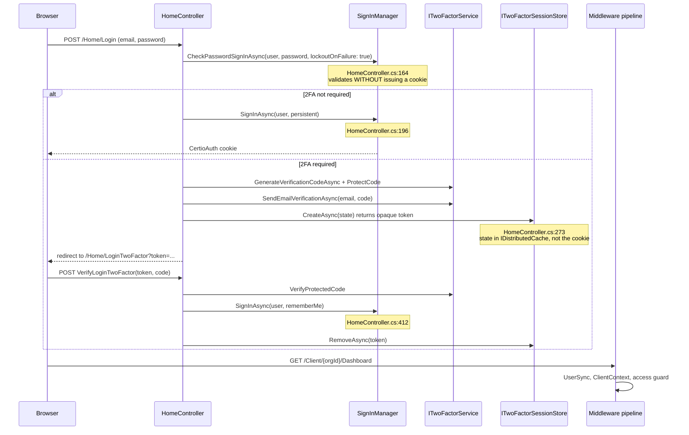

# Module 03 — Identity and multi-tenancy

**Time:** 2 hours. **Prerequisite:** modules 00-02.

## Objectives

By the end you can:

- Explain why there are two user tables and what breaks if they drift apart
- Model any real-world arrangement of firms, clients, and outside counsel in this schema
- Explain firm-based cross-organization access, and name its two hard limitations
- Trace a login through password check, 2FA, and org selection

## Read this first

1. `Certio.Domain/Users/UserOrganization.cs` — 82 lines, the tenancy junction and all the role strings
2. `Certio.Domain/Organizations/OrganizationRelationship.cs` — 111 lines, the org-to-org graph
3. `Certio.Web/Services/ClientContext.cs` — how a request picks a tenant
4. `Certio.Web/Services/FirmRelationshipCacheService.cs` — the cache in front of the graph
5. `Certio.Application/Services/PermissionService.cs:86-111` — `GetFirmRelationshipAsync`, and its `FirstOrDefaultAsync`
6. `Certio.Web/Controllers/HomeController.cs:136-200` and `:286-440` — login and the 2FA gate

---

## Two user tables



`ApplicationDbContext` derives from `IdentityDbContext`, so Identity's tables and the domain's tables
share one database and one `SaveChanges`. But they are joined by *convention*, not by a foreign key.
`UserSyncMiddleware` (module 02) reconciles them on every authenticated request by calling
`IUserSyncService.EnsureCustomUserExistsAsync`, which creates the domain `User` row on first sight.

**Why two tables — pragmatic, and a common trap.** ASP.NET Core Identity gives you password hashing,
lockout, 2FA scaffolding, and OAuth for free, but `IdentityUser` has a `string` primary key and is
awkward to extend with domain behavior. Rather than the idiomatic fix — subclass
`IdentityUser<int>` and use it as the domain entity — the team kept them separate. What that buys is a
clean domain `User` that carries real behavior (`GetEffectivePermissions`) and int keys that every
other table can reference cheaply. What it costs:

- **Every authenticated request pays a sync.** `UserSyncMiddleware.cs:39-44` calls
  `EnsureCustomUserExistsAsync` and then `EnsureDefaultsAsync` on each request. Both hit the database.
- **Two sources of truth for identity facts.** `AspNetUsers.Email` and `Users.Email` can diverge; the
  domain `User.IsActive` and Identity's lockout state are unrelated. Deactivating a user in one place
  does not deactivate them in the other, which is why `UserDeletionService` exists as a separate
  240-line coordination service.
- **Registration is a special case in the pipeline.** `UserSyncMiddleware.cs:81-88` skips sync during
  registration POSTs, so the invariant "an authenticated request has a `CustomUser`" does not hold
  there.

If you were starting over: `IdentityUser<int>` with the domain properties on the subclass, one table,
no middleware. The refactor now would touch every FK in the schema, which is why it has not happened.

---

## The tenancy model

Three concepts do all the work, and they are genuinely well designed.

**`Organization`** is the tenant root. `OrganizationType` (`Organization.cs:219`) is `Client`,
`LawFirm`, `EventPlanner`, `Government`, or `NonProfit`. An event planning company and each of its
clients are separate organizations.

A note on vocabulary before you read further, because this module is where it bites hardest. The product
is pivoting to the events industry (module 00), but the tenancy code was written for legal practice and
still says so. `LawFirm` in an identifier means **"the service-provider side of a
provider-client relationship"** — for an event planning company, that is still the value in the database.
This module uses the real identifiers, because those are what you will type and grep.

**`UserOrganization`** is a many-to-many junction that carries the user's *role within that specific
organization*. This is the crucial move: a person's `UserType` and `Role` are properties of the
membership, not of the user. The same human can be a `LawFirm`/`Partner` in one org (displayed to an
event planning company as "Director") and a `Client`/`Owner` in another. Unique on
`(UserId, OrganizationId)` (`ApplicationDbContext.cs:648`).

Both `UserType` and `Role` are **strings with `const` classes**, not enums
(`UserOrganization.cs:43-81`): four user types and nineteen roles.

**Why strings instead of enums — deliberate, and defensible.** The role vocabulary is
domain-specific and changed repeatedly (migration `UpdateLawFirmRoleNames` renamed several). With an
enum, every rename is a data migration over integer values; with strings plus consts, it is a
`migrationBuilder.Sql` update and a rename in one file. The cost is no compile-time exhaustiveness:
the `switch` in `User.GetBasePermissions` (`User.cs:272-309`) has `_ => new List<Permission>()`
fallbacks, so **a typo in a role string produces a user with zero permissions rather than a compiler
error.** That failure mode is quiet and it is the one you will actually hit.

**`OrganizationRelationship`** is a directed edge between organizations, with a type and an access
level:

```csharp
public const string LawFirmClient = "LawFirmClient";
public const string EventPlannerClient = "EventPlannerClient";
public const string PartnerFirm = "PartnerFirm";
public const string Subsidiary = "Subsidiary";
public const string Vendor = "Vendor";
public const string Consultant = "Consultant";
```

Access levels are `FullAccess`, `ReadOnly`, `LimitedAccess`, `MatterSpecific`, `DocumentOnly`
(`OrganizationRelationship.cs:103-110`). The entity carries real behavior: `IsExpired()`,
`IsValid() => IsActive && !IsDeleted && !IsExpired()`, and `CanAccess(userId)`.

Only two of the six relationship types confer cross-org access. `RelationshipTypes.ServiceProviderClientTypes`
(`OrganizationRelationship.cs:85-89`) contains `LawFirmClient` and `EventPlannerClient`, and
`IsServiceProviderClient` is what the access checks call. `PartnerFirm`, `Subsidiary`, `Vendor`, and
`Consultant` are currently descriptive metadata with no authorization effect.

Here is the model with an event-planning tenant. Note that the stored values are legal-flavored while
the displayed values are not — the parenthetical is what the user actually sees.



Two distinct mechanisms give someone access to another organization's data, and it is important to
keep them apart:

- **Direct membership** — a `UserOrganization` row. Used for outside parties who need scoped access to
  one client: added to the client org with `UserType = External` and a narrow role. The available
  external roles are still legal ones — `OpposingCounsel`, `ExpertWitness`, `CourtPersonnel`,
  `RegulatoryBody`, `Other` (`UserOrganization.cs:52-56`) — so an events deployment has only `Other` to
  work with for vendors, venues, and photographers. Their permissions come from `PermissionSets`.
- **Provider-based access** — no `UserOrganization` row in the target org at all. Alice can reach Org 5
  purely because Bloom Events has an `EventPlannerClient` relationship with it. Her permissions come
  from `PermissionService.GetPartnerPermissions(relationship.AccessLevel)`.

**Why provider-based access instead of provisioning memberships — deliberate, and the best idea in this
codebase.** A planning company with 40 staff and 300 clients would otherwise need 12,000 membership rows
kept in sync as people join and leave. One relationship row per client, plus company membership per
staff member, gives the same result in O(providers + clients) rows. Onboarding a new coordinator grants
access to every client automatically; ending an engagement is one `IsActive = false`. That is a genuinely
good model, and it is the thing most worth preserving through the pivot — which is why the next section
matters.

### The pivot trap: `UserTypes` has no `EventPlanner`

This is the most consequential thing in the module, and it is easy to miss because the code looks
symmetric and is not.

Two of the three concepts have an events counterpart:

| Concept | Legal value | Events value | Exists? |
|---|---|---|---|
| `OrganizationType` | `LawFirm` | `EventPlanner` | yes (`Organization.cs:219-226`) |
| `RelationshipTypes` | `LawFirmClient` | `EventPlannerClient` | yes, and `IsServiceProviderClient` accepts both |
| `UserTypes` | `LawFirm` | — | **no** (`UserOrganization.cs:75-81`) |

`UserTypes` has exactly four values: `Client`, `External`, `Certio`, `LawFirm`. And cross-organization
access is gated on that field, not on the organization type or the relationship type. The check
`uo.UserType == UserTypes.LawFirm` appears in **eleven places across six production files**:

| File | Lines |
|---|---|
| `Certio.Application/Services/PermissionService.cs` | 95, 368, 406 |
| `Certio.Web/Services/FirmRelationshipCacheService.cs` | 134, 209, 298, 361 |
| `Certio.Domain/Organizations/OrganizationRelationship.cs` | 71 |
| `Certio.Domain/Users/User.cs` | 223 |
| `Certio.Web/Controllers/HistoryController.cs` | 96 |
| `Certio.Web/Controllers/ClientController.cs` | 73, 1417 |

**So event planner staff must be stored with `UserType = "LawFirm"`.** If someone reasonably concludes
that an `EventPlanner` organization's members should have a matching user type and adds one, every one of
those eleven checks returns false and the user gets **zero cross-organization access** — no client
events, no client documents, no client tasks. The organization would still *look* right, because
`OrganizationType.EventPlanner` drives the display terminology independently. The symptom is "the planner
can log in but sees none of their clients," and nothing in the code will point at the cause.

**Is this a bug?** Not exactly, and the distinction matters for how you fix it. `UserType` has quietly
become an **access-model discriminator** — "is this person on the provider side or the client side" —
rather than a business-type label, which is the job `OrganizationType` now does. Under that reading the
current code is coherent, and `LawFirm` is simply a badly-named value for "service provider."

But it is a trap, because `RelationshipTypes.EventPlannerClient` exists and *looks* like the parallel
path. Two of three layers say the pivot happened. The right fix is small and worth doing before the first
event-planning customer: rename the constant to something domain-neutral —
`UserTypes.ServiceProvider`, with `LawFirm` kept as a deprecated alias so existing rows keep working —
and update the eleven call sites. That is a `migrationBuilder.Sql` update plus a rename, cheap precisely
*because* the codebase stored these as strings rather than enums (see the tradeoff two sections above,
where that decision now pays off).

### The two hard limitations

**One provider organization per user.** `PermissionService.GetFirmRelationshipAsync`
(`PermissionService.cs:88-95`) finds the user's provider-side membership with `FirstOrDefaultAsync`:

```csharp
var lawFirmMembership = await _context.UserOrganizations
    .Include(uo => uo.Organization)
        .ThenInclude(o => o.OrganizationRelationships)
            .ThenInclude(r => r.TargetOrganization)
    .FirstOrDefaultAsync(uo =>
        uo.UserId == userId &&
        uo.IsActive &&
        uo.UserType == UserTypes.LawFirm);
```

Nothing in the schema prevents two active `LawFirm` memberships — there is no uniqueness constraint on
`(UserId, UserType)`. If a freelance planner contracts with two planning companies, whichever row EF
returns first wins, and access through the other company silently vanishes. `ClientContext.CreateAsync`
has the same shape. This is a latent correctness bug rather than a design decision, and **the pivot makes
it more likely to fire**: freelance and contract staff working across multiple planning companies is
normal in the events industry, where of-counsel arrangements were the rare edge case in legal.

**Access level is relationship-wide, not per event.** `AccessLevels.MatterSpecific` exists as a string,
but `GetPartnerPermissions` maps it to a fixed permission list (`PermissionService.cs:149-159`) with no
per-event scoping. Narrowing to one event happens through a different mechanism entirely —
`Matter.AccessLevel` plus `MatterPermission` rows, covered in module 04. So a planning company marked
`MatterSpecific` actually gets the same breadth as `FullAccess` minus a few permissions, across every
event in the client org.

### Caching the graph

`FirmRelationshipCacheService` wraps these lookups in `IMemoryCache` with a 15-minute TTL
(`FirmRelationshipCacheService.cs:14`). It caches `HasFirmAccessAsync`, the accessible-organization
list, the relationship object, and a `ClientAccessInfo` summary.

Two consequences. First, **revoking a firm relationship takes up to 15 minutes to take effect** —
there is no invalidation call. Second, this is `IMemoryCache`, so it is per-process; two app instances
will disagree for up to 15 minutes after a change. Note the sanitization at
`CachedPermissionService.cs:279` (`CreateCacheFriendlyRelationship`), which strips navigation
properties before caching to avoid serializing the object graph — a good detail to notice.

---

## Login and organization selection



The important detail is the **order at `HomeController.cs:164` and `:196`**: password verification
uses `CheckPasswordSignInAsync`, which validates credentials and applies lockout *without* issuing an
authentication cookie. The cookie is only issued after the 2FA gate. That is the correct sequencing;
the common bug is to sign in first and then "require" 2FA, leaving a valid session for anyone who
abandons the second step.

**Why an opaque token in a distributed store instead of a cookie or session — deliberate.** The
pending-login state lives in `ITwoFactorSessionStore`
(`DistributedTwoFactorSessionStore`, registered as a singleton at `Program.cs:649`) and the browser
holds only a token. The verification code itself is stored *protected* via
`_twoFactorService.ProtectCode` (`HomeController.cs:252`) using ASP.NET Data Protection, so a store
compromise does not yield usable codes. Client-side state would let a user tamper with the pending
identity.

Note that Identity is configured strictly (`Program.cs:504-521`): confirmed email and account
required, 12-character passwords with 4 unique characters, lockout after 5 attempts for 15 minutes,
unique email enforced. The auth cookie is `CertioAuth`, HttpOnly, `SameSite=Strict` in production,
30-minute sliding expiration (`Program.cs:569-591`).

### After login: choosing an organization

There is no "current organization" in the session or the claims. **The organization is a URL segment.**
`/Client/{orgId}/...` is the canonical shape, and `ClientController.List` is the org picker.
`UserOrganization.IsPrimary` (`UserOrganization.cs:31`) exists to pick a default for the UI.

**Why the URL rather than session state — deliberate, and a good call.** Putting the tenant in the URL
makes every request self-describing: it is bookmarkable, shareable, cacheable, safe across multiple
browser tabs in different orgs, and trivially loggable. Session-based tenant selection breaks all of
those and creates a class of bug where a background request executes against the wrong tenant. The
cost is that every route needs the segment and every link must carry it, which is why
`_ClientLayout.cshtml` threads `orgId` through so much markup.

---

## Sharp edges

- **`Matter.AccessLevel` defaults to `""`** (`Matter.cs:36`) and `PermissionService.CanAccessMatterAsync`
  only recognizes `"Everyone"` and `"Specific"`, returning `false` otherwise
  (`PermissionService.cs:220-246`). A matter created with an empty access level is invisible to
  everyone except its creator. The invariant is enforced at the edge — `CreateMatterDto.AccessLevel`
  defaults to `"Everyone"` (`MatterDTOs.cs:12`) and `MatterController.cs:862` rejects an empty value —
  but not in the domain. Any new write path that bypasses that controller can create an orphaned
  matter.
- **`User.MatterIds` is a denormalized primitive collection** on the user row, and `HasMatterAccess`
  consults it. It duplicates what `MatterPermission` and `MatterAssignment` already express, so there
  are three overlapping sources of truth for "can this user see this matter."
- **`OrganizationRelationshipAssignedUser` has a `UserId` with no navigation property** to `User`. It
  narrows a relationship to specific users, but you cannot traverse it in LINQ without a manual join.
- **`Organization.Settings` is a JSON string**, not a typed owned entity. Per-org terminology
  customization and AI model tier live in there, unvalidated and unindexable.
- **`Organization.OwnerId` uses `DeleteBehavior.Restrict`** (`ApplicationDbContext.cs:522-526`), so an
  organization owner can never be hard-deleted. Combined with the interceptor's soft-delete
  conversion, deletion of users is always logical.

---

## Check yourself

1. Alice is a `Partner` at Bloom Events (Org 1), an `EventPlanner` organization with an
   `EventPlannerClient` relationship to Widget Co (Org 5) at `AccessLevel = "ReadOnly"`. She opens
   `/Client/5/Matter/Details/12`. List every check that runs and the exact permission list she ends up
   with. What job title does the UI show her, and where does that string come from?
2. A colleague sets up a new planning company and gives its staff `UserType = "EventPlanner"` because the
   organization type is `EventPlanner`. Predict the exact symptom, name three of the eleven lines
   responsible, and propose the smallest correct fix.
3. A freelance planner is added as `LawFirm`/`Associate` to two planning companies, both serving Org 5.
   Describe the bug, cite the line, and propose the smallest correct fix.
4. A florist needs to see exactly one event in Org 5 and nothing else. Which of the two access
   mechanisms do you use, what rows do you create, and which `UserType`/role pair is the least-bad fit
   given what `UserOrganization.cs:52-56` offers?
5. A provider relationship is revoked at 10:00. At 10:05 a planner from that company loads a client page.
   What happens, and why? Name the two caches involved and their TTLs.
6. Someone deactivates a user by setting `Users.IsActive = false`. Can that user still log in? Trace
   it through Identity and the middleware and cite your evidence.

Labs in [`EXERCISES.md`](EXERCISES.md#module-03).
