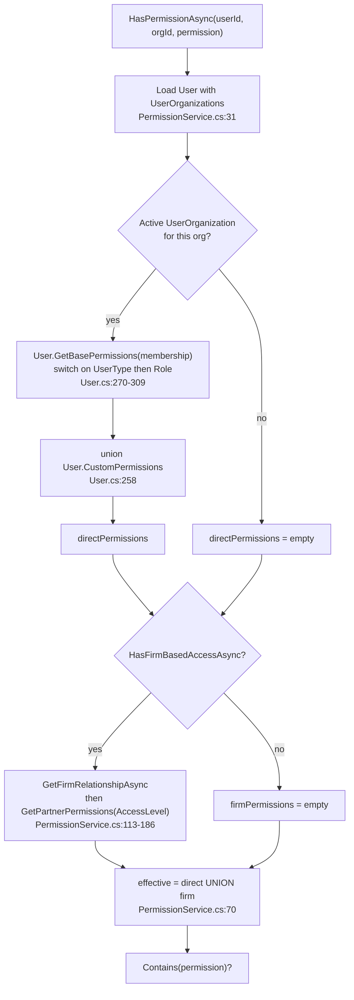
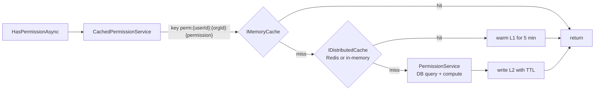

# Module 04 — The permission system

**Time:** 2 hours. **Prerequisite:** modules 02, 03.

## Objectives

By the end you can:

- Compute any user's effective permissions by hand from the source, without running the app
- Explain the four-stage resolution algorithm and where each stage's data lives
- Describe the two-level cache, its key scheme, and the invalidation gap
- Find and articulate the privilege inversion in the client role hierarchy

## Read this first

1. `Certio.Domain/Users/User.cs:252-310` — `GetEffectivePermissions` and `GetBasePermissions`
2. `Certio.Domain/Users/User.cs:316-563` — the `Permission` enum and all 17 permission sets
3. `Certio.Application/Services/PermissionService.cs:23-186` — org-level resolution and the firm overlay
4. `Certio.Application/Services/PermissionService.cs:188-330` — matter and task access
5. `Certio.Web/Services/CachedPermissionService.cs` — the whole caching decorator
6. `Certio.Web/Security/RequirePermissionAttribute.cs` — the filter, and read its org-resolution fallback carefully
7. `Certio.Tests/Services/PermissionServiceTests.cs` — 509 lines, the best-tested code in the repo

---

## The model

Permissions are a **26-member enum in six categories** (`User.cs:316-357`), and they are **never
stored in the database as permission rows**. There is no `Permissions` table, no `RolePermissions`
table. Effective permissions are computed on every check from role strings plus static lists.

| Category | Permissions |
|---|---|
| Documents | `ViewDocuments`, `DownloadDocuments`, `UploadDocuments`, `DeleteDocuments`, `CommentOnDocuments` |
| Matters | `ViewMatters`, `CreateMatters`, `EditMatters`, `DeleteMatters`, `ManageMatterSettings` |
| User management | `InviteUsers`, `RemoveUsers`, `ManageUserPermissions` |
| Communication | `ViewMessages`, `SendMessages`, `DeleteMessages`, `ManageThreads` |
| System | `ViewAuditLogs`, `ManageSystemSettings`, `AccessAdminPanel` |
| Agent actions | `ViewAgentActions`, `ProposeAgentActions`, `ApproveAgentActions`, `RollbackAgentActions` |
| Unified inbox | `ViewInbox`, `ManageInbox` |

`PermissionSets` (`User.cs:359-563`) holds **17 `static readonly List<Permission>`** grants, one per
`(UserType, Role)` pair.

**Why compute rather than store — deliberate, and correct for this scale.** Storing grants means a
join on every check, a migration for every policy change, and a data-fix script when a role's meaning
evolves. Computing them makes the policy reviewable in one file, diffable in git, and free to change.
The cost is that **you cannot query "who can delete matters in org 5" in SQL** — you have to enumerate
users and evaluate. For a product with dozens of roles that is fine; for one with customer-defined
roles it would not be.

`User.CustomPermissions` (a primitive string collection on the user row) is the escape hatch for
per-user grants, unioned in at `User.cs:258-259` via `Enum.Parse<Permission>`. Note the sharp edge: an
invalid string in that column throws at parse time, and it is a **user-level** override, not
per-organization, so a custom permission granted for one org leaks into every org that user belongs to.

---

## The resolution algorithm

Four stages, running from the outside in. `HasPermissionAsync` is just
`GetEffectivePermissionsAsync(...).Contains(permission)` (`PermissionService.cs:23-27`).



Two properties of this algorithm matter more than the details.

**Direct and firm permissions are unioned, not intersected** (`PermissionService.cs:70`). The comment
in the source says "Use whichever grants more permissions (union of both)." So a planner who is *both*
a direct member of a client org and reachable through a provider relationship gets the more permissive of
the two. Deliberate and reasonable — but it means restricting a provider relationship to `ReadOnly` does
nothing if the same person also holds a direct `Member` membership.

**Matter scoping short-circuits everything.** `User.GetEffectivePermissions` takes an optional
`matterId` and, if supplied, returns an *empty list* when the user lacks matter access:

```csharp
if (matterId.HasValue && !HasMatterAccess(matterId.Value, organizationId))
{
    return new List<Permission>(); // No permissions if no matter access
}
```

That is fail-closed, which is right. But note that `PermissionService.GetEffectivePermissionsAsync`
calls `user.GetEffectivePermissions(organizationId)` with **no matter id**
(`PermissionService.cs:45`). Matter-level scoping therefore never happens through the
`HasPermissionAsync` path; it happens through the separate `CanAccessMatterAsync` path below. Two
mechanisms for the same concept, and only one of them is reachable from the permission API.

### Matter and task access

`CanAccessMatterAsync` (`PermissionService.cs:188-253`) is a separate ladder:

1. Org membership or firm access to the matter's organization — else deny (line 203-211)
2. The matter's creator always has access (line 214-218)
3. `Matter.AccessLevel == "Everyone"` — org access suffices (line 221-224)
4. `Matter.AccessLevel == "Specific"` — need a non-revoked `MatterPermission` row, **or** an active
   `MatterAssignment` (line 227-244)
5. Anything else — deny (line 246)

`CanAccessTaskAsync` (`PermissionService.cs:285-327`) mirrors it: org or firm access, then a direct
`TaskAssignment`, otherwise fall through to the parent matter's access.

Step 5 is why module 03 flagged `Matter.AccessLevel` defaulting to `""`. Any matter created outside
`MatterController` is accessible to its creator and nobody else.

`CanPerformMatterOperationAsync` (`PermissionService.cs:255-283`) composes the two systems: access to
the matter, then a `HasPermissionAsync` check for the operation mapped to a permission
(`"edit" or "update" => Permission.EditMatters`). This is the method you want for most real
authorization decisions, and it is underused.

There are also throw-based variants — `ValidatePermissionOrThrowAsync`,
`ValidateMatterAccessOrThrowAsync`, `ValidateTaskAccessOrThrowAsync` — which raise
`UnauthorizedOperationException`. These feed the hybrid pattern from module 01.

---

## The privilege inversion

Read `ClientManager` (`User.cs:377-387`) next to `ClientMember` (`User.cs:390-400`) and compare.

| Permission | `ClientOwner` | `ClientManager` | `ClientMember` | `ClientLawyer` |
|---|---|---|---|---|
| `CreateMatters` | yes | **no** | **yes** | no |
| `DeleteMatters` | yes | **no** | **yes** | no |
| `DeleteDocuments` | yes | **no** | **yes** | no |
| `InviteUsers` | yes | yes | **no** | yes |
| `RemoveUsers` | yes | yes | **no** | yes |
| `ApproveAgentActions` | yes | yes | **no** | no |
| `ViewAuditLogs` | no | no | no | **yes** |

`ClientMember` can create and delete matters and delete documents. `ClientManager`, nominally the more
senior role, cannot do any of those. The comments explain the intent — `ClientManager` is "Full access
to assigned matters" and `ClientMember` is "Full self-service access" — so these were designed as two
different *shapes* of account, a delegated manager versus a self-serve solo user, rather than two rungs
of one ladder.

**Verdict — accidental in effect, whatever the intent.** The role *names* imply a hierarchy that the
grants contradict, and `Member` is the default value of `UserOrganization.Role`
(`UserOrganization.cs:22`). So the default role for a new client user includes `DeleteMatters`. Anyone
reasoning about this system from role names alone will get it wrong, and role names are exactly what
product and support staff reason from. If you rename anything in this codebase, rename these:
`ClientMember` to something like `ClientSelfServe`.

Also worth noting: `ViewAuditLogs` is granted to `ClientLawyer` but not to `ClientOwner`. And
`AccessAdminPanel` and `ManageSystemSettings` appear in exactly one set, `CertioAdmin`
(`User.cs:460`).

**A pivot note on `ClientLawyer`.** The role constant is `Lawyer` (`UserOrganization.cs:49`) and there is
no events equivalent — `RoleDisplayHelper` remaps the *provider-side* roles (`Partner` to Director,
`Paralegal` to Coordinator) but leaves the client-side roles alone. So a client organization in an
events deployment still offers `Owner`, `Manager`, `Member`, and `Lawyer`. Given that `ClientLawyer` is
the only client role holding `ViewAuditLogs`, it is not a role you can simply drop; whoever plans the
events role vocabulary needs to decide where that permission goes first. This is a good example of why
a pivot is not a rename: the *word* is easy to change and the *permission grant attached to it* is the
actual work.

---

## Caching

`IPermissionService` resolves to `CachedPermissionService` in DI (`Program.cs:670-672`), which
decorates the concrete `PermissionService`. Underneath, `ICacheService` is `RedisCacheService`, itself
a two-level cache: `IMemoryCache` as L1 and `IDistributedCache` as L2, where an L2 hit warms L1 for
five minutes.



| Key prefix | Contents | TTL |
|---|---|---|
| `perm:{userId}:{orgId}:{permission}` | single bool | 15 min |
| `eff_perms:{userId}:{orgId}` | permission list | 15 min |
| `org_member:{userId}:{orgId}` | bool | 15 min |
| `firm_access:{userId}:{orgId}` | bool | 15 min |
| `matter_access:{userId}:{matterId}` | bool | 10 min |
| `task_access:{userId}:{taskId}` | bool | 5 min |

TTLs are at `CachedPermissionService.cs:32-34`. Booleans are boxed in a `BooleanCacheWrapper`
(`CachedPermissionService.cs:13`) because `ICacheService` requires reference types — a small but
instructive detail about the cost of a `where T : class` constraint.

**Why cache permissions at all — deliberate and necessary.** Uncached, `GetEffectivePermissionsAsync`
loads the user with `Include(u => u.UserOrganizations)` and may then perform the deep
`Include...ThenInclude...ThenInclude` firm-relationship query at `PermissionService.cs:88`. A page that
renders 40 matters and checks a permission per row would issue 40+ of those. The cache turns that into
one.

### The invalidation gap

All three invalidation methods are stubs. From `CachedPermissionService.cs:244-277`:

```csharp
public async Task InvalidateUserPermissionsAsync(int userId)
{
    _logger.LogInformation("Invalidating all permission caches for user {UserId}", userId);

    // Invalidate all cached permissions
    // In a production system, you'd use Redis pattern matching to delete keys
    // For now, we rely on cache expiration

    // NOTE: To fully implement this, we'd need to extend ICacheService with a DeletePatternAsync method
    // that uses Redis SCAN and DELETE commands
}
```

The method logs and returns. `InvalidateMatterAccessAsync` and `InvalidateTaskAccessAsync` do the same.
So the real behavior of the system is:

**A permission change takes effect after the TTL expires, up to 15 minutes later.** Demote a director to
staff and they keep director permissions for 15 minutes. Revoke an event grant and they keep reading it
for 10 minutes. When a planning company works competing accounts in the same market — two hotel brands,
two rival sponsors — event-level separation is a client-confidentiality commitment, so a 15-minute window
after removing someone from an account is a contractual problem, not just a UX annoyance.

The author knew: the comment names the fix. `RedisCacheService` would need a
`RemoveByPatternAsync` using `SCAN` plus `DEL` against the `Certio_` instance prefix. The complication
is the L1 memory cache, which has no pattern removal either, so a correct fix needs a version/epoch
key per user — bump `perm_epoch:{userId}` on change and include it in every key — rather than pattern
deletion. That is the design worth discussing, and it is Lab 4.3.

Also note the passthrough set: `Validate*OrThrowAsync`, `CanPerformMatterOperationAsync`, and
`CanPerformTaskOperationAsync` do **not** go through the cache. So the composed operation check is
slower than its parts, and inconsistently so.

---

## Enforcement points and the fallback

`RequirePermissionAttribute` is a `TypeFilterAttribute` wrapping `RequirePermissionFilter`, used as
`[RequirePermission(Permission.AccessAdminPanel)]`. The filter needs a user and an organization. The
user comes from `Items["CustomUser"]` and denies with 401 if absent
(`RequirePermissionAttribute.cs:59-66`), which is correct. The organization is resolved from four
sources in order (`RequirePermissionAttribute.cs:76-122`):

1. `Items["CurrentOrganizationId"]` — set by the middleware, authoritative
2. Route data `orgId`
3. `Session.GetInt32("OrganizationId")`
4. **"LAST RESORT": the user's first active `UserOrganization` ordered by `Id`**

Read that fourth branch again:

```csharp
var userOrg = await _context.UserOrganizations
    .Where(uo => uo.UserId == userId && uo.IsActive)
    .OrderBy(uo => uo.Id)
    .FirstOrDefaultAsync();

if (userOrg != null)
{
    organizationId = userOrg.OrganizationId;
}
```

**This is the most dangerous line in the authorization code.** When the organization cannot be
determined from the request, the filter does not deny — it substitutes an *arbitrary* organization
(the user's oldest membership) and evaluates the permission there. The check then passes or fails
based on the user's role in a tenant that has nothing to do with the request.

Concretely: a user who is `Owner` of their own client org calls an endpoint where org resolution failed.
The filter evaluates their `ClientOwner` grants and lets them through. Whether that is exploitable
depends on what the action does with the unresolved org afterwards, and today the blast radius is
limited because `AccessAdminPanel` lives only in `CertioAdmin` and most protected endpoints sit behind
the `OrgMember` policy, which already fails closed. But the pattern is wrong, and it directly
contradicts the fail-closed design of `ClientContext.IsValid`. The fix is three lines: delete the
fallback and return `ForbidResult` when the org is unknown.

The comparison worth internalizing: `ClientContext` fails closed on an unresolvable tenant;
`RequirePermissionFilter` guesses. Two authors, two instincts, one codebase. Consistency in
fail-closed behavior is not a style preference.

---

## Sharp edges

- **Permission logging is at `Information` level.** `PermissionService.cs:57`, `:74`, and `:80` log on
  every resolution, and `RequirePermissionFilter` logs four times per check. On a page with many
  permission checks this floods the log and costs real time. Drop these to `Debug`.
- **Emoji in log messages** at `CachedPermissionService.cs:63` and throughout
  `RequirePermissionAttribute.cs`, against the project's own `.cursorrules`.
- **`HasFirmBasedAccessAsync` and `GetFirmRelationshipAsync` are separate queries** and
  `GetEffectivePermissionsAsync` calls both (`PermissionService.cs:50-52`), duplicating the deep
  include. There is even a defensive log for the inconsistent case at `PermissionService.cs:63`.
- **`GetPartnerPermissions` accepts both spellings** — `"Full" or "FullAccess"`,
  `"Limited" or "LimitedAccess"`, `"ReadOnly" or "ReadOnlyAccess"` (`PermissionService.cs:118-177`) —
  because the `AccessLevels` constants use the long form but some data uses the short form. Defensive
  and correct; a symptom of string-typed enums.
- **No permission covers billing.** `BillingService` takes no `IPermissionService` at all. Time
  entries, invoices, and trust accounting are protected only by the `OrgMember` policy, so **any member
  of an organization can read and write its billing data** regardless of role. That is the largest
  authorization gap in the product.

---

## Check yourself

1. Bob is `LawFirm`/`Paralegal` in Org 1 — a coordinator at a planning company. Org 1 has an
   `EventPlannerClient` relationship to Org 5 with `AccessLevel = "DocumentOnly"`. Compute Bob's exact
   effective permission list in Org 5 by hand, citing the two lists you unioned.
2. Same Bob, but he is also a direct `Client`/`Member` of Org 5. Now compute it. Which permission does
   he gain that the provider relationship deliberately withheld, and which line makes that happen?
3. An event has `AccessLevel = "Specific"` with no `MatterPermission` rows and one
   `MatterAssignment` whose `RemovedAt` is set. Who can access it? Cite the lines.
4. An admin demotes a `Partner` to `Staff` at 14:00 — a Director to Staff, as the planner sees it. At
   14:07 that user deletes a document. Does it succeed? Explain using the cache keys and TTLs, and name
   the code that was supposed to prevent it.
5. Design the epoch-based invalidation described above. What key do you add, where do you bump it, and
   how does it interact with the L1 memory cache? What does it cost per check?
6. Find every endpoint where a permission is checked against a *possibly wrong* organization. Start at
   `RequirePermissionAttribute.cs:108`.

Labs in [`EXERCISES.md`](EXERCISES.md#module-04).
