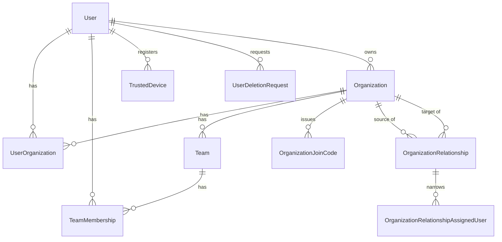
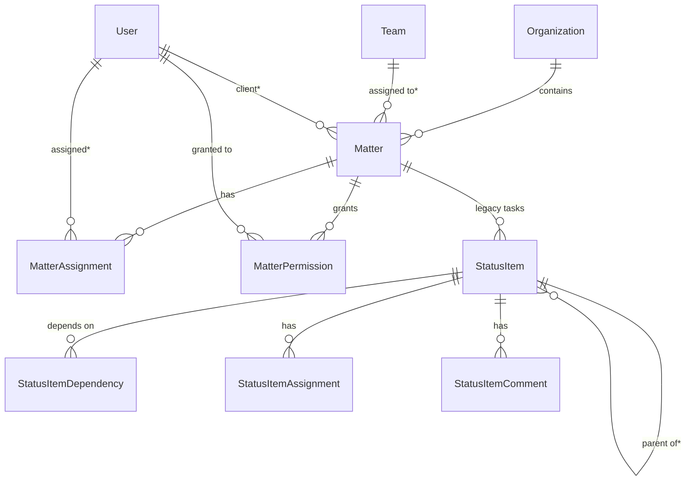
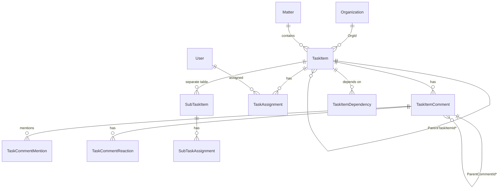
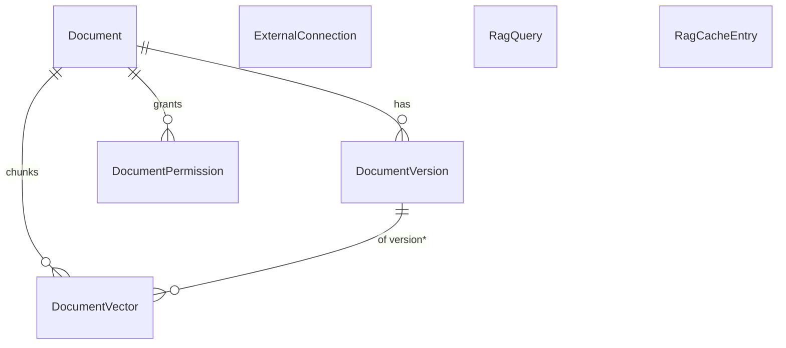
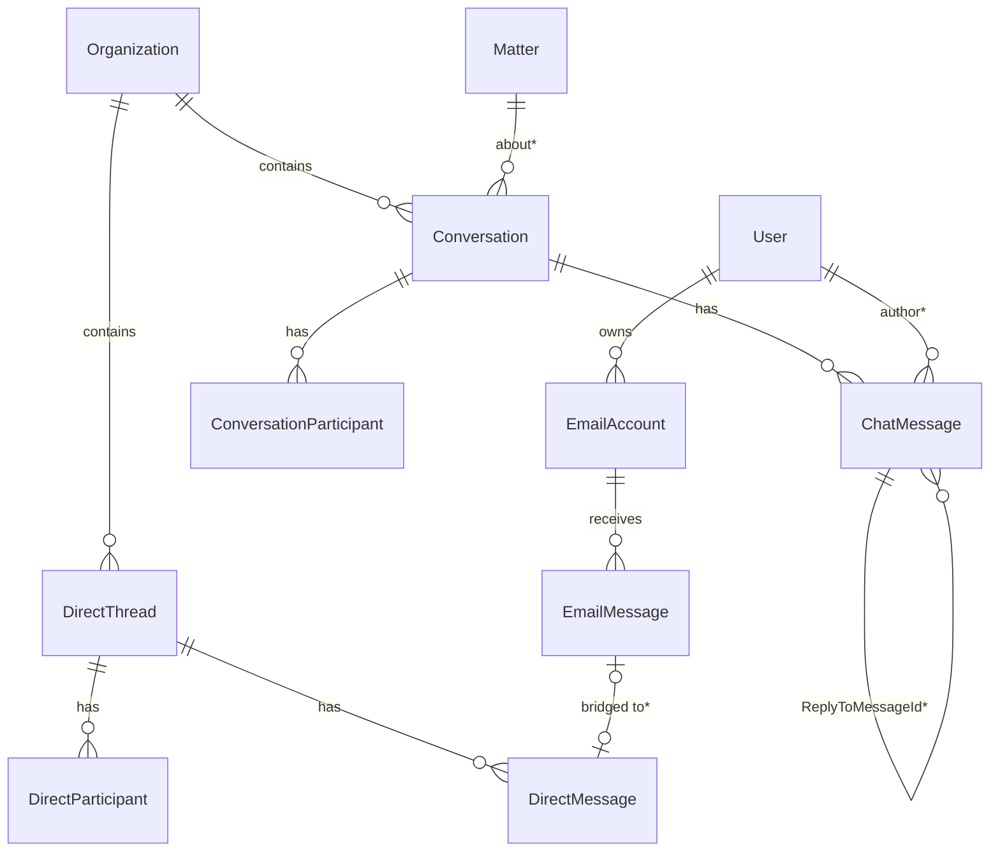
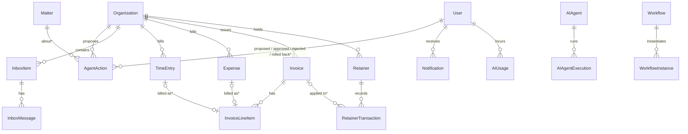
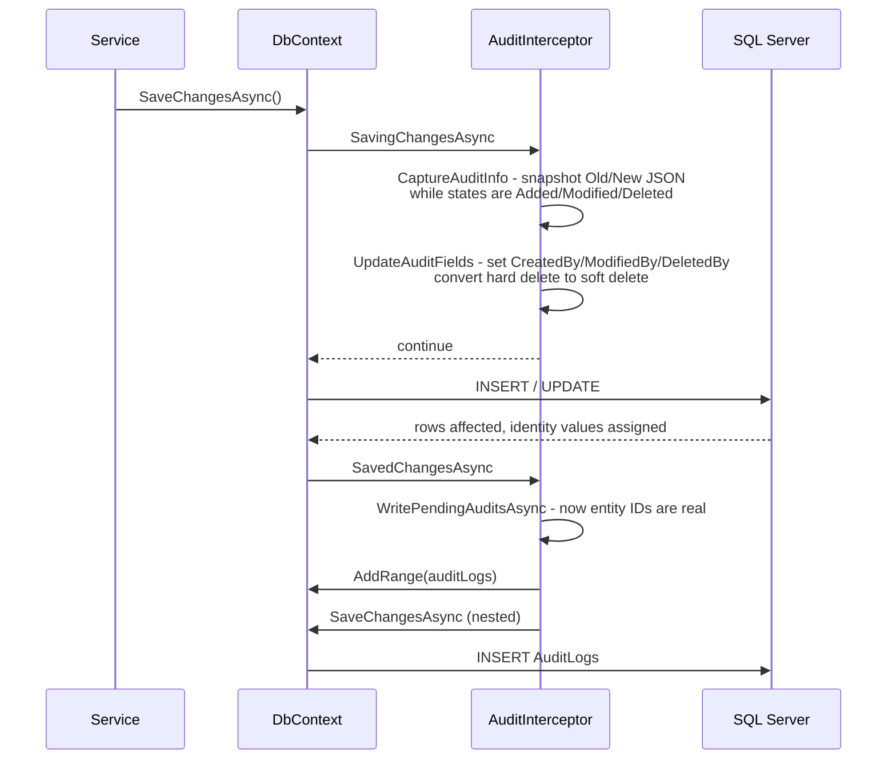

# Module 05 — The data model

**Time:** 2.5 hours. **Prerequisite:** module 03.

## Objectives

By the end you can:

- Draw the ER diagram for any bounded context from memory
- Explain soft delete: the reflection-based global filter, the interceptor conversion, and the two schemas
- Explain exactly what the audit interceptor writes, what it misses, and the nested `SaveChanges`
- Identify the three parallel modeling decisions that were never unwound

## Read this first

1. `Certio.Infrastructure/Data/ApplicationDbContext.cs:36-136` — all 68 `DbSet` declarations, grouped
2. `Certio.Infrastructure/Data/ApplicationDbContext.cs:184-233` — the global query filter and its comment
3. `Certio.Domain/Audit/IAuditable.cs` — the cross-cutting interfaces
4. `Certio.Infrastructure/Interceptors/AuditInterceptor.cs` — all 522 lines; it is the highest-leverage file in the repo
5. `Certio.Domain/Matters/Matter.cs` and `Certio.Domain/Tasks/TaskItem.cs` — read side by side
6. `Certio.Domain/Documents/Document.cs` — note the ID types

Scale: **68 `DbSet` properties**, a 1,731-line `DbContext`, **95 `HasIndex` calls** of which **18 are
unique**, 47 domain source files, and **72 migrations** from `20250906051535_InitialCreate` to
`20260227044249_ExtendMatterAssignmentForVendorsAndGuests`.

---

## Bounded contexts

The `DbSet` declarations are grouped by comment in the source, and those groups are the real bounded
contexts. Diagrams follow, one per context. `PK` marks primary keys and `FK` foreign keys; `*`
marks a nullable FK.

### Tenancy core



`UserOrganization` is unique on `(UserId, OrganizationId)`; `OrganizationRelationship` is unique on
`(SourceOrganizationId, TargetOrganizationId, RelationshipType)`; `OrganizationJoinCode.Code` is
unique. `Organization.OwnerId` uses `DeleteBehavior.Restrict`.

### Matters and the legacy task model



`MatterAssignment.UserId` is **nullable** — the `ExtendMatterAssignmentForVendorsAndGuests` migration
added support for vendors and guests who have no account, identified by email. `AssignmentType` is a
string: `OriginatingAttorney`, `ResponsibleAttorney`, `ResponsibleStaff`, `RelevantContact`, `Vendor`,
`Guest`.

That enum is the events pivot mid-flight, visible in one line. The first three values are legal
(`OriginatingAttorney` is a law-firm billing-credit concept); `Vendor` and `Guest` were added later for
event planning, along with the nullable `UserId` that lets you assign a florist who has no login. Two
consequences worth carrying: the legal three are what an events deployment has to repurpose for planner
roles, and **`Matter` also carries `GuestCount` and `Location`** (`MatterService.cs:77-80`), which were
never legal fields at all. The data model was reaching toward events before the product decision was
made.

### The current task model



Note `TaskItem` carries **both** `OrgId` and `MatterId`. The org id is denormalized so task queries do
not have to join through `Matter` — a deliberate and reasonable choice given that org scoping is
manual (see below).

### Documents and RAG



`Document.Id` is a **`Guid`**, and so are `Document.OrgId` and `Document.MatterId` — while
`Organization.Id` and `Matter.Id` are `int`. There is no foreign key between them. Module 10 covers the
deterministic int-to-Guid conversion used to bridge them.

Unique constraints: `DocumentVersion` on `(DocumentId, VersionNumber)`, `DocumentVector` on
`(OrgId, DocumentId, ChunkIndex)`, `DocumentPermission` on `(DocumentId, UserId)`.
`Document.Tags`, `Document.Metadata`, and `DocumentVector.Embedding` (a `float[]`) are all stored via
JSON value converters, so none of them is queryable in SQL.

### Communications



`ChatMessage` has **two** self-references: `ParentMessageId` for threading and `ReplyToMessageId` for
quote-replies, both `Restrict` on delete (`ApplicationDbContext.cs:1186-1196`). `DirectThread` uses a
`Guid` PK and is unique on `(OrganizationId, UserAId, UserBId)` — the pair is stored in a canonical
order so a thread is not duplicated.

Note `EmailAccount` has **no organization id**. Email accounts are user-scoped, which means an inbox
follows the person across tenants.

### AI, agent actions, billing, and the rest



`AgentAction.RunId` is unique — the idempotency key (module 09). `Invoice.InvoiceNumber` is unique.
The four billing roots are the **only** entities that actually inherit `AuditableEntity`.

`AIAgentExecution` and `WorkflowInstance` use polymorphic association — `RelatedEntityId` plus
`RelatedEntityType` strings, no FK. Flexible, unenforceable, unjoinable.

---

## Soft delete

Two schemas coexist:

- **`IsDeleted` bool + `DeletedAt` + `DeletedById`** — the majority
- **`DeletedAt` only** — the document family

And the enforcement is reflection over property names, not the interface. From
`ApplicationDbContext.cs:194-233`:

```csharp
var isDeletedProperty = clrType.GetProperty("IsDeleted", BindingFlags.Public | BindingFlags.Instance);
if (isDeletedProperty != null && isDeletedProperty.PropertyType == typeof(bool))
{
    var parameter = Expression.Parameter(clrType, "e");
    var body = Expression.Equal(
        Expression.Property(parameter, isDeletedProperty),
        Expression.Constant(false));
    builder.Entity(clrType).HasQueryFilter(Expression.Lambda(body, parameter));
    continue;
}
// falls through to a DeletedAt == null filter
```

The comment above it at `ApplicationDbContext.cs:184-191` is the best piece of documentation in the
repository, and it explains the reasoning precisely: the filter used to be written by hand in every
query across roughly 25 services, and a single omission meant soft-deleted rows leaked into lists,
search, exports, and AI context.

**Why reflection instead of `ISoftDeletable` — pragmatic, and the right call.** The idiomatic version
is `if (typeof(ISoftDeletable).IsAssignableFrom(clrType))`. That would have required adding the
interface to about 25 entities, and the reflection version worked on all of them immediately, including
`Document` with its different schema. It is also self-healing: a new entity with an `IsDeleted`
property is filtered automatically, whereas the interface version would need someone to remember.

The cost is that the mechanism is invisible from the entity. Nothing on `Matter` tells you a query
filter applies. When a row "disappears," the explanation is in a file you were not reading, and the
fix is `.IgnoreQueryFilters()`, which the comment does mention.

### The interceptor converts hard deletes

`AuditInterceptor.UpdateAuditFields` (`AuditInterceptor.cs:99-109`):

```csharp
else if (entry.State == EntityState.Deleted)
{
    if (HasProperty(entry, "IsDeleted"))
    {
        // Convert hard delete to soft delete
        entry.State = EntityState.Modified;
        entry.CurrentValues["IsDeleted"] = true;
        SetDeletedByFields(entry, currentUserId, timestamp);
    }
}
```

**Every `Remove()` on an entity with an `IsDeleted` property silently becomes an `UPDATE`.** This is
consistent with the query filter and it is the behavior you want by default. It is also a trap: a
cleanup script that removes 10,000 rows will issue 10,000 updates and the rows will still be there.
`ApplicationDbContext` additionally does this conversion in `SaveChanges` for `User` and
`OrganizationRelationship` (`ApplicationDbContext.cs:1702-1728`) — the same job in two places.

### No tenant filter

This is the most important sentence in the module. **The only global query filter is soft delete.**
There is no `HasQueryFilter(e => e.OrganizationId == _currentOrgId)`.

**Why not — a defensible tradeoff, but the riskiest one in the codebase.** A tenant filter needs the
current tenant at `DbContext` construction. Here, the tenant is resolved *mid-pipeline* by
`ClientContextMiddleware`, after the scoped `DbContext` already exists, so a filter would need an
`IClientContextAccessor` captured by closure and read lazily — workable but subtle. It would also break
the many legitimate cross-tenant queries: firm-based access, `ClientController.List`, admin tooling,
and the audit log itself. EF's answer for those is `.IgnoreQueryFilters()`, which also disables soft
delete, so you cannot opt out of one filter without the other.

The consequence is that **org isolation is 100% manual**, enforced by developer discipline in every one
of hundreds of query sites. That is the codebase's single largest standing risk, and it is why ground
rule #1 in the [README](README.md) is what it is. The mitigation that does exist is the
resolve-then-verify pattern in `ClientContext` (module 02): if you always take your org id from
`IClientContextAccessor`, the id itself is trustworthy even though the query is not automatically
scoped.

---

## The audit interceptor

`AuditInterceptor` is a `SaveChangesInterceptor` registered as a singleton (`Program.cs:483`) and
attached to the `DbContext` (`Program.cs:500`). It does four jobs in two phases.



**Why two phases — deliberate, and the interesting design insight.** An audit row needs
`EntityId`, but for a newly inserted entity the ID does not exist until after the database assigns it.
Meanwhile the *change information* (which properties were modified, their original values) is only
available *before* the save, because `SaveChanges` resets entity state to `Unchanged`. Neither phase
alone has both facts. So phase 1 captures the diff into an `AsyncLocal` list
(`AuditInterceptor.cs:29`) and phase 2 reads the now-populated IDs and writes the rows. The
`AsyncLocal` is what makes this safe with concurrent async saves on different contexts.

`AuditLog` captures entity type and id, action, result, user id and name, IP address, user agent,
`OldValues` and `NewValues` JSON, timestamp, session id, request URL, HTTP method, organization id,
matter id, and AI provenance fields when `IsAIGenerated` is set (`AuditInterceptor.cs:172-200`).
`OldValues` includes only modified properties with non-null originals; `NewValues` includes all non-null
properties on insert (`AuditInterceptor.cs:472-519`).

### What it misses

`ShouldAudit` (`AuditInterceptor.cs:452-470`) is an explicit allowlist of **11 types**:

`User`, `Organization`, `Matter`, `TaskItem`, `Document`, `Team`, `MatterAssignment`,
`MatterPermission`, `TaskAssignment`, `UserOrganization`, `CalendarEvent`.

Out of 68 `DbSet`s. Not audited: all **billing** (`TimeEntry`, `Invoice`, `Retainer`,
`RetainerTransaction`), all **messaging** (`ChatMessage`, `DirectMessage`, `Conversation`), all
**agent actions**, the **unified inbox**, `SubTaskItem`, `OrganizationRelationship`, and
`ChangeNotice`.

This list is inverted relative to risk, and the pivot does not rescue it. Money movement and client
communications are exactly what you need a trail for when a client disputes a change order, a vendor
claims an approval was given, or an invoice is contested — and neither `Invoice`/`RetainerTransaction`
nor `ChatMessage`/`DirectMessage` is covered. `OrganizationRelationship` is also unaudited, so there is
no record of when a planning company gained or lost access to a client. Some services compensate with
hand-rolled audit writes —
`AgentActionService` and `UnifiedInboxService` both have private `LogAuditEventAsync` methods that
insert `AuditLog` rows directly — so the trail exists in places but is produced by three different
mechanisms with three different levels of detail.

### Sharp edges in the interceptor

- **`context.SaveChanges()` inside `SavedChanges`** (`AuditInterceptor.cs:208`) is a nested save. It
  does not recurse infinitely because `ShouldAudit` rejects `AuditLog`, but it means one logical
  operation issues two round trips and, if you ever wrap the outer save in an explicit transaction, the
  audit insert joins that transaction — so an audit-write failure rolls back the business operation.
- **No sensitive-field redaction.** `GetNewValues` serializes every non-null property on insert. Add a
  field holding a token, a national ID, or a bank number to an audited entity and it lands in
  `AuditLogs` in plaintext. There is no exclusion list.
- **A `catch { return null; }` swallows serialization failures** (`AuditInterceptor.cs:490`), so an
  unserializable value produces an audit row with no diff and no error.
- **The user comes from `HttpContext.Items["CustomUserId"]`** first, then claims
  (`AuditInterceptor.cs:368-383`). Saves from background services have no `HttpContext`, so
  `AIBackgroundService`, `EmailSyncService`, and `BackgroundEmbeddingWorker` produce audit rows with a
  null user.

---

## The three parallel models

Each of these is a migration that was started and not finished. Recognizing them saves you from
"fixing" the wrong one.

**1. `StatusItem` versus `TaskItem`.** `StatusItem` is the original task model with its own
assignments, comments, dependencies, and parent/child hierarchy. `TaskItem` replaced it (migration
`AddTaskItemEntities`) with the same feature set plus reactions and mentions. **Both still exist and
`Matter` has collections for both.** New work goes on `TaskItem`. `StatusItem` still has live
references, including `Notification.StatusItemId`.

**2. `TaskItem.ParentTaskItemId` versus the `SubTaskItem` table.** Sub-tasks are modeled twice: a
self-reference on `TaskItem`, and a separate `SubTaskItem` entity with its own
`SubTaskAssignment`. `SubTaskService` (457 lines) operates on the latter. `SubTaskItem` also lacks
soft-delete fields, so it is the one entity family in the task graph that hard-deletes.

**3. `int` versus `Guid` primary keys.** Everything from the original schema uses `int`. Two later
subsystems chose `Guid`: documents and direct messaging (migrations `DocumentsFoundation`,
`AddDirectMessaging`). Reasonable in isolation — `Guid` lets a client generate an ID before the
round trip, useful for uploads and optimistic message rendering. The cost is a hard seam:
`Document.OrgId` is a `Guid` while `Organization.Id` is an `int`, so **no foreign key can exist
between them** and referential integrity for document tenancy is enforced only in application code.
`DocumentIndexerService.cs:133` has a comment admitting audit logging was skipped for exactly this
reason: "Guid UserId doesn't match int-based Users table FK constraint."

Also note `AIAuditableEntity` (`IAuditable.cs`), a base class combining audit, soft delete,
`IAIGenerated`, and `IApprovable`. **No entity uses it.** `Matter`, `TaskItem`, and `ChatMessage` all
declare the AI provenance fields by hand instead.

---

## Check yourself

1. Write the LINQ for "all non-deleted tasks in matter 12." Now write it for "all tasks in matter 12
   including deleted ones." What else does the second query change, and why is that a problem?
2. `_context.Users.Remove(user); await _context.SaveChangesAsync();` — what SQL runs? Cite the line
   that decides.
3. A `TimeEntry` of 8 hours is edited to 12 hours. Is there an audit record? Where would you look
   first, and what do you conclude about the audit design?
4. An `AuditLog` insert fails because `NewValues` exceeds the column length. What happens to the
   business operation that triggered it? Answer both with and without an ambient transaction.
5. You add `TaxIdNumber` to `Organization`. Trace where that value ends up besides the
   `Organizations` table, and cite the line.
6. Why can there be no FK from `Document.OrgId` to `Organizations.Id`? Name two integrity risks that
   follow and one thing you would do about it that does not require a migration.

Labs in [`EXERCISES.md`](EXERCISES.md#module-05).
