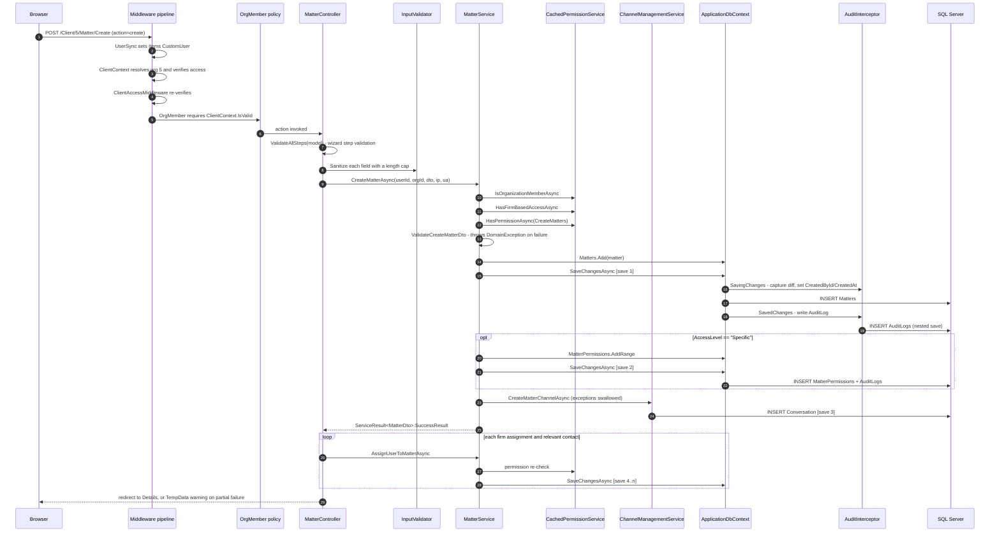
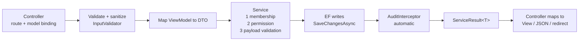

# Module 06 — Workflow: the matter lifecycle

**Time:** 1.5 hours. **Prerequisite:** modules 02, 04, 05.

This is the reference workflow. Once you can narrate it from memory you can read any other feature in
the codebase, because they all follow this shape.

## Objectives

By the end you can:

- Narrate a create-matter request from HTTP POST to `AuditLogs` row without opening the files
- Count the `SaveChanges` calls one creation performs and describe every partial-failure state
- Explain where the DTO boundary, the sanitization boundary, and the permission boundary each sit
- Apply the same trace to a feature you have never seen

## Read this first

1. `Certio.Web/Controllers/MatterController.cs:560-780` — the wizard `POST Create` action
2. `Certio.Application/Services/MatterService.cs:38-158` — `CreateMatterAsync`
3. `Certio.Application/Services/MatterService.cs:160-260` — `UpdateMatterAsync`, for contrast
4. `Certio.Application/DTOs/MatterDTOs.cs` — the three DTO shapes
5. `Certio.Web/Security/InputValidator.cs` — sanitization

---

## The full trace



---

## Stage by stage

### 1. The controller: a server-side wizard

`POST /Client/5/Matter/Create` handles a multi-step form. The same action services `next`,
`previous`, and `create` by switching on an `action` parameter
(`MatterController.cs:~600-651`). Step state lives in `MatterFormViewModel`, round-tripped through
hidden fields.

**Why a server-side wizard — deliberate for this stack.** Nothing in Certio's front end is a SPA
(module 11), so a client-side multi-step form would mean hand-rolling state management in jQuery and
duplicating validation. Posting back per step keeps one validation implementation. The cost is a
round trip per step and a large view model.

Validation is layered: `ValidateAllSteps` re-runs every step's rules at submit time
(`MatterController.cs:653`), which correctly assumes the client can post directly to `create` without
walking the steps.

### 2. Sanitization at the boundary

Every string is passed through `InputValidator.Sanitize(value, maxLength)` before entering the DTO
(`MatterController.cs:669-681`):

```csharp
Title = InputValidator.Sanitize(model.Title, InputValidator.MAX_TITLE_LENGTH),
Description = InputValidator.Sanitize(model.Description, InputValidator.MAX_DESCRIPTION_LENGTH),
Location = InputValidator.Sanitize(model.Location, 300),
```

**Why sanitize in the controller rather than the service — deliberate, with a caveat.** Sanitization is
an input-boundary concern: the Application layer should be able to trust its DTOs. Doing it here keeps
the service free of HTML-escaping knowledge.

The caveat is that it depends on discipline. `MatterService.CreateMatterAsync` does not re-sanitize, so
any other caller — a background job, the agent-action executor, a new API controller — writes whatever
it is given. Since the agent-action executor creates matters and tasks from **LLM-generated payloads**
(module 09), that is a real path. Length caps in particular would be better as domain invariants where
they cannot be bypassed.

### 3. The service: authorize, validate, persist

`MatterService.CreateMatterAsync` (`MatterService.cs:38`) is worth memorizing as the canonical shape:

```csharp
var isOrgMember = await _permissionService.IsOrganizationMemberAsync(userId, organizationId);
var hasFirmAccess = await _permissionService.HasFirmBasedAccessAsync(userId, organizationId);

if (!isOrgMember && !hasFirmAccess)
{
    throw new UnauthorizedOperationException(userId, "create", "Matter", "Not a member of organization");
}

var hasPermission = await _permissionService.HasPermissionAsync(userId, organizationId, Permission.CreateMatters);
if (!hasPermission) { /* log effective permissions, then throw */ }

ValidateCreateMatterDto(createDto);
```

Note the order: **membership, then permission, then payload validation.** Authorization before
validation means a caller who is not allowed to create matters learns nothing about the validity of
their payload. That is the correct sequence and it is not accidental.

Note also that this is the *third* time membership has been checked on this request (middleware, policy,
service). Redundant over HTTP, essential over any other entry point — the same code is reachable from
`AgentActionService` executing an approved AI action, where no middleware ran.

The failure path at `MatterService.cs:64` deserves attention: before throwing, it loads and logs the
user's full effective permission list. Excellent for debugging, and an information-disclosure risk if
logs are broadly readable.

### 4. Persistence, and the transaction that is not there

Three or more separate `SaveChangesAsync` calls, no transaction:

| Save | What | Line |
|---|---|---|
| 1 | the `Matter` row | `MatterService.cs:98` |
| 2 | `MatterPermission` rows, if `AccessLevel == "Specific"` | `MatterService.cs:112` |
| 3 | the matter's `Conversation` channel, inside `ChannelManagementService` | via `MatterService.cs:121` |
| 4..n | one save per `MatterAssignment`, back in the controller | `MatterController.cs:731` |

Plus a nested audit save after each one (module 05). A matter created with three firm assignments and
two contacts issues on the order of **twelve database round trips**.

The failure states are genuinely different in kind:

- **Fails between save 1 and 2** — the matter exists with `AccessLevel = "Specific"` and no permission
  rows. Per `PermissionService.CanAccessMatterAsync` (module 04), it is now visible only to its
  creator. Silent, and it looks like a permissions bug forever after.
- **Fails during save 3** — handled. `MatterService.cs:131-135` catches, logs, and continues, because a
  matter without a chat channel is degraded but usable. This is a *deliberate and correct* choice.
- **Fails during saves 4..n** — partially handled. The controller collects errors and surfaces
  `TempData["WarningMessage"]` (`MatterController.cs:746-749`), telling the user which assignments
  failed so they can retry. Also deliberate.

So two of the three seams were consciously handled and one was not. The unhandled one is the
dangerous one, and it is the one a transaction would fix for free.

**What good would look like:** create the matter and its permission rows in a single `SaveChanges` by
adding both to the change tracker before saving. EF assigns the FK from the tracked `Matter` navigation
property, so no explicit transaction is even needed:

```csharp
var matter = new Matter { /* ... */ };
if (matter.AccessLevel == "Specific" && createDto.PermissionUserIds?.Any() == true)
{
    foreach (var uid in createDto.PermissionUserIds)
        matter.Permissions.Add(new MatterPermission { UserId = uid, GrantedById = userId, GrantedAt = DateTime.UtcNow });
}
_context.Matters.Add(matter);
await _context.SaveChangesAsync();   // one atomic write
```

That is Lab 6.2, and it generalizes: **before reaching for `BeginTransaction`, check whether the writes
can simply share one `SaveChanges`.** Most of the multi-save sequences in this codebase can.

### 5. Auditing, invisibly

`MatterService` injects `IAuditService` and never calls it. The bare comment `// Audit log` sits at
`MatterService.cs:142` where the call used to be. The audit trail is produced entirely by
`AuditInterceptor`, which sees `Matter`, `MatterAssignment`, and `MatterPermission` in its allowlist
and writes a row per change with old/new value JSON.

**Why the interceptor won — deliberate, and the right outcome.** Explicit audit calls are forgettable:
every new write path must remember, and the one that forgets is the one you needed. Moving auditing to
`SaveChanges` makes it structurally unforgettable for the covered types. The cost is the allowlist
(module 05) and the loss of business intent — the interceptor records "Matter 42 Updated,
`Status: Planning -> InProgress`" but cannot record "matter reopened after client appeal," because it
sees rows, not reasons.

The `ip` and `userAgent` parameters threaded through `CreateMatterAsync` are a fossil of the old
approach: they are accepted and never used, because the interceptor reads them from `HttpContext`
itself.

---

## Update and delete, briefly

`UpdateMatterAsync` (`MatterService.cs:160`) follows the same shape with `CanAccessMatterAsync` and
`EditMatters` instead. `DeleteMatterAsync` requires `DeleteMatters` and calls `Remove`, which the
interceptor converts to a soft delete (module 05), which the global query filter then hides. Three
mechanisms cooperating to make "delete" mean "hide" — powerful once you know, mystifying until then.

`MapToMatterDto` (`MatterService.cs:993`) is hand-written and `async`, because it issues additional
queries to populate assignment and permission summaries. Watch for this: **mapping that performs I/O is
an N+1 waiting to happen** when a list endpoint maps 50 matters.

---

## The template

Strip the specifics and you have the shape every feature in this codebase follows. Use it as a reading
guide and as a checklist for new work.



When you add a feature, ask in order: is the org id from `IClientContextAccessor`? Is there a
`Permission` for this operation, and is it checked in the service rather than only the controller? Can
all the writes share one `SaveChanges`? Is the entity in `ShouldAudit`, and if not, does this operation
need a trail?

---

## Check yourself

1. A matter is created with `AccessLevel = "Specific"` and five permission user ids, and the process is
   killed after save 1. Describe the database state, who can see the matter, and how a support engineer
   would diagnose it three weeks later.
2. Why does `CreateMatterAsync` accept `ipAddress` and `userAgent`? Trace where they are used. What
   should happen to them?
3. `ChannelManagementService.CreateMatterChannelAsync` throws. What does the user see? Now suppose
   `MatterPermissions.AddRange` throws instead. Contrast the two, and say whether the difference is
   justified.
4. A new `POST /api/matters` endpoint calls `CreateMatterAsync` directly with a JSON body. Which
   protections from the wizard path does it lose? List them by name.
5. Rewrite saves 1 and 2 as a single atomic write. Which EF feature makes the FK work without an
   explicit transaction?
6. Apply this trace to a feature you have not read: pick `POST /Tasks/Create` and write the equivalent
   sequence diagram. Where does it deviate from the template, and is each deviation defensible?

Labs in [`EXERCISES.md`](EXERCISES.md#module-06).
