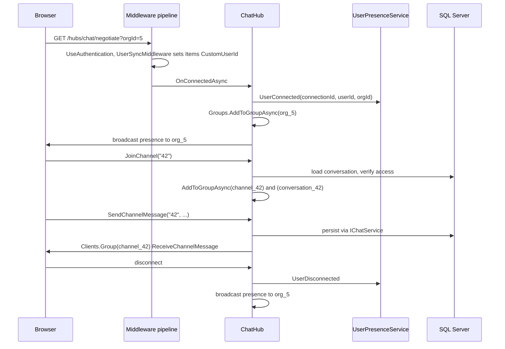
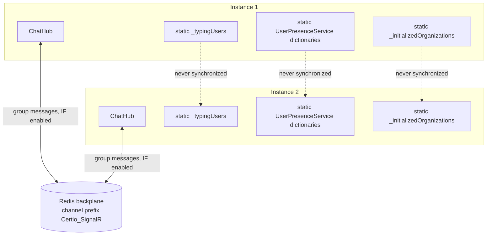

# Module 07 — Workflow: real-time messaging

**Time:** 1.5 hours. **Prerequisite:** modules 02, 04.

## Objectives

By the end you can:

- Name the four hubs, their routes, their group naming schemes, and what each is actually used for
- Explain how a hub authenticates and authorizes a caller, and why the client-supplied user id is safe
- Identify every piece of in-process state that breaks when you run two app instances
- Decide correctly between a hub method and an HTTP endpoint for new work

## Read this first

1. `Certio.Web/Program.cs:702-714` — SignalR registration and the conditional Redis backplane
2. `Certio.Web/Program.cs:962-965` — hub routes
3. `Certio.Web/Hubs/ChatHub.cs:155-218` — `SendMessage`, the model to copy
4. `Certio.Web/Hubs/ChatHub.cs:328-412` — typing indicators and presence
5. `Certio.Web/Services/UserPresenceService.cs:1-20` — three static dictionaries
6. `Certio.Web/Hubs/NotificationHub.cs` — the simplest hub, and the one that validates group joins
7. `Certio.Web/Hubs/UpdatesHub.cs` — read it and notice what is missing

---

## The four hubs

| Hub | Route | Purpose | Group scheme |
|---|---|---|---|
| `ChatHub` | `/hubs/chat` | channels and AI conversations | `conversation_{id}`, `channel_{id}`, `org_{orgId}` |
| `DirectHub` | `/hubs/direct` | one-to-one direct messages | `dm:{threadGuid}` |
| `NotificationHub` | `/hubs/notifications` | toasts, badges, sidebar | `user_{userId}`, `matter_{matterId}`, `org_{orgId}` |
| `UpdatesHub` | `/hubs/updates` | **nothing — the class has no methods** | none |

All four carry `[Authorize]`, so cookie authentication is required to connect. Notice they use
`[Authorize]`, **not** `[Authorize(Policy = "OrgMember")]` — the `OrgMember` policy depends on
`ClientContext`, which `ClientContextMiddleware` builds from the request path or an `/api/` query
parameter. A WebSocket handshake to `/hubs/chat?orgId=5` does not match either pattern, so the policy
could not be satisfied. **Tenancy for hubs is therefore enforced inside each hub method, not by the
pipeline.** That is the key structural difference from HTTP, and the reason the hub code looks more
defensive than controller code.

`UpdatesHub` is an empty authenticated endpoint. Clients connect and it does nothing; real pushes go
through `NotificationHub`. Harmless, but do not spend time looking for its purpose.

---

## Anatomy of a hub method

`ChatHub.SendMessage` (`ChatHub.cs:155`) is the pattern. Read the signature and then the body:

```csharp
public async Task SendMessage(string conversationId, string userId, string userType, string content, string messageType = "Text")
{
    // ...
    var actualUserId = GetCurrentUserId();
    if (!actualUserId.HasValue) { await Clients.Caller.SendAsync("Error", "User not authenticated"); return; }

    var conversation = await _context.Conversations.AsNoTracking()
        .FirstOrDefaultAsync(c => c.Id == conversationIdInt);
    if (conversation == null) { /* Error, return */ }

    var hasAccess = await _chatService.CanUserAccessConversationAsync(
        conversationIdInt, actualUserId.Value, conversation.OrganizationId);
    if (!hasAccess) { /* Error, return */ }

    var resolvedUserType = ResolveUserType(conversation.OrganizationId);
    var message = await _chatService.SendMessageAsync(conversationIdInt, actualUserId.Value, resolvedUserType, content, messageType);

    await Clients.Group($"conversation_{conversationId}").SendAsync("ReceiveMessage", new { /* ... */ });
}
```

**The method accepts `userId` and `userType` from the client and ignores both.** It calls
`GetCurrentUserId()` and `ResolveUserType()` and uses those instead. This is the single most important
security pattern in the hub layer and it is done correctly: the parameters survive for
backward compatibility with older JS callers, while the server derives identity from the authenticated
connection. `SendChannelMessage` (`ChatHub.cs:220`) does the same, including with the `userName`
parameter.

**Why derive rather than trust — deliberate and non-negotiable.** A hub method is a public RPC
endpoint. Anyone with a valid cookie can invoke it from a console with arbitrary arguments. If
`SendMessage` used the passed `userId`, any authenticated user could post as any other user. The
general rule: **in a hub method, every identity fact comes from `Context`, and every authorization
fact comes from a fresh lookup.**

Note also the ordering — resolve the conversation, then check access against *the conversation's own
organization id* rather than a client-supplied one. This is the resolve-then-verify pattern from module
02, applied where no middleware can help.

`GetCurrentUserId()` reads `HttpContext.Items["CustomUserId"]` first and falls back to claims. The
`HttpContext` is available during the SignalR handshake because `UserSyncMiddleware` ran on the
negotiate request, and SignalR keeps a reference to it for the connection's lifetime.

### Connection lifecycle



Note at `ChatHub.cs:122-123` that joining a channel adds the connection to **two** groups,
`channel_{id}` and `conversation_{id}`. A channel is a `Conversation` row with a channel flag, and
different senders broadcast to different group names, so the hub joins both to guarantee delivery. That
is duplicated bookkeeping papering over an unclear domain distinction — a good candidate for
simplification once you understand why it exists.

`NotificationHub` is the one hub that validates group joins against permissions: `JoinMatterGroup` and
`JoinOrganizationGroup` check `IPermissionService` before adding the connection. Without that, a client
could subscribe to `matter_{id}` for a matter it cannot see and receive its notifications.

---

## Scale-out: what breaks with two instances

This is the most useful thing in the module, because the app is deployed to Azure App Service where
scaling out is one slider.



**Group messaging does scale**, conditionally. `Program.cs:702-714` adds
`AddStackExchangeRedis` with channel prefix `Certio_SignalR` — but only when Redis is enabled by the
same condition described in module 00. So `Clients.Group(...)` reaches other instances **only if
`Caching:UseRedis` is true or the connection string points at Azure Redis.** Deploy two instances
without that and users on different instances simply do not see each other's messages. Nothing warns
you; it looks like an intermittent delivery bug.

**Presence does not scale.** `UserPresenceService` holds three `static ConcurrentDictionary` fields
(`UserPresenceService.cs:7-9`) mapping connections to users, users to connections, and users to last-seen
times. It is registered as a singleton (`Program.cs:769`), which is per-process. With two instances the
online-user list is wrong on both, always. The fix is Redis sets keyed by org with TTL-based expiry.

**Typing indicators do not scale and are not thread-safe.** `ChatHub.cs:23`:

```csharp
private static readonly Dictionary<string, HashSet<string>> _typingUsers = new();
```

A plain `Dictionary`, mutated from `StartTyping` and `StopTyping` (`ChatHub.cs:340-371`) with no lock.
Hub methods run concurrently on thread-pool threads, so **concurrent typing events on one instance can
corrupt the dictionary or throw**, and `Dictionary` corruption under concurrent write can produce an
infinite loop inside `Dictionary` internals. This is a genuine bug today on a single instance, not just
a scale-out issue. `ConcurrentDictionary<string, ConcurrentDictionary<string, byte>>` fixes the
immediate problem; Redis with a short TTL fixes it properly, since typing state is inherently ephemeral.

**Channel initialization does not scale.** `ChannelInitializationMiddleware._initializedOrganizations`
(module 02) is another process-local `HashSet`.

The pattern to extract: **anything `static` in a web application is per-instance state, and per-instance
state is a correctness bug the moment you scale out.** Search for `static readonly` in
`Certio.Web/` and you have the scale-out audit for free.

---

## Sharp edges

- **Exception messages are echoed to clients.** `ChatHub.cs:216` sends
  `$"Failed to send message: {ex.Message}"` to the caller. A SQL exception message can carry table and
  column names. Log the detail, send a generic string.
- **`ChatHub` injects `ApplicationDbContext` directly** and queries `Conversations` itself
  (`ChatHub.cs:172`) rather than going through `IChatService`. The layering slip from module 01 reaches
  the hubs too.
- **Hubs bypass `RequestAuditMiddleware` entirely.** Messages are not in the `AuditInterceptor`
  allowlist either (module 05), so **chat and DM traffic produces no audit trail whatsoever.** For a
  product where a disputed change order or a "you approved this" argument is settled by the message
  history, that is a significant gap.
- **`Clients.Group($"conversation_{conversationId}")` uses the raw string parameter**, not the parsed
  int (`ChatHub.cs:194` versus `:159`). `"42"` and `"042"` are different groups. Parse once, use the
  parsed value everywhere.
- **`GetOnlineUsers` requires an org context** (`ChatHub.cs:384-389`) resolved from the query string at
  connect time. A client that connects without `?orgId=` gets an error from this method but works fine
  for everything else — a confusing partial failure.

---

## Choosing a hub method or an HTTP endpoint

The codebase does both for the same operations, which is itself instructive.
`ChatHub.SendChannelMessage` and `POST /api/communications/channels/{channelId}/messages`
(`CommunicationsController`) both send a channel message. The duplication exists because the hub path
gives instant fan-out and the HTTP path is the fallback when the socket is down.

Use a hub method when the operation's *primary* output is a push to other connected clients: messages,
typing, presence, live status. Use HTTP when the operation is a request-response the caller needs a
result from, when it must be idempotent or retryable, or when it needs the middleware pipeline —
`ClientContext`, the `OrgMember` policy, `RequestAuditMiddleware`, anti-forgery. Note that the second
list is exactly the set of protections a hub method gives up, which is why every hub method has to
re-implement authorization by hand.

If you need both, put the logic in a service and have the hub and the controller both call it. That is
what `IChatService` is for, and `ChatHub` mostly honors it.

---

## Check yourself

1. A hostile client calls `SendMessage("5", "999", "Certio", "hello")` where 999 is another user's id.
   What is persisted, and which two lines prevent the impersonation?
2. The app is scaled to two instances with `USE_REDIS` unset. Alice on instance 1 and Bob on instance 2
   are in the same channel. Enumerate what each sees when the other posts, starts typing, and goes
   offline.
3. `_typingUsers` is a plain `Dictionary` mutated from concurrent hub calls. Describe a concrete failure,
   and give both the minimal fix and the correct fix.
4. Compliance asks for a complete record of all client communications for matter 12 in Q3. Can you
   produce it from `AuditLogs`? What would you have to add, and where?
5. A new feature must notify every user assigned to a matter when a document is uploaded. Which hub,
   which group, and what has to be validated before a client is allowed into that group? Cite the
   existing method you would copy.

Labs in [`EXERCISES.md`](EXERCISES.md#module-07).
