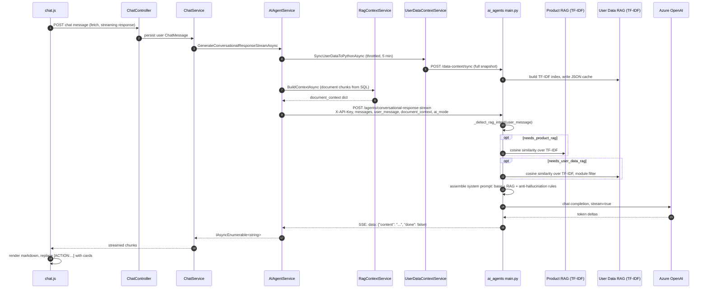
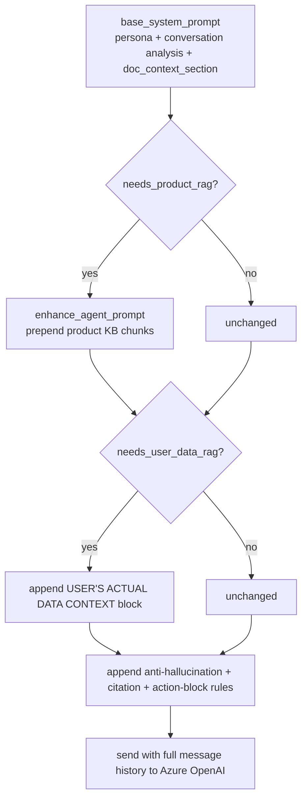
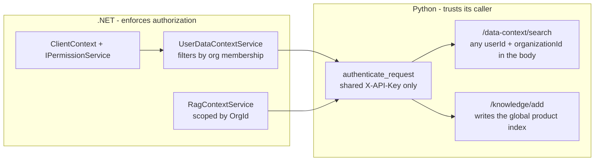

# Module 08 — Workflow: AI chat and the three retrieval systems

**Time:** 2.5 hours. **Prerequisite:** modules 01, 05.

This is the most unconventional subsystem in the codebase and the one where the existing documentation
is least accurate. Read the code, not the docs — including this one.

## Objectives

By the end you can:

- Trace a chat message from the browser through .NET, into Python, to the model, and back as a stream
- Name the three independent retrieval systems, where each stores data, and how each actually ranks
- Explain why nothing in this system computes a semantic embedding, despite the naming
- Describe the trust boundary between .NET and Python, and what Python does not verify
- Find a keyword gate that the events pivot silently broke, and argue for the right fix

## Read this first

Both sides, in this order:

1. `Certio.Application/Services/AIAgentService.cs:185-290` — the SSE streaming client
2. `Certio.Application/Services/AIAgentService.cs:388-463` — `CreateAIRequest`, the wire contract
3. `Certio.Application/Services/UserDataContextService.cs:1-120` — context assembly in C#
4. `ai_agents/main.py:487-556` — authentication and rate limiting
5. `ai_agents/main.py:2354-2600` — the conversational endpoint and prompt assembly
6. `ai_agents/main.py:3471+` — `_detect_rag_intent`
7. `ai_agents/certio_rag_system_enhanced.py:60-80` and `:454-460` — the vectorizer and retrieval
8. `Certio.Application/Services/Documents/VectorStoreService.cs:143-240` — `ComputeScore`

---

## The end-to-end flow



Every arrow is worth knowing. The two that surprise people are the `/data-context/sync` push — .NET
sends the user's *entire* data snapshot to Python before asking a question — and the fact that document
retrieval happens in **.NET**, not Python.

---

## Retrieval system 1: document RAG, in .NET

Documents live in SQL Server. `DocumentIndexerService` splits extracted text into 1,200-character
chunks (`DocumentIndexerService.cs:18`) and writes `DocumentVector` rows. `RagContextService` retrieves
them and `AIAgentService` forwards them as a `document_context` field.

Now read what an "embedding" is here (`DocumentIndexerService.cs:228-238`):

```csharp
private static float[] GeneratePlaceholderEmbedding(string content)
{
    // Placeholder embedding uses deterministic hash-based vector so that similarity search remains stable.
    var vector = new float[8];
    var hash = content.GetHashCode();
    var rng = new Random(hash);
    for (var i = 0; i < vector.Length; i++)
    {
        vector[i] = (float)rng.NextDouble();
    }
    return vector;
}
```

**Eight random floats seeded by the string's hash code.** It carries no semantic information — two
paraphrases of the same sentence get unrelated vectors. And it is never used for retrieval:
`VectorStoreService.SearchAsync` does not read `Embedding` at all. Retrieval is
`ComputeScore` (`VectorStoreService.cs:143-240`), a hand-tuned lexical scorer:

| Signal | Weight |
|---|---|
| token match in document title | 0.95 each, +0.6 for exact title equality |
| token match in chunk text | 0.55 each |
| substring match in chunk (no token match) | 0.4 |
| token match in vector tags | 0.35 each, capped at 0.7 |
| substring match in title | 0.6 |
| token match in category | 0.2 each |

With fallbacks: if fewer than `topK` chunks score above zero, it pads with the most recently modified
(`VectorStoreService.cs:102-121`).

**Verdict — pragmatic, and defensible, but the naming is a real hazard.** For a document library where
users search by file name and exact term — a venue name, a vendor, "Johnson wedding" — BM25-style
lexical matching genuinely competes with embeddings, and it needs no embedding API, no vector index, and
no re-embedding on model change. Title
weighting at 0.95 versus body at 0.55 is a sensible product judgment. The recency fallback means the
assistant always has *something*.

The hazard is that everything is named as if it were semantic: `DocumentVector`,
`Embedding`, `VectorStoreService`, `QueueEmbeddingAsync`, `BackgroundEmbeddingWorker`,
`Document.LastEmbeddedAt`. An engineer told "we do RAG with vector search" will spend a day looking for
the vector index. And the failure mode is invisible: ask "what are my obligations if the counterparty
breaches?" and if the document says "remedies upon default," nothing matches and the fallback returns
the most recently modified chunks — plausible-looking, unrelated context. **Naming that overstates
capability produces silent wrong answers, not loud errors.** Either rename the types or implement real
embeddings; the current state is the worst of both.

## Retrieval system 2: product knowledge, in Python

Static Python data structures — `certio_knowledge_base.py` (641 lines) and
`certio_onboarding_knowledge.py` (1,008 lines) — chunked at import time and indexed with scikit-learn
TF-IDF (`certio_rag_system_enhanced.py:65-72`):

```python
self.vectorizer = TfidfVectorizer(
    max_features=1500,
    stop_words='english',
    ngram_range=(1, 3),
    min_df=1,
    max_df=0.9
)
```

Retrieval is genuine cosine similarity over sparse TF-IDF vectors
(`certio_rag_system_enhanced.py:454-458`), plus heuristic boosts for priority, category, user type, and
feature. Top-k is 5 by default, 8 for how-to questions, 10 for onboarding.

Two things to know. First, this index is **in-memory and global** — no org scoping, correct since it is
product documentation, but note that `POST /knowledge/add` writes into the same shared index at runtime,
so any caller with the API key can inject content into every user's prompts, and it vanishes on restart.

Second, and more important: **this knowledge base still describes an event-planning product.** The base
system prompt at `main.py:2487` reads:

> `You are Notal AI, an advanced assistant for event planners and vendors.`

So when product RAG activates, the assistant answers as a confident expert on the wrong product. This is
the concrete cost of the incomplete rename from module 00, and it is the single highest-value fix in the
AI subsystem.

## Retrieval system 3: user data, pushed from .NET to Python

`UserDataContextService` (1,068 lines) queries SQL for the user's matters, tasks, calendar,
communications, clients, teams, and documents, formats each entity into a text chunk, and POSTs the
whole snapshot to `/data-context/sync`. Python rebuilds a per-user TF-IDF index and persists it to
`ai_agents/data/user_data_cache/user_{userId}_org_{orgId}.json`.

The committed sample (`user_1_org_1.json`) shows the shape: `total_chunks: 140`, `module_summaries` per
module, and a `chunks` array where each entry has `module_name`, `entity_type`, `entity_id`, `title`, a
formatted `content` block, and `metadata`. Embeddings are not persisted; they are rebuilt on load.

Freshness is a 5-minute throttle on the .NET side (`AIAgentService.cs:33-34`):

```csharp
private readonly ConcurrentDictionary<string, DateTime> _userDataSyncCache = new();
private static readonly TimeSpan UserDataSyncInterval = TimeSpan.FromMinutes(5);
```

**Why push the whole snapshot instead of letting Python query the database — deliberate, and correct.**
Giving the Python service database credentials would put a second writer on the schema, duplicate the
entire permission model in Python, and couple deployments. Pushing a pre-authorized snapshot means
**permission filtering happens exactly once, in C#, where the permission model lives.** That is the right
boundary.

The costs are real and worth naming. Data is up to five minutes stale, so "what tasks did I just
create?" can legitimately answer wrong. The throttle dictionary is per-process, so N instances mean N
syncs. Snapshots are full, not incremental, so a user with thousands of records ships a large payload
every five minutes. And the JSON cache on the Python container's disk is **unencrypted client data at
rest outside the database** — on Azure App Service that is ephemeral storage, but it is still a copy of
confidential client content — guest lists, budgets, vendor contracts — sitting outside every access
control the .NET app implements. That deserves a threat-model conversation, not a shrug.

### RAG activation is gated

Not every message triggers retrieval. `_detect_rag_intent` (`main.py:3471`) classifies the message and
returns `needs_product_rag`, `needs_user_data_rag`, `user_data_modules`, `top_k`, and a `reason`. The
call site (`main.py:2515-2553`) then activates each pipeline independently.

**Why gate — deliberate and well judged.** Greetings and small talk do not need retrieval, and skipping
it removes two similarity searches and thousands of prompt tokens from the hot path. Note that the
module filter is passed through to narrow the user-data search rather than searching everything. This is
the most thoughtfully engineered part of the AI subsystem.

The cost is that intent detection is keyword-based, so it is another silent-failure surface: a data
question phrased unusually skips user-data RAG and the model answers from general knowledge — fluently
and wrongly. The anti-hallucination block bolted onto the prompt at `main.py:2556-2569` ("you MUST use
ONLY that exact data", "DO NOT invent") is the mitigation, and prompt instructions are a weak
substitute for having supplied the right context.

### The pivot broke a keyword gate, and nobody would notice

There is a second, coarser gate in C#, and it is the clearest example in the codebase of why a domain
pivot needs a behavioral inventory rather than a find-and-replace.

`ChatService.SendMessageAsync` fires background AI processing (`ChatService.cs:306-308`), which calls
`AIBackgroundService.ProcessAIAgentsAsync`. That method refuses to run unless
`ShouldProcessAIAgents` passes, and one of its conditions is `HasLegalContent`
(`AIBackgroundService.cs:219-236`):

```csharp
var legalKeywords = new[]
{
    "contract", "agreement", "legal", "law", "lawyer", "attorney", "court", "lawsuit",
    // ... 46 total: litigation, patent, trademark, arbitration, indemnification ...
};
var allContent = string.Join(" ", messages.Select(m => m.Content)).ToLower();
return legalKeywords.Any(keyword => allContent.Contains(keyword));
```

**Forty-six legal keywords, and not one events keyword.** No venue, catering, guest, vendor, florist,
run-of-show, seating, or rehearsal. So a conversation like *"Can we move the ceremony to 4pm? The florist
needs loading dock access by noon and the seating chart still needs sign-off"* scores zero and **AI
processing is silently skipped** — no summary, no goal extraction, no reply suggestion. It logs "no legal
content detected" at `LogInformation` level (`AIBackgroundService.cs:166`) and returns.

Compare the Python side, which was pivoted: `_count_legal_terms` there searches for `venue`, `catering`,
`permit`, `vendor`, `deposit`, `cancellation` (`ai_agents/main.py:929-933`), and `legal_areas` is
actually `["Weddings", "Corporate Events", "Galas and Fundraisers", "Conferences and Conventions", ...]`
(`main.py:976-979`). **Someone updated the Python keyword lists and missed the C# one**, which is exactly
the failure mode you would predict: the Python file has "legal" in the identifier names, so it turned up
in a search; the C# method is a private helper on a service whose name gives no hint it encodes domain
vocabulary.

Three things make this worth studying rather than just fixing:

- **The failure is silent and looks like a product decision.** Users experience "the AI doesn't summarize
  our conversations," which reads as a missing feature rather than a bug.
- **It partially works, which is worse.** `contract`, `agreement`, `compliance`, `liability`, `rental`,
  and `business` are in the list and do occur in event planning, so the feature fires for
  vendor-contract discussions and stays dark for operational ones. Intermittent behavior is much harder
  to diagnose than a total outage. The matching is also `Contains` on the concatenated text rather than
  whole-word, so `"law"` matches *lawn* and `"trial"` matches *industrial* — a garden-ceremony thread can
  pass the gate by accident. Whatever this check is measuring, it is not "is this conversation
  substantive."
- **The gate is arguably wrong in kind, not just in content.** Swapping in event keywords keeps a
  brittle allowlist. Since the other two conditions (three or more meaningful messages, not a greeting,
  not processed in the last five minutes) already filter noise, the honest fix is probably to delete
  `HasLegalContent` entirely and accept a slightly higher processing rate. Ask whether the keyword gate
  was ever earning its cost.

There is a subtlety worth catching: `AIBackgroundService` is registered as a singleton rather than a
hosted service, so its `ExecuteAsync` never runs (module 12). But `ProcessAIAgentsAsync` is called
directly by `ChatService`, so **this code path is live** despite the misregistration. Two unrelated
defects in one class, and neither masks the other.

---

## The prompt

Assembled in layers (`main.py:2487-2569`):



Note the emoji-prefixed rule headers in the prompt text itself. Since the model never sees the
`.cursorrules` file, these are functional prompt tokens rather than a style violation — but they are also
a reminder that this prompt has been iterated by trial and error rather than designed.

## Provider selection and streaming

`create_openai_client()` (`main.py:85-106`) picks Azure OpenAI when `AZURE_OPENAI_ENDPOINT` and
`AZURE_OPENAI_API_KEY` are both set, otherwise plain OpenAI, both with `max_retries=0` so retry policy
stays in application code. `get_model_name()` (`main.py:397`) maps a `ModelType` enum to Azure
deployment names from environment variables with fallbacks to cheaper models.

GPT-5.1 and 5.2 use a **separate Azure resource and the Responses API**, called through raw `httpx`
rather than the SDK (`main.py:108-122`, `152-395`). So there are three streaming code paths: the
OpenAI SDK stream, a raw httpx Chat Completions stream, and the Responses API stream. There is a
fallback at `main.py:3280-3313` that retries non-streaming when a stream yields empty content.

Model tier can be requested per message via `ai_model_tier` (`main.py:2768-2798`), accepting
`GPT4oMini`, `GPT4o`, `GPT5`, `GPT51`, `GPT52`, the legacy `Basic`/`Intermediate`/`Advanced`/`Premium`
names, or `Auto` for complexity-based selection.

**Anthropic and Google are in `requirements.txt` and are never imported.** So are LangChain, torch,
transformers, spacy, nltk, redis, and sqlalchemy. Production builds from
`requirements-minimal.txt` (`ai_agents/Dockerfile:11-12`), so the bloat costs local install time rather
than image size — but it is why people believe this service uses LangChain and multiple providers. It
uses neither.

### Streaming on the .NET side

`AIAgentService.GenerateConversationalResponseStreamAsync` (`AIAgentService.cs:185`) sends with
`HttpCompletionOption.ResponseHeadersRead` — essential, or `HttpClient` would buffer the whole response
and defeat streaming — then reads lines, strips the `data: ` prefix, deserializes each into a
`StreamChunk`, and yields `Content`.

Two details worth copying. Malformed JSON in a chunk is caught and skipped rather than aborting the
stream (`AIAgentService.cs:264`), which is right for a best-effort text stream. And because C# forbids
`yield return` inside a `try/catch`, the connection setup is a separate `try` that sets a
`connectionFailed` flag, checked afterwards to yield `GenerateFallbackResponse(userMessage)`
(`AIAgentService.cs:242-247`). That is the standard idiom for the constraint and worth recognizing.

Elsewhere the service calls `EnsureSuccessStatusCode()` and, on exception, returns an empty default
object. So **an AI service outage looks like an empty summary rather than an error**, and the caller
cannot tell "no key points found" from "the service is down."

---

## The trust boundary



Python authentication is a single shared secret (`main.py:525-547`): `X-API-Key` or
`Authorization: Bearer`, compared with `secrets.compare_digest`, plus a per-key-and-IP rate limit
(default 60/minute). It returns 503 if `AI_API_KEY` is unset — fail-closed, good.

But **there is no authorization.** Any holder of that one key can call
`POST /data-context/search` with an arbitrary `userId` and `organizationId` and read whatever is cached
for that user. There is no notion of which caller is entitled to which tenant.

**Why — deliberate, and acceptable only under an assumption that must be stated.** The Python service is
designed as a trusted internal component: authorization is .NET's job, and re-implementing the
permission model in Python would duplicate the most security-critical code in the product across two
languages and two deployments. That is a sound argument. It is sound *only if the service is never
reachable from outside the trust boundary*, and today nothing in the repository enforces that. There is
no VNet integration, no IP allowlist, and both Azure Web Apps are internet-facing by default. The key
lives in `.env`, which is committed to the repository.

So the honest statement is: **the security of all AI-cached client data rests on one shared secret in a
committed file.** The fix does not require reimplementing permissions — network isolation plus rotating
the key out of source control closes most of it. Note also that `GET /health` is unauthenticated and
reports the agent list and rate-limiter state.

---

## Sharp edges

- **`ai_agents/main.py` is 4,283 lines** with 30-plus routes, no router modules, no lifespan handler, no
  CORS middleware, and one test file covering authentication only.
- **Python identifiers still say "legal" where the data says "events."** `legal_areas` holds
  `["Weddings", "Corporate Events", "Galas and Fundraisers", ...]` and `_count_legal_terms` counts venue
  and catering terms. Harmless at runtime, but it means grepping for `legal` in Python finds pivoted code
  and grepping in C# finds unpivoted code — the opposite of what you would assume.
- **The conversational endpoints take raw `dict`, not a Pydantic model** (`main.py:2354`), so there is no
  request validation on the highest-traffic endpoint despite Pydantic models existing for the others.
- **`BackgroundAgentManager` is instantiated and never started.** `main.py:549-555` creates it;
  `.start()` is never called. Tasks submitted to `/background-agents/submit-task` are queued and never
  run.
- **`cost_analytics.py` (435 lines) is superseded** by `simplified_cost_optimization.py` and is not
  wired in. Cost figures are *estimated at model-selection time*, not read from API responses, so they
  drift from the actual bill.
- **No cross-request conversation cache in Python.** Full message history is re-sent every turn, and the
  history is re-tokenized on every request. `IntelligentContextManager` exists to compress it but is only
  reachable through the `/context/optimize` analytics endpoint.
- **The document-context payload embeds full extracted text** as a `documentContents` JSON string
  (`AIAgentService.cs:466-540`), so a large document can dominate the token budget with no truncation
  policy visible on the .NET side.

---

## Check yourself

1. A user asks "summarize the indemnification clause in the Vendor MSA." Trace the retrieval. Which of
   the three systems can find it, and what happens if the document says "hold harmless" instead?
2. `DocumentVector.Embedding` exists and is populated. Prove from the code that it is never used in
   search, and name the two files you used.
3. A user creates a task and immediately asks "what tasks do I have?" The new task is missing. Give the
   exact reason and the two lines that cause it. Now propose a fix that does not remove the throttle.
4. Someone obtains `AI_API_KEY`. Enumerate exactly what they can read and write, endpoint by endpoint.
   Which single change removes most of that exposure without touching the Python code?
5. Product RAG activates for a question about event deadlines. What persona does the model adopt, and
   which line sets it? What is the user-visible consequence?
6. Two planners exchange eight messages about a venue walkthrough and get no AI summary. A different pair
   discussing a catering *contract* does. Explain the difference, cite the method, and decide whether you
   would extend the keyword list or delete the gate — defend the choice using the other two conditions in
   `ShouldProcessAIAgents`.
7. Design real embeddings for document search: which provider call, where in the pipeline, what schema
   change, what happens to the 8-float column, and how do you re-index existing documents?

Labs in [`EXERCISES.md`](EXERCISES.md#module-08).
