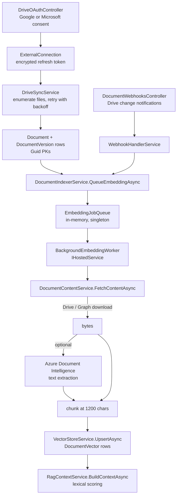
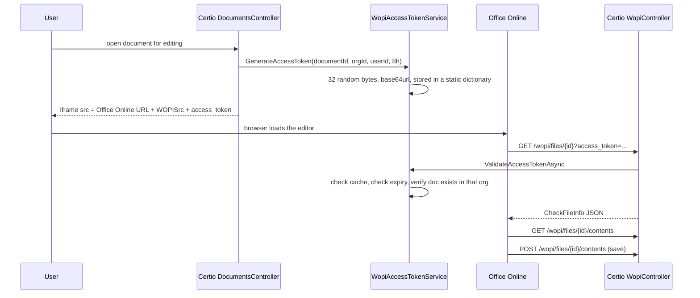

# Module 10 — Documents and external integrations

**Time:** 2 hours. **Prerequisite:** modules 05, 08.

## Objectives

By the end you can:

- Follow a Google Drive file from OAuth consent to an indexed, searchable chunk
- Explain the `int` to `Guid` seam and the deterministic GUID that bridges it
- Explain WOPI: what it is, how tokens work here, and why editing breaks on scale-out
- Describe the resilience patterns actually present, and where they are missing

## Read this first

1. `Certio.Application/Services/Documents/DriveSyncService.cs:431-559` — the retry loop, the best example in the repo
2. `Certio.Application/Services/Documents/DocumentContentService.cs:1-120` — provider dispatch and rate limiting
3. `Certio.Application/Services/Documents/DocumentIndexerService.cs` — all 207 lines
4. `Certio.Application/Services/Documents/WopiAccessTokenService.cs` — all 128 lines
5. `Certio.Domain/Identity/DeterministicGuid.cs` — the `int`/`Guid` bridge, all 52 lines
6. `Certio.Web/Controllers/WopiController.cs` — `[AllowAnonymous]`, and why that is correct

---

## The document pipeline



### 1. OAuth and token storage

`DriveOAuthController` (979 lines) and `EmailOAuthController` (702 lines) run the consent flows.
Refresh tokens land in `ExternalConnection` rows, encrypted. Notice how the encryption is wired:
`DocumentContentService` takes **token encrypt and decrypt delegates as constructor parameters** rather
than an interface. That keeps the Application layer independent of ASP.NET Data Protection, which lives
in the Web project — an unusual but legitimate way to invert a dependency without declaring an
abstraction. It is also harder to discover: you have to read `Program.cs` to learn what the delegates do.

**The OAuth flow itself is one of the best-implemented things in the codebase**, and it is worth reading
as a counterweight to the sharp edges elsewhere. The callback is `[AllowAnonymous]`
(`DriveOAuthController.cs:121`) with an honest comment explaining why — and the reason is subtle. The
auth cookie is `SameSite=Strict` in production (`Program.cs:575`), so on a top-level redirect back from
`accounts.google.com` the browser will **not** send it. A naive implementation puts `[Authorize]` on the
callback and mysteriously fails in production while working in development, where the cookie is `Lax`.

Instead, identity travels in the OAuth `state` parameter, encrypted and signed with ASP.NET Data
Protection under a purpose string (`DriveOAuthController.cs:532-548`):

```csharp
private string ProtectState(OAuthStatePayload payload)
{
    var protector = _dataProtectionProvider.CreateProtector("DriveOAuthState");
    var json = JsonSerializer.Serialize(payload);
    return protector.Protect(json);
}
```

That is exactly right: the state is tamper-proof, so a user cannot rewrite it to bind their Google
tokens to another organization, and it is purpose-scoped so a state blob cannot be swapped for a token
blob (`"DriveOAuthTokens"` is a separate protector). One gap: the payload carries `IssuedAtUtc` but
`UnprotectState` never checks it, so a protected state is replayable until the Data Protection keys
rotate. Adding a five-minute expiry check is a two-line fix.

Token refresh is inline in `DocumentContentService` and `CalendarSyncService`, POSTing to
`oauth2.googleapis.com/token` or `login.microsoftonline.com` and throwing
`InvalidOperationException` on failure. There is no shared token-refresh component, so the logic is
duplicated across the document, calendar, and email integrations — three copies to fix when a provider
changes its contract.

### 2. Sync, with the codebase's best retry logic

`DriveSyncService.UpsertMetadataAsync` (`DriveSyncService.cs:431-559`) implements **five attempts with
exponential backoff**. This is the only place in the .NET code with a real retry policy, and it is
worth reading closely because it is the pattern the rest of the integrations should adopt.

**Why hand-rolled instead of Polly — pragmatic.** Polly is not referenced anywhere in the solution.
One bespoke loop is cheaper than a new dependency; five bespoke loops would not be. Since only one
exists, the decision has not yet cost anything — but the absence of retry on the *other* external calls
is the more interesting fact. Calendar sync, Graph download, and the AI service calls have none, so a
single transient 503 surfaces as a user-visible failure.

`DriveSyncService` also takes `IServiceScopeFactory`, which is the correct pattern for a service that
may fan out work across scopes.

### 3. Content extraction with concurrency control

`DocumentContentService.FetchContentAsync` switches on `DocumentSourceType` — `GoogleDrive`,
`OneDrive`, `InternalUpload` — downloads the bytes, and optionally sends them to **Azure Document
Intelligence** for text extraction from PDFs and images.

Two resilience details worth copying:

- **`SemaphoreSlim(2)`** caps concurrent Azure Document Intelligence calls at two
  (`DocumentContentService.cs:36-41`). Azure DI has strict rate limits and per-page pricing; an
  unbounded fan-out from the background worker would trip both.
- **A static rate-limit gate.** On a 429 the service records `_rateLimitedUntil` from the `Retry-After`
  header and short-circuits subsequent calls until it passes (`DocumentContentService.cs:676-691`).
  This is a **circuit breaker** in miniature, and it is the right instinct: stop calling a service that
  told you to stop.

Both pieces of state are `static`, so they are per-process (module 07's theme again). With N instances
you get 2N concurrent calls and N independent circuit breakers.

Failures return an empty `DocumentContentResult` with a status string rather than throwing, so an
extraction failure degrades to "no content" and the document is still listed, just not searchable.
Deliberate and reasonable, but it means a systematically failing extractor is invisible without
monitoring `Document.LastEmbeddedAt`.

### 4. Queue and worker

`IEmbeddingJobQueue`/`EmbeddingJobQueue` is registered as a singleton (`Program.cs:876`) and
`BackgroundEmbeddingWorker` as a hosted service (`Program.cs:877`).

**Why a background queue — deliberate and correct.** Extraction plus Azure DI on a 200-page PDF takes
tens of seconds. Doing that in the request would time out the upload. Queueing returns immediately and
the document becomes searchable when indexing completes.

**The queue is in memory.** A restart, a deploy, or an Azure App Service instance recycle drops every
queued job silently. Documents stay un-indexed with no retry and no dead-letter, and the only signal is
`Document.LastEmbeddedAt` remaining null. A durable queue (Azure Storage Queue, Service Bus, or even a
`PendingEmbeddings` table polled by the worker) is a small change with a large reliability payoff, and
the table version needs no new infrastructure. That is Lab 10.2.

### 5. Indexing

Chunking is fixed-size at 1,200 characters (`DocumentIndexerService.cs:18`) with no sentence or
paragraph awareness, so chunks split mid-sentence. Combined with lexical retrieval (module 08), a phrase
spanning a boundary is unfindable. Semantic chunking — split on paragraphs, overlap by a sentence —
would help both retrieval styles and costs nothing at query time.

Note the honest comment at `DocumentIndexerService.cs:133`:

```csharp
// Skip audit logging - Guid UserId doesn't match int-based Users table FK constraint
// Embedding operations are tracked via Document.LastEmbeddedAt timestamp
```

A real feature was dropped because of the ID-type seam. That is what a schema inconsistency costs
eighteen months later.

---

## The `int` to `Guid` seam

`Document.OrgId` and `Document.MatterId` are `Guid`. `Organization.Id` and `Matter.Id` are `int`. There
is no foreign key. The bridge is a deterministic hash. As found, it was
`AIAgentService.CreateDeterministicGuid` (since moved — see the update at the end of this section):

```csharp
private static Guid CreateDeterministicGuid(string namespacePrefix, int value)
{
    using var sha256 = SHA256.Create();
    var hash = sha256.ComputeHash(Encoding.UTF8.GetBytes($"{namespacePrefix}:{value.ToString(CultureInfo.InvariantCulture)}"));
    Span<byte> guidBytes = stackalloc byte[16];
    hash.AsSpan(0, 16).CopyTo(guidBytes);
    guidBytes[6] = (byte)((guidBytes[6] & 0x0F) | 0x40); // Version 4
    guidBytes[8] = (byte)((guidBytes[8] & 0x3F) | 0x80); // Variant RFC 4122
    return new Guid(guidBytes);
}
```

Called with namespaces `"certio:organization"`, `"certio:user"`, and `"certio:matter"`
(`AIAgentService.cs:529-533`). This is essentially UUIDv5 — a namespaced hash producing a stable,
collision-resistant GUID for any int. The implementation is careful: it sets the version and variant
bits correctly so the result is a well-formed RFC 4122 GUID.

**Why — pragmatic damage control, and genuinely clever.** Given that the documents subsystem already
shipped with `Guid` tenancy, the choices were a migration converting `Document.OrgId` to `int` (touching
`DocumentVector`, `DocumentPermission`, `RagQuery`, `RagCacheEntry`, `ExternalConnection`, and every
Guid-keyed row in production) or a deterministic mapping. The mapping is reversible in the sense that it
always produces the same GUID for the same int, which is all the code needs.

The costs are permanent as long as the seam exists:

- **No referential integrity.** Nothing prevents a `Document` with an `OrgId` matching no organization.
- **The function is not invertible.** Given a document you cannot recover its integer org id, so you
  cannot join documents to organizations in SQL, in a report, or in a debugging session.
- **It lived in the wrong class, and had been copy-pasted six times.** *(Fixed — see below.)* A
  cross-cutting identity mapping was a `private static` method on the AI service, so every other caller
  reimplemented it. Line numbers are the pre-consolidation locations, so use git history to see them:

  | File | Line (before the fix) |
  |---|---|
  | Certio.Application/Services/AIAgentService.cs | 974 |
  | Certio.Application/Services/UserDataContextService.cs | 761 |
  | Certio.Web/Controllers/ClientController.cs | 2034 |
  | Certio.Web/Controllers/DocumentsController.cs | 809 |
  | Certio.Web/Controllers/DocumentsApiController.cs | 1250 |
  | Certio.Web/Controllers/Api/DriveOAuthController.cs | 435 |

  Six copies of a hash function that had to agree **byte for byte** across the whole system, because if
  any one of them changed its namespace string, its hash algorithm, or its byte-slicing, that call site
  silently starts producing different GUIDs — and the symptom is not an exception, it is documents
  quietly disappearing from search results for one tenant.
- **It quietly dropped a feature** (the audit call above).

If you fix one schema thing, this is the one. The mapping is a *bridge over* the problem, not a solution
to it.

### Update: the duplication has been removed

The six copies are now one class, `Certio.Domain.Identity.DeterministicGuid`, with named helpers
(`ForOrganization`, `ForUser`, `ForMatter`) so a caller cannot mistype a namespace prefix and get a GUID
that matches nothing. Study the original state above anyway, because the interesting part is not the
extraction — it is what made the extraction risky.

This function's output is already sitting in the `Documents` tables. That makes it part of the storage
format, not an implementation detail, and it changes what "equivalent" has to mean: not "produces
well-formed GUIDs" but "produces *these exact* GUIDs". A wrong answer does not throw. It returns a GUID
that matches no rows, so a tenant's documents silently disappear — the same failure mode the duplication
threatened, arriving instead through the cleanup meant to prevent it.

So the copies had to be compared for byte-level equivalence before consolidating, not just read for
intent. They differed cosmetically — some called `value.ToString(CultureInfo.InvariantCulture)`, others
interpolated the int directly — which for an invariant-culture integer is the same string, but that is a
fact you have to establish rather than assume. `DeterministicGuidTests` then pins seven known outputs
whose expected values were computed independently of the C# code, so the test constrains the format
instead of restating the implementation.

Two things this did **not** fix: there is still no referential integrity, and the mapping is still not
invertible. Consolidation removed the risk of the copies *diverging*; the seam itself is Tier 3 item 20 in
[module 14](14-design-critique.md), and closing it means migrating production rows.

---

## WOPI

WOPI (Web Application Open Platform Interface) is the protocol Office Online uses to edit a document
hosted by someone else. Certio acts as the **WOPI host**: Office Online calls back into Certio to fetch
and save file contents.



`WopiController` is `[AllowAnonymous]`, and that is **correct**: the caller is Microsoft's server, not
the user's browser, so it carries no Certio cookie. Authentication is the bearer-style `access_token`
instead. This is the one place in the app where `[AllowAnonymous]` on a data endpoint is the right
answer, and it is worth understanding why so you can recognize the legitimate case.

Token generation (`WopiAccessTokenService.cs:26-56`) is done properly: 32 bytes from
`RandomNumberGenerator`, base64url-encoded, 8-hour default expiry. Validation
(`:58-93`) checks the cache, checks expiry, removes expired tokens, and then **verifies the document
still exists in the token's organization and is not deleted** — so a token cannot outlive the
authorization it represents.

The problem is where tokens live (`WopiAccessTokenService.cs:18`):

```csharp
private static readonly ConcurrentDictionary<string, WopiAccessTokenInfo> _tokenCache = new();
```

In-process. Three consequences:

- **A restart or deploy invalidates every open editing session.** The user loses the editor mid-document.
- **Scale-out breaks editing entirely and intermittently.** The token is minted on instance A; Office
  Online's callback load-balances to instance B, which has never seen it, and returns null. The
  user-visible symptom is "editing works sometimes."
- **`CleanupExpiredTokens()` exists and nothing calls it.** No hosted service, no timer. Expired entries
  are only removed lazily when someone presents them, so the dictionary grows for the lifetime of the
  process — a slow memory leak proportional to editing volume.

Moving the token to `IDistributedCache` fixes all three at once and matches what the codebase already
does for 2FA sessions via `DistributedTwoFactorSessionStore`. **The pattern already exists in the
repository; this service just did not use it.** That is Lab 10.3.

`WopiDiscoveryService` fetches Office Online's discovery XML with a 10-second timeout and caches it for
24 hours, falling back to the local `discovery.xml` at the repo root (219 KB) — which is why that file
is not junk.

---

## The integration inventory

| Integration | Service | Auth | Retry | On failure |
|---|---|---|---|---|
| Google Drive | `DriveSyncService`, `DocumentContentService` | OAuth refresh token | 5 attempts, backoff (sync only) | log, throw |
| OneDrive / Graph | same | OAuth refresh token | sync only | status-based exception |
| Google Calendar | `CalendarSyncService` | OAuth refresh token | none | log warning |
| Outlook Calendar | `CalendarSyncService` | OAuth refresh token | none | log warning |
| Gmail / Outlook mail | `EmailService`, `EmailSyncService` | OAuth refresh token | none | log |
| SMTP | `EmailSendingService` (MailKit) | credentials | none | log |
| Azure Document Intelligence | `DocumentContentService` | API key | semaphore + 429 gate | empty result |
| Azure OpenAI | Python only | API key | backoff in Python | fallback text |
| Office Online | `WopiController`, `WopiDiscoveryService` | WOPI access token | 24h discovery cache | null |
| Python AI service | `AIAgentService` | shared `X-API-Key` | none | default objects |

Two patterns to take away. **Webhooks are authenticated by shared secret**, validated in
`EmailWebhookController` (which is one of only three files with real tests, at 259 lines) and
`DocumentWebhooksController`, with the secrets required at startup in production
(`Program.cs:63-74`) — fail-fast, correct. And **inbound and outbound integrations degrade
differently**: outbound failures return empty results and log, inbound failures reject the request.
That asymmetry is right, but it means outbound integration health is invisible without deliberate
monitoring, and there is none.

---

## Sharp edges

- **`FileStorageService` has an `UseAzureBlobStorage` option and a blob connection string, but writes to
  a local path.** On Azure App Service that path is ephemeral: internally uploaded documents do not
  survive a restart or a swap.
- **`WebhookHandlerService` is 66 lines** and re-queues embedding on a change notification with no
  deduplication. A noisy Drive folder can queue the same document repeatedly.
- **`RagContextService` caches query results in a database table** (`RagCacheEntry`) rather than in
  Redis — a durable cache with none of Redis's expiry machinery, so entries need manual cleanup.
- **`DocumentPermission.UserId` is a `Guid`** while `Users.Id` is an `int`, so document-level permissions
  cannot be joined to users either.
- **`DocumentsApiController` is 1,275 lines** and mixes search, sync, embed, status, and index
  operations. It is the place to start if you want to understand the document surface, and the place to
  split first.

---

## Check yourself

1. A user uploads a 40 MB scanned PDF, then the app is redeployed 20 seconds later. What is the state of
   that document, and what will the user experience when they search for its contents next week?
2. `Document.OrgId` is a `Guid` and `Organization.Id` is an `int`. Given only a `Document` row, can you
   determine its organization? Explain using `CreateDeterministicGuid`.
3. A user is editing a spreadsheet in Office Online when the app scales from one instance to two. What
   happens, when, and what does the user see? Which single line is responsible?
4. Why is `[AllowAnonymous]` correct on `WopiController` but wrong on `DocumentsApiController`? State the
   general principle.
5. Azure Document Intelligence starts returning 429. Trace the behavior across the next 50 documents.
   Which two mechanisms limit the damage, and what breaks about them at three instances?
6. `CleanupExpiredTokens()` has no callers. Write the smallest change that runs it correctly, then argue
   whether that is the right fix or a distraction from the real one.

Labs in [`EXERCISES.md`](EXERCISES.md#module-10).
