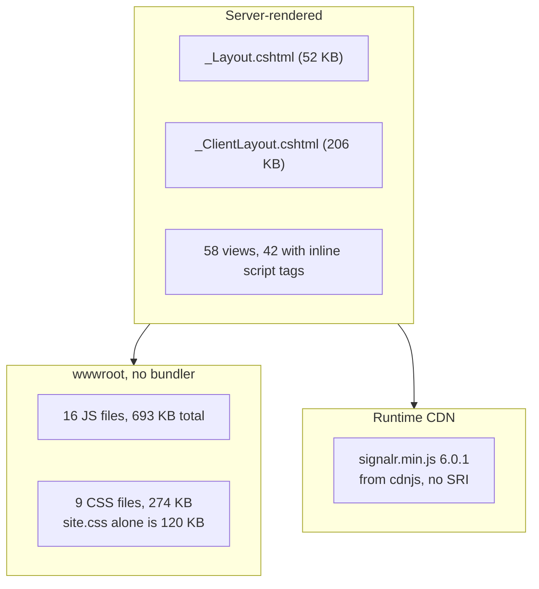

# Module 11 — The front end

**Time:** 2 hours. **Prerequisite:** module 02.

## Objectives

By the end you can:

- Explain what the front end actually is: server-rendered Razor plus vanilla JS, no build step
- Find and read the 466-line navigation system that is disabled by one hardcoded `false`
- Assess the XSS posture honestly: 148 `innerHTML` writes, 8 duplicate escapers, no CSP
- Decide what you would change first, and defend it

## Read this first

1. `Certio.Web/wwwroot/js/page-navigation.js:6-9` — read these four lines before anything else
2. `Certio.Web/Views/Shared/_ClientLayout.cshtml` — skim the structure, note the length
3. `Certio.Web/wwwroot/js/chat.js` — skim; this is the largest file in the front end
4. Search the whole repo for `Content-Security-Policy`. Note what you find.

---

## The inventory

There is **no build step**. No `package.json`, no `libman.json`, no webpack, no vite, no
`wwwroot/lib`. Every script is hand-written ES5/ES6 loaded with a `<script>` tag, and the only
third-party dependency is fetched from a CDN at runtime.



| File | Size | Role |
|---|---|---|
| `chat.js` | 122 KB | AI chat, streaming, action-card rendering |
| `agent-actions.js` | 97 KB | parse and render `[ACTION:...]` blocks, call the API |
| `email-integration.js` | 77 KB | mailbox UI |
| `communications-sidebar.js` | 77 KB | messaging panel |
| `billing.js` | 73 KB | time entries and invoices |
| `tasks.js` | 54 KB | task board |
| `page-navigation.js` | 15 KB | **disabled** |

And on the Razor side, paths relative to `Certio.Web/`:

| View | Size |
|---|---|
| `Views/Matter/_MatterTasks.cshtml` | 347 KB |
| `Views/Tasks/Index.cshtml` | 342 KB |
| `Views/Shared/_ClientLayout.cshtml` | 206 KB |
| `Views/Matter/Details.cshtml` | 200 KB |
| `Views/Client/Dashboard_Old.cshtml` | 152 KB |

**A 347 KB Razor partial** is the single most striking number in this codebase. For scale, that is larger
than `Program.cs`, `ApplicationDbContext.cs`, and `User.cs` combined. It is markup, inline CSS, and
inline JavaScript in one file, and it is a *partial* — meaning it is included into an already-large parent
view. No editor outline helps you here; no reviewer can meaningfully diff it.

**Why no build step — pragmatic, and defensible longer than you would guess.** A build step means Node in
CI, a lockfile to audit, and a source-map story. For a server-rendered MVC app, `<script src>` genuinely
works, and the team clearly moved fast. The bill comes due in three places: no minification (users
download 693 KB of unminified JS), no tree-shaking, and **no module system**, which is what produces the
global-function coupling described below.

Note `Dashboard_Old.cshtml` (152 KB) sitting untracked next to `Dashboard.cshtml`. Dead views are
kept around as backups instead of relying on git. Worth checking git log before assuming anything in
`Views/` is live.

---

## The disabled navigation system

Open `page-navigation.js:5-9`:

```javascript
// Configuration - can be disabled if needed
const config = {
    enabled: false,
    fallbackOnError: true
};
```

`enabled: false`. The `DOMContentLoaded` handler returns immediately at line 17. **All 466 lines are
dead code**, including `loadPage`, `executeScripts`, `updateActiveNavLink`, `updateViewBagValues`,
`restoreSidebarState`, and eight `initialize*Scripts` functions — five of which are empty bodies:

```javascript
function initializeDashboardScripts() {
}
```

This is an **abandoned SPA-ification attempt**, and it is the most instructive artifact in the front end
because you can read the exact point at which the approach collapsed. The intent was to intercept sidebar
clicks, fetch the target page, and swap `.client-main-content-wrapper`'s `innerHTML`.

Why it could not work, visible in the code itself:

- **`executeScripts` (`:282-304`) re-executes every `<script>` in the swapped content.** With 42 views
  containing inline scripts that declare globals and attach listeners, navigating twice means
  double-registered handlers, redeclared `const`s, and duplicated SignalR subscriptions. The `innerHTML`
  assignment at `:179` does not run scripts, so this function had to exist — and it is exactly what makes
  the approach unsound.
- **`getMainContentElement` (`:248-271`) tries eight selectors in sequence**, falling back to `body`. That
  cascade is a fossil record of the DOM not being consistent enough to target reliably.
- **Per-page re-initialization was left unfinished** — the empty function bodies are where the work
  stopped.

**This is a genuinely good decision recorded badly.** Turning the flag off rather than shipping a broken
navigation experience was correct. Leaving 466 lines of dead code, still downloaded by every user, with a
comment that reads "can be disabled if needed" — implying it is normally enabled — is how a correct
decision becomes a trap for the next developer. The honest version is deleting the file and writing a
paragraph in `docs/` explaining that AJAX navigation was attempted and why inline scripts made it
unworkable. That is Lab 11.1.

The one part worth keeping: `isValidNavigationUrl` (`:74-101`) is a **correctly written** client-side URL
validator. It blocks cross-origin URLs by comparing `hostname`, blocks `javascript:` and `data:`, and
allowlists a prefix rather than denylisting. Whoever wrote it understood the threat model.

---

## How pages actually work

Every navigation is a full page load. The layout renders the chrome; the view renders content; inline
`<script>` blocks in the view wire up behavior; the JS files in `wwwroot/js` provide shared functions
hung off `window`.

Cross-file communication is by **global function probing**:

```javascript
if (typeof window.initializeTasks === 'function') {
    window.initializeTasks();
}
```

There are dozens of these. It is duck-typing across files with no module system, so:

- A rename in `tasks.js` silently disables the caller — the `typeof` check swallows it. **The failure mode
  of a typo is silence, not an error.**
- Load order matters but is only enforced by `<script>` tag order in a 206 KB layout.
- Nothing is greppable in one step: to find who calls `initializeTasks` you must search strings, not
  symbols.

SignalR arrives from a CDN (`_ClientLayout.cshtml:3197`):

```html
<script src="https://cdnjs.cloudflare.com/ajax/libs/microsoft-signalr/6.0.1/signalr.min.js" defer></script>
```

Three problems in one line. **No `integrity` attribute**, so a compromised CDN response executes with
full privileges on an authenticated page showing client contracts and guest data — the textbook
supply-chain risk, and the fix is
one SRI hash. **Client 6.0.1 against an ASP.NET Core 9 server** — supported, but nobody chose this, it
just aged. And **an external runtime dependency**: if cdnjs is unreachable, real-time features fail
silently for every user. The SignalR client ships as a static web asset with the framework; serving it
locally removes all three problems at once.

---

## XSS: an honest assessment

Count the `innerHTML` assignments:

| File | `innerHTML =` |
|---|---|
| `chat.js` | 38 |
| `billing.js` | 17 |
| `agent-actions.js` | 14 |
| `change-control.js` | 14 |
| `email-integration.js` | 14 |
| `notifications-sidebar.js` | 12 |
| `communications-sidebar.js` | 11 |
| others | 28 |
| **total** | **~148** |

Plus **68 `Html.Raw` calls** across the views.

There are **8 separate definitions of `escapeHtml`** in `wwwroot/js` — one per file that needed it,
copy-pasted. So escaping is understood, applied inconsistently, and impossible to audit centrally: to
know whether a given `innerHTML` write is safe you must trace its data source by hand, 148 times.

Then search the repo for `Content-Security-Policy`. **Zero matches.** There is no security-headers
middleware at all — the `Middleware/` folder contains six files and none of them sets a header. So no
CSP, no `X-Frame-Options`, no `X-Content-Type-Options`, no `Referrer-Policy`.

To be fair about what *is* done well, because it is not nothing:

- **Cookies are hardened properly** (`Program.cs:571-577`): `HttpOnly`, `SecurePolicy.Always` in
  production, `SameSite=Strict` in production. That is stricter than most apps ship, and it is why the
  OAuth flow needed the protected-`state` design in module 10.
- **HSTS is enabled** in non-development (`Program.cs:914`) and HTTPS redirection always
  (`:917`).
- **Razor auto-escapes by default**, so the 68 `Html.Raw` calls are the exception rather than the rule.
- **Antiforgery tokens are sent from JS** in 7 places, so CSRF was considered.

The gap is specifically **CSP**, and the reason is architectural rather than negligent: with 42 views
containing inline `<script>` and inline `onclick` handlers throughout, a meaningful CSP would need
`unsafe-inline`, which defeats most of its purpose. Doing CSP properly requires extracting inline scripts
first — a large mechanical refactor. That is why it has not happened, and it is worth understanding as an
example of **how an early convenience (inline scripts) forecloses a later security control.**

The pragmatic sequence, in order of value per hour spent:

1. Add `X-Content-Type-Options: nosniff`, `X-Frame-Options: DENY`, and `Referrer-Policy` now. Five lines
   of middleware, zero risk, no refactor needed.
2. Add SRI to the SignalR tag, or serve it locally.
3. Add CSP in **report-only** mode to measure the real violation surface before committing to the
   refactor.
4. Extract inline scripts view by view, then enforce CSP.

That is Lab 11.2, and step 1 is the highest value-per-minute change in this entire curriculum.

---

## Sharp edges

- **`site.css` is 120 KB** with no preprocessor and no naming convention, so specificity conflicts are
  resolved by `!important` and by ordering. Inline `style=` attributes in views (see the spinner at
  `page-navigation.js:136`) hardcode brand colors like `#3d1019` instead of using a variable.
- **`Views/Client/Dashboard_Old.cshtml` is untracked** and 152 KB. Delete it; git remembers.
- **`site.js` and `universal-search.js` are ~0 KB** — empty placeholder files.
- **No client-side tests and no linter.** No ESLint config, no Prettier. 693 KB of JS with no automated
  check of any kind.
- **`console.error` is the error-reporting channel.** No client-side error telemetry, so a JS exception
  breaking a page for all users produces zero server-side signal.
- **Accessibility is inconsistent.** `page-navigation.js:138` uses `visually-hidden` correctly, but
  content swapped via `innerHTML` announces nothing to a screen reader, and there are no ARIA live regions
  for the streaming AI responses.

---

## Check yourself

1. Without running anything, determine whether AJAX navigation is active for users today. Which line
   settles it, and what does the surrounding comment imply that is misleading?
2. Explain why `executeScripts` had to exist for AJAX navigation, and why its existence proves the
   approach could not work in this codebase. Reference the inline-script count.
3. You rename `initializeTasks` to `initTasks` in `tasks.js` and forget one caller. What happens at
   runtime, and why is that worse than a crash?
4. There are 148 `innerHTML` writes and 8 copies of `escapeHtml`. Design an audit you could actually
   finish in a day that tells you which writes are unsafe.
5. Why would adding a strict CSP break this app today? Name the specific feature of the views that
   forces `unsafe-inline`, and give the smallest first step that improves security without a refactor.
6. The SignalR tag has no `integrity` attribute. Construct the concrete attack, and state what an attacker
   gains given that the page is authenticated and displays client contracts, budgets, and guest lists.

Labs in [`EXERCISES.md`](EXERCISES.md#module-11).
