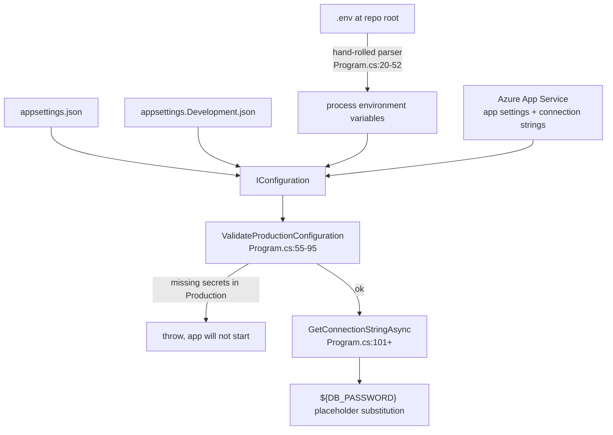
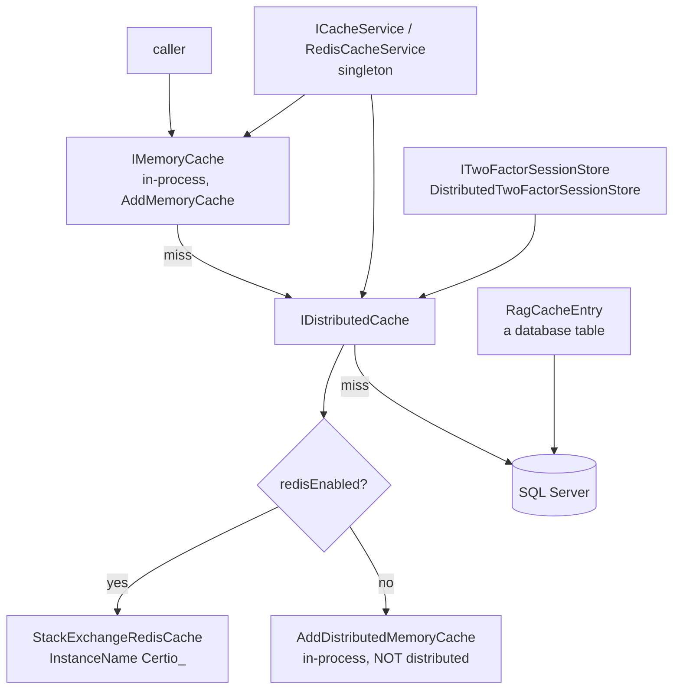

# Module 12 — Cross-cutting concerns

**Time:** 2.5 hours. **Prerequisite:** modules 01, 02, 05.

## Objectives

By the end you can:

- Explain the configuration and secrets pipeline, including the hand-rolled `.env` parser
- Describe all three cache layers and the single line that silently makes the "distributed" cache local
- Name the one architectural theme that recurs in seven modules of this curriculum
- Audit DI lifetimes and spot a `BackgroundService` that never runs
- Assess observability honestly: what you would have during a 3am production incident

## Read this first

1. `Certio.Web/Program.cs:20-95` — `.env` loading and production validation
2. `Certio.Web/Program.cs:606-649` — the cache layers
3. `Certio.Web/Program.cs:966` — the health check. One line. Read it and think.
4. `Certio.Web/Services/AIBackgroundService.cs:19-25` — `ExecuteAsync`
5. `Certio.Infrastructure/Interceptors/AuditInterceptor.cs:26-34` — a singleton done right

---

## Configuration and secrets



**`ValidateProductionConfiguration` is a genuinely good pattern.** In Production it requires
`EmailIntegration:GmailVerificationToken`, `EmailIntegration:WebhookSecret`, and
`USE_AZURE_SQL=true`, collecting *all* errors before throwing rather than failing on the first
(`Program.cs:83-94`). Fail-fast at startup beats discovering a missing webhook secret when the first
webhook arrives, and collecting all errors means one deploy cycle instead of three. Copy this pattern.

Three things are off.

**The `.env` parser is hand-rolled — and `DotNetEnv` is already a dependency.**
`Certio.Web.csproj` references `DotNetEnv 3.1.1`, and `Env.Load` appears nowhere in the codebase.
`Program.cs:20-52` reimplements it with `line.Split('=', 2)`, which does not handle quoted values,
escaped characters, multi-line values, or `export` prefixes. A password containing `#` or wrapped in
quotes will be read wrong, and the failure surfaces as an authentication error far from the cause. The
fix is deleting 30 lines and calling the library that is already installed.

**Startup logging goes to `Console.WriteLine`, with emojis.** `Program.cs:39` writes
`🔧 Loaded {key} from .env`; `:50` and `:86-90` use `❌` and `🚨`. This bypasses `ILogger` entirely,
so startup diagnostics have no level, no structure, and no destination other than stdout — and it
violates the repository's own `.cursorrules`, which prohibits emojis in console output. Worth noting
because it is the same rule violated in `CachedPermissionService` and `RequirePermissionAttribute`: **a
convention that is not enforced mechanically is not a convention.**

**`${DB_PASSWORD}` placeholder substitution is hand-rolled string replacement**
(`Program.cs:116-119`). Azure App Service already supports Key Vault references
(`@Microsoft.KeyVault(...)`) that resolve before the app sees them. The custom mechanism means the
password is assembled in process memory and its absence produces a connection string with a literal
`${DB_PASSWORD}` in it, which surfaces as a login failure rather than a configuration error.

On the positive side, `GetConnectionStringAsync` implements the local-versus-Azure SQL fallback that
makes the project genuinely easy to run offline, and `EnableRetryOnFailure(maxRetryCount: 5,
maxRetryDelay: 30s)` (`Program.cs:495-498`) handles Azure SQL's transient disconnects correctly. That
is the right resilience setting and it is easy to forget.

---

## Caching: three layers, one trap



The decision at `Program.cs:613-615`:

```csharp
var redisConnection = builder.Configuration.GetConnectionString("Redis");
var useRedis = (builder.Configuration["Caching:UseRedis"] ?? Environment.GetEnvironmentVariable("USE_REDIS")) == "true";
var redisEnabled = !string.IsNullOrWhiteSpace(redisConnection) && (useRedis || redisConnection.Contains(".redis.cache.windows.net", StringComparison.OrdinalIgnoreCase));
```

**Why optional Redis — pragmatic and correct.** Requiring Redis to run the app locally would be a real
barrier, and the comment at `:611-612` explains the motivation honestly: an unreachable Redis causes
request timeouts, which is worse than no Redis.

Three problems, in increasing severity.

**The hostname string-match is fragile.** Redis auto-enables if the connection string contains
`.redis.cache.windows.net`. A self-hosted Redis, Azure Cache in a sovereign cloud with a different
suffix, or a private-endpoint hostname all fail the check and silently fall through to in-memory —
with a connection string sitting right there in configuration.

**The `try/catch` around registration cannot work.** `AddStackExchangeRedisCache` only registers
options in the DI container; it does not open a connection. The `catch` at `:628-633` will therefore
never execute, and the in-memory fallback it contains is unreachable. An actual Redis outage throws
`RedisConnectionException` at first *use*, deep inside a request, where this handler is not. **This is
resilience theater: code that looks like a fallback, reads like a fallback in review, and provides
none.** The real fix is a circuit breaker at the call site, or accepting the failure and monitoring it.

**`AddDistributedMemoryCache` is a name that lies.** It implements `IDistributedCache` with a
process-local dictionary. Every consumer that asked for a distributed cache still compiles, still
passes tests, and is silently per-instance. Concretely, on two instances without Redis:

- **`DistributedTwoFactorSessionStore` breaks login.** The 2FA code is stored on instance A; the code
  submission load-balances to instance B, which has no session. The user sees "invalid code" for a
  code that is correct.
- **`CachedPermissionService` gives each instance its own permission view**, so revoking a permission
  takes effect on one instance and not the other — compounding the missing invalidation from module 04.
- **Nothing warns you.** The only signal is `Console.WriteLine` at startup (`:637`), on stdout, which
  nobody reads during an incident.

If you deploy more than one instance, Redis is not optional — it is load-bearing. A startup check that
throws when `Production` and instance count is greater than one and Redis is disabled would turn a
mysterious intermittent login bug into a deployment error. That is Lab 12.1.

---

## The recurring theme: static state

This is the one architectural pattern to take away from the whole curriculum, because it appears in
**thirteen files** and in seven of these modules. Verify it yourself with the command at the end of
[`APPENDIX-evidence.md`](APPENDIX-evidence.md) — the field counts below are a **lower bound**, since that
search matches a fixed set of types. `DocumentContentService` shows 2 by that measure and actually holds
4, because two of them are `static int` counters.

| File | Static fields | Module | What breaks at 2+ instances |
|---|---|---|---|
| `Certio.Web/Hubs/ChatHub.cs` | 1 | 07 | typing indicators, group tracking |
| `Certio.Web/Services/UserPresenceService.cs` | 3 | 07 | presence: users show offline |
| `Certio.Application/Services/Documents/WopiAccessTokenService.cs` | 1 | 10 | Office Online editing fails intermittently |
| `Certio.Application/Services/Documents/DocumentContentService.cs` | 2 | 10 | 2N concurrent Azure calls, N circuit breakers |
| `Certio.Application/Services/AIAgentService.cs` | 2 | 08 | user-data sync throttle multiplies |
| `Certio.Application/Services/Documents/DocumentIndexerService.cs` | 1 | 10 | — |
| `Certio.Application/Services/Documents/RagContextService.cs` | 1 | 08 | — |
| `Certio.Web/Middleware/ChannelInitializationMiddleware.cs` | 2 | 02 | per-instance init tracking |
| `Certio.Web/Services/BriefingMessageService.cs` | 2 | — | duplicate briefings |
| `Certio.Application/Services/CalendarService.cs` | 2 | — | — |
| `Certio.Web/Services/ChangeNoticeService.cs` | 3 | — | — |
| `Certio.Web/Services/ChannelManagementService.cs` | 1 | — | — |
| `Certio.Web/Controllers/HistoryController.cs` | 1 | — | — |

Every one of these is **correct on a single instance and wrong on two**, which is exactly what makes it
dangerous: it cannot be caught by tests, code review, or a staging environment that runs one instance.
It is caught by scaling out on a Monday morning.

**Credit where it is due: the team knows.** `docs/BACKLOG/SCALABILITY_AND_ARCHITECTURE.md` lists this as
**P0 — "Distribute process-local state (multi-instance)"**, states the limitation explicitly — *"Known
limitation until done: single-instance (or sticky sessions with degraded presence/typing) only"* — and
even sets the trigger correctly: *"Before running more than one app instance behind a load balancer."*
That is a well-written backlog entry, and the P0/P1/P2/P3 framing in that document is better than most
teams manage. Read it after this module.

So the problem is not awareness. It is that (a) the backlog names **4 components**
(`UserPresenceService`, `ChatHub._typingUsers`, `FirmRelationshipCacheService`, `EmbeddingJobQueue`) while
the table above finds **13** — `WopiAccessTokenService` and `DocumentContentService` are missing, and
those break Office editing and Azure rate limiting respectively; and (b) **nothing enforces the
constraint at runtime.** A known limitation recorded in a backlog file does not stop someone from setting
the instance count to 3 in the Azure portal. The gap to close is not documentation but a startup check —
which is why it is Lab 12.1.

`AuditInterceptor` shows the correct way to hold per-request state in a singleton
(`AuditInterceptor.cs:29`):

```csharp
private readonly AsyncLocal<List<(EntityEntry Entry, string Action, string? OldValues, string? NewValues)>> _pendingAuditInfo = new();
```

`AsyncLocal<T>` flows with the async execution context, so each request gets its own list from a shared
singleton — no locks, no cross-request leakage. That is a genuinely sophisticated choice, and it proves
the knowledge existed in the codebase. The static dictionaries elsewhere are not ignorance; they are
**local decisions each made in isolation, in a codebase where the deployment topology was a constraint
in a backlog file rather than a check in the build.** Which is the actual lesson: a constraint nothing
enforces will be violated by people who would have honored it.

---

## Dependency injection

Roughly **48 `AddScoped`, 10 `AddSingleton`, 0 `AddTransient`, 4 `AddHostedService`, 3 `AddHttpClient`**.
Zero transients is fine — scoped is the right default for services touching `DbContext`.

Two things to examine.

**`AIBackgroundService` is a `BackgroundService` that never runs.** It is registered with
`AddSingleton` at `Program.cs:749`, not `AddHostedService`, so the host never starts it. Its
`ExecuteAsync` is:

```csharp
protected override async Task ExecuteAsync(CancellationToken stoppingToken)
{
    while (!stoppingToken.IsCancellationRequested)
    {
        await Task.Delay(1000, stoppingToken); // Check every second
    }
}
```

An empty poll loop that checks nothing. Even if it were registered as a hosted service it would burn a
wakeup per second to do nothing. The class is actually used as a plain helper — `ChatService` injects
it and calls `ProcessAIAgentsAsync` directly. So this is a service that **inherits from the wrong base
class, is registered with the wrong lifetime, and works anyway** because nothing depends on the base
class behavior. Two independent mistakes cancelling out is the kind of thing that survives for years,
and the fix is to stop inheriting `BackgroundService` and name it for what it does.

**`WopiAccessTokenService` is `AddScoped` but its token cache is `static`.** The lifetime says
per-request; the state is per-process. Neither is wrong on its own, but the mismatch means a reader
reasoning from the registration draws the wrong conclusion about the cache's lifetime.

The four real hosted services are `MetricsReportingService`, `EmailSyncService`,
`ChangeNoticeAutoReminderService`, and `BackgroundEmbeddingWorker`. **All four run on every instance**,
so with three instances the change-notice reminder job runs three times. Whether that produces
duplicate reminders depends on each job's own guards, not on any framework-level leader election — and
there is none.

---

## Observability

Search the solution for `Serilog`, `ApplicationInsights`, and `OpenTelemetry`. **Zero matches.**
Logging is the default `ILogger` to console, plus `Console.WriteLine` at startup.

The health check (`Program.cs:966`) is one line:

```csharp
app.MapGet("/healthz", () => Results.Ok(new { ok = true }));
```

This can only fail if the process is dead. It does not check SQL Server, Redis, or the Python AI
service. An instance with an exhausted connection pool or a wrong password reports healthy and keeps
receiving traffic. `AddHealthChecks` appears nowhere, so the ASP.NET Core health-check framework — which
would give you database and Redis probes in about ten lines — is unused.

The distinction that matters: **liveness** asks "should I be restarted," and for that a static `ok` is
defensible. **Readiness** asks "should I receive traffic," and for that it is actively harmful. One
endpoint serving both roles means a broken instance stays in rotation.

What does exist:

- **`RequestAuditMiddleware`** (210 lines) records requests, and notably skips `/healthz` to avoid
  filling the audit log with probe traffic — a thoughtful detail.
- **`PerformanceMonitoringMiddleware`** (68 lines) times requests.
- **`CacheMetricsService`** plus `MetricsReportingService` track hit rates and log them periodically.
- **`AuditLog`** is a rich application-level audit trail (module 05).

So the *application* has good introspection and the *platform* has almost none. During a 3am incident
you would have: console logs with no correlation IDs, no distributed tracing across the .NET-to-Python
boundary, no metrics backend, no alerting, and a health endpoint that always says yes. You would be
reading `AuditLog` in SQL to reconstruct what happened. Adding App Insights or OpenTelemetry is roughly
a day's work and would change incident response more than any other single item in this curriculum.

---

## Sharp edges

- **Two dead dependencies.** `Microsoft.SemanticKernel 1.4.0` and
  `Microsoft.SemanticKernel.Connectors.OpenAI 1.4.0` are referenced with **zero usages** in C# — the AI
  work all lives in Python. `DotNetEnv 3.1.1` is referenced and unused. Both are supply-chain surface
  and CVE-scan noise for no benefit, and the SemanticKernel version is long superseded.
- **`UpdatesHub` is entirely dead.** It is `public class UpdatesHub : Hub { }` — an empty body — mapped
  at `/hubs/updates` (`Program.cs:962`), and no `IHubContext<UpdatesHub>` is injected anywhere. It is a
  live WebSocket endpoint that does nothing, while `README.md` counts it as one of "4 SignalR hubs."
- **No security-headers middleware** (module 11): no CSP, no `X-Frame-Options`, no `nosniff`.
- **`Program.cs` is 969 lines.** Extracting `AddCertioAuthentication()`, `AddCertioCaching()`, and
  `AddCertioServices()` extension methods would make the startup story readable without changing behavior.
- **`await` in top-level startup** (`GetConnectionStringAsync` at `:489`) can perform a connectivity
  probe before the host is built, adding latency to cold start on every instance.
- **No `IOptions<T>` pattern.** Configuration is read via string keys (`configuration["Foo:Bar"]`)
  scattered across services, so there is no compile-time checking and no single place to see what a
  feature needs.

---

## Check yourself

1. You deploy to two Azure App Service instances with no Redis connection string. Name three
   user-visible failures and the single line of `Program.cs` responsible for all of them.
2. Redis goes down mid-day. Trace exactly what happens. Does the `try/catch` at `Program.cs:628` help?
   Explain why not, in terms of when `AddStackExchangeRedisCache` does its work.
3. `AIBackgroundService` inherits `BackgroundService`. Does `ExecuteAsync` ever run? Prove it from the
   registration, then explain why the class still functions.
4. Contrast `AuditInterceptor`'s `AsyncLocal` with `ChatHub`'s static dictionary. Both are singletons
   holding per-something state. Why is one correct?
5. `/healthz` returns `{ok:true}` unconditionally. Construct a scenario where this causes a longer
   outage than having no health check at all.
6. Find every dead dependency and dead endpoint named in this module. For each, state the concrete risk
   of leaving it in place — and be honest where the risk is only cosmetic.

Labs in [`EXERCISES.md`](EXERCISES.md#module-12).
