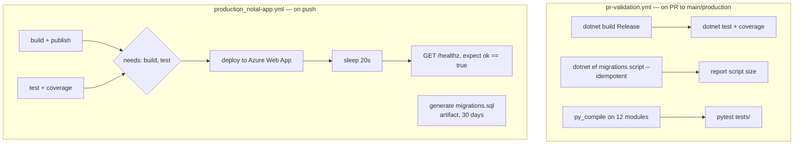

# Module 13 — Testing, CI, and quality gates

**Time:** 2 hours. **Prerequisite:** modules 04, 07, 12.

## Objectives

By the end you can:

- State what is tested, what is not, and why the split is more rational than it first looks
- Read the three CI workflows and identify which gates are real and which are decorative
- Explain how migrations reach production, and the risk in that path
- Trace the connection between module 12's health check and the production deploy gate
- Decide where the next ten tests should go

## Read this first

1. `.github/workflows/pr-validation.yml` — all 134 lines
2. `.github/workflows/production_notal-app.yml:126-190` — the deploy and health-check stages
3. `Certio.Tests/Services/PermissionServiceTests.cs` — the largest test file
4. `Certio.Tests/UnitTest1.cs` — all 10 lines

---

## What is actually tested

Eleven files, **58 `[Fact]`s, zero `[Theory]`s**, about 2,570 lines. Paths relative to `Certio.Tests/`:

| Test file | Lines | Subject |
|---|---|---|
| `Services/PermissionServiceTests.cs` | 509 | permission resolution |
| `Hubs/ChatHubSecurityTests.cs` | 503 | hub authorization |
| `Hubs/NotificationHubSecurityTests.cs` | 391 | hub authorization |
| `Security/AuthorizationAttributeTests.cs` | 355 | attributes and filters |
| `Controllers/HomeControllerSecurityTests.cs` | 322 | login, 2FA |
| `Controllers/Api/EmailWebhookControllerTests.cs` | 259 | webhook secret validation |
| `Services/AIAgentServiceTests.cs` | 87 | AI service |
| `Services/MatterServiceTests.cs` | 62 | matter creation |
| `Hubs/TestableHubCallerContext.cs` | 48 | test helper |
| `Services/TaskServiceTests.cs` | 27 | tasks |
| `UnitTest1.cs` | 10 | nothing — the `dotnet new` scaffold |

Do the arithmetic: **roughly 2,340 of 2,570 lines — over 90 percent — test security.** Permissions, hub
authorization, authorization attributes, login and 2FA, and webhook secrets. Business logic gets 176
lines across three files.

**Read that as a deliberate and defensible prioritization, not as neglect.** In a multi-tenant platform,
an authorization bug leaks a competing client's budget, guest list, or vendor pricing; a bug in invoice
totals
produces a wrong number someone notices and fixes. The blast radii are not comparable. Given a finite
testing budget, security-first is the correct allocation, and whoever made that call was thinking
clearly. The hub security tests in particular are unusually thorough — 894 lines across two files for a
component most teams never test at all — and they exist because SignalR hubs bypass the MVC
authorization filters entirely (module 07), so the attribute tests do not cover them.

Now the gaps, stated plainly. Against roughly **99 production classes** (28 Application services, 34
controllers, 37 Web services), 11 test files cover about 9. Untested:

- **`AgentActionService`** — the state machine with the IDOR from module 09. A single test asserting
  "user in org A cannot approve an action in org B" would have caught it, and would sit naturally
  alongside the existing permission tests.
- **`AuditInterceptor`** — the compliance backbone. Nothing verifies that an update produces an
  `AuditLog` row with correct old and new values, or that a hard delete is converted to a soft delete.
  For a product whose value proposition includes an audit trail, this is the highest-value missing test.
- **Soft-delete query filters** — nothing asserts that a deleted `Matter` disappears from queries.
- **Multi-tenant isolation at the data layer** — given the absence of a global tenancy filter
  (module 05), no test asserts that org A's data is invisible to org B. Testing the *invariant* rather
  than each call site is what would actually protect it.
- **`ServiceResult` error mapping**, billing, calendar, documents, and every integration.

Two mechanical notes: **`UnitTest1.cs` is the default scaffold**, never deleted, containing an empty
test — a small thing that tells you the project was created and never tidied. And **zero `[Theory]`
usage** means table-driven cases are written as separate `[Fact]`s or not at all, which is why
permission testing takes 509 lines. The permission matrix (5 roles × 23 permissions) is the textbook
`[Theory]`/`[InlineData]` case and would compress substantially while covering more.

The AI service has **4 Python test files**, but only `ai_agents/tests/test_authentication.py` (51 lines)
sits in a `tests/` directory. The other three — `test_enhanced_rag.py` (214), `test_simplified_system.py`
(141), `test_env.py` (29) — live at `ai_agents/` root, and CI runs `pytest tests/` only. **384 lines of
Python tests never execute in CI.** They are developer scripts named like tests, which is the worst of
both worlds: they look like a safety net and are not one.

---

## The CI pipeline

Three workflows: `pr-validation.yml`, `production_notal-app.yml`, `production_notal-ai.yml`. Note the
names — the deployment targets are `Notal-app` and `Notal-ai`, which is the naming evidence from
module 00.



**What is genuinely good:**

- **Tests gate deployment.** `deploy` declares `needs: [build, test]` (`production_notal-app.yml:132`),
  so a failing test blocks production. Many repositories this size do not manage that.
- **Build and test run in parallel**, then converge — correct pipeline shape.
- **The migration script is generated with `--idempotent`**, so it is safe to re-run. Producing it as a
  reviewable 30-day artifact is a thoughtful touch for a regulated product.
- **A post-deploy health check with retries** exists at all, and `environment: name: 'Production'` means
  GitHub environment protection rules can require manual approval.
- **Python modules get a `py_compile` check**, which at least catches syntax errors in a language with no
  compiler.

**What is decorative — gates that look like gates:**

**Coverage is collected and discarded.** `--collect:"XPlat Code Coverage"` runs in both workflows and
`coverage.cobertura.xml` is uploaded as an artifact. No threshold, no diff-coverage check, no
`ReportGenerator`. Coverage can drop from 20 percent to 2 percent and the build stays green. Measuring
without a threshold produces the *appearance* of coverage discipline with none of the effect.

**"Migration Safety Check" only checks that migrations build.** The job name promises safety analysis;
`dotnet ef migrations script --idempotent` verifies the model compiles and the script generates. It does
not detect a dropped column, a narrowed type, or a `NOT NULL` added without a default — the destructive
operations that actually cause outages. Grepping the generated SQL for `DROP COLUMN`, `DROP TABLE`, and
`ALTER COLUMN` and failing the job would make the name true, in about fifteen lines.

**The Python job has no linter.** `py_compile` is a syntax check. There is no `ruff`, `flake8`, `black`,
or `mypy`, even though `.cursorrules` requires type hints and PEP 8 for Python. As in module 12: an
unenforced convention is not a convention.

**The health check cannot fail.** This is the sharpest finding in the module, and it closes the loop from
module 12. The gate is:

```powershell
$response = Invoke-RestMethod -Uri $prodUrl -Method Get -TimeoutSec 15
if ($response.ok -eq $true) { ... exit 0 }
```

And the endpoint is `app.MapGet("/healthz", () => Results.Ok(new { ok = true }))`. It returns `ok: true`
whenever the process is running. **So the final gate on every production deployment verifies only that
the process started.** Deploy with a wrong connection string, an unreachable Redis, or a broken Python
AI service, and the pipeline reports a successful, verified deploy while every user gets a 500. The retry
loop and the 20-second warm-up wait make it feel rigorous, which is what makes it dangerous. Making
`/healthz` actually probe SQL Server and Redis converts this from theater into the most valuable gate in
the pipeline, and it is maybe twenty lines using `AddHealthChecks`. That is Lab 13.2.

**No security scanning of any kind.** No dependency audit, no secret scanning, no CodeQL or SAST. Given
two unused packages (module 12) and a CDN script with no SRI (module 11), a dependency review job would
find real items on day one.

---

## How migrations reach production

This deserves its own section because the answer is *not in the pipeline*.

`Database.Migrate()` and `EnsureCreated()` appear **nowhere in the codebase** — verified by searching
all `.cs` files. And the `migration-script` job is **not** in `deploy`'s `needs` list; it only uploads
`migrations.sql` as an artifact.

So migrations are applied **manually by a human running the generated SQL**.

**That is a defensible deliberate choice.** Automatic migration-on-startup in a multi-instance
deployment means N instances racing to migrate the same database, and for client and financial records
you want a human
looking at the DDL before it runs. Many mature teams land exactly here.

The risk is in the *ordering*, not the decision. `deploy` does not wait for migrations, so code
expecting a new column can go live before the column exists. The failure appears as runtime SQL errors on
whichever endpoints touch the new schema, and the always-green health check will not catch it. The
mitigation is process, not code: apply migrations before merging the deploy, and keep every migration
backward-compatible for one release so old and new code can both run. **None of this is written down
anywhere in the repository**, which means it lives in one person's memory. That is Lab 13.3, and writing
that runbook is probably worth more than any test in this module.

---

## Compiler and style enforcement

| Setting | State |
|---|---|
| `Nullable` | `enable` in all five projects — good |
| `TreatWarningsAsErrors` | **absent everywhere** |
| `.editorconfig` | **does not exist** |
| `Directory.Build.props` | **does not exist** |
| Analyzers | none beyond the .NET SDK defaults |
| ESLint / Prettier | none (module 11) |
| Python linters | none |

`Nullable: enable` is the single most valuable of these and it is on. But with no
`TreatWarningsAsErrors`, nullable violations are warnings that scroll past in a build log — which is why
`!` null-forgiving operators and unchecked dereferences accumulate.

No `Directory.Build.props` is why the target framework and package versions are duplicated across five
`.csproj` files, and why `Certio.Web` targets `net9.0` while the three libraries target `net8.0`
(module 01). One shared props file would make that mismatch visible in one place and fixable in one edit.

---

## Where the next ten tests go

In priority order, with the reasoning:

1. **`AgentActionService` cross-org authorization** (module 09). A known IDOR. A test is the fix's proof.
2. **`AuditInterceptor` produces correct `AuditLog` rows.** The compliance story depends on it and
   nothing checks it.
3. **Soft-delete filter excludes deleted rows** — one test per major entity, cheap and high-signal.
4. **Tenant isolation at the `DbContext` level.** Assert the invariant, not the call sites.
5. **`CachedPermissionService` invalidation** (module 04) — currently a stub, so write the test that
   fails, then fix it.
6. **Convert `PermissionServiceTests` to `[Theory]`** over the role/permission matrix. Fewer lines, more
   cases, and the privilege inversion from module 04 becomes visible as a data row.
7. **`ServiceResult` error mapping** for each `DomainException` type.
8. **`DriveOAuthController` state tampering** — assert a modified `state` is rejected, and that an
   expired one is too once you add the expiry check.
9. **`WopiAccessTokenService` rejects a token for a document in another org.**
10. **Move the three root-level Python test files into `tests/`** so CI runs them, then fix what breaks.

Note that items 1, 5, 8, and 9 are all tests that would have caught defects identified in this
curriculum. That is the argument for writing them, and it is a better argument than a coverage number.

---

## Check yourself

1. Over 90 percent of test lines target security. Argue that this is correct, then name the one untested
   non-security component whose failure would be most damaging, and defend that too.
2. Coverage is collected in both workflows. What would have to change for it to affect a build outcome?
3. The `migration-check` job is named "Migration Safety Check." Name three destructive schema changes it
   would not catch, and sketch the check that would.
4. A deploy ships code needing a column that has not been added. Walk through the pipeline. At which
   stage should it fail, and at which does it actually? Name the two components responsible.
5. `ai_agents/test_enhanced_rag.py` is 214 lines and never runs in CI. Explain why from the workflow, and
   say why a test that never runs is worse than no test.
6. `Nullable` is enabled but warnings are not errors. Predict what you will find building the solution,
   and explain how that state accumulated.

Labs in [`EXERCISES.md`](EXERCISES.md#module-13).
