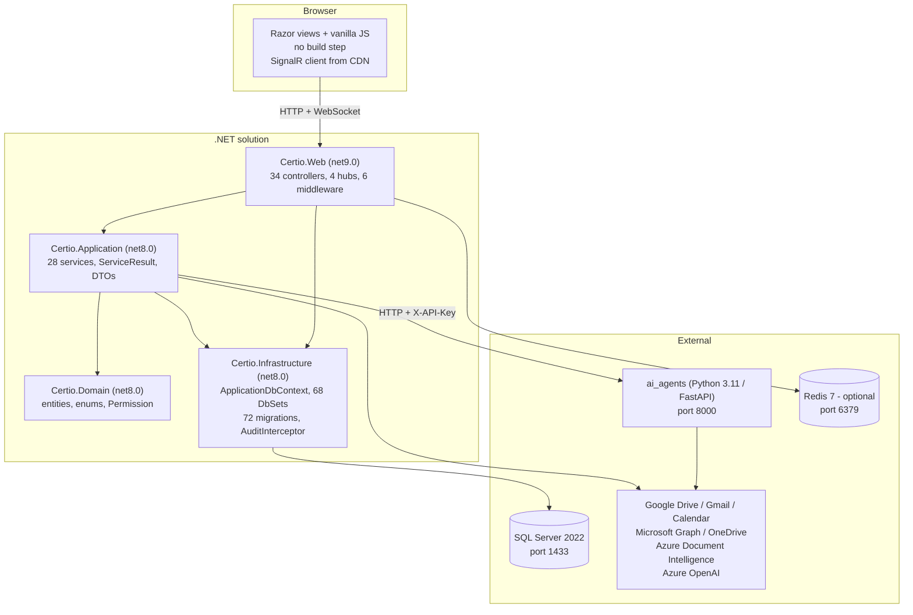

# Certio Learning Curriculum

A structured, code-first teaching plan for the Certio (deployed as "Notal") platform — a multi-tenant
workspace for **event planners and their clients**.

**Built:** July 2026, from an independent read of the source tree.
**Audience:** an engineer who needs to become productive *and opinionated* about this codebase.

---

## How this curriculum was built

Every claim in these modules was verified against source and cited as `path:line`. The existing
documentation in `docs/` — **200 markdown files** — was treated as a *hypothesis* rather than a source of
truth. Where the docs and the code disagree, the code wins and the discrepancy is recorded in
[`APPENDIX-evidence.md`](APPENDIX-evidence.md) with a command you can run to check it.

Three examples of why that matters:

| Existing docs say | The code says |
|---|---|
| 42 EF Core migrations in `Certio.Web/Migrations` | **72** migrations, in `Certio.Infrastructure/Migrations`. `Certio.Web/Migrations/` exists and is empty. |
| "Vector search (RAG)" over document embeddings | `DocumentVector.Embedding` is a hash of the chunk text and is **never read**. Retrieval is lexical token scoring (`VectorStoreService.cs:143-240`). Nothing in the system computes semantic similarity. |
| "Thin controllers, under 50 lines per action" | `HomeController` is 2,767 lines; `DocumentsApiController` is 1,275; several controllers inject `ApplicationDbContext` directly. |

To be clear about the other direction: **several existing documents are accurate and are cited as
sources.** `docs/BACKLOG/SCALABILITY_AND_ARCHITECTURE.md` correctly identifies most of the structural
debt and prioritizes it well; `docs/operations/MAKE_REPO_PUBLIC_SAFELY.md` is a correct runbook for a
real problem (history rewrite executed September 2026). The appendix credits them and explains where
this curriculum adds to them rather than repeating them.

The habit embedded here — **read the code, verify the summary** — is the most transferable thing in the
curriculum.

---

## Before you start: secrets hygiene (updated September 2026)

`ai_agents/.env`, related appsettings paths, and local SQLite / `.vs` DB files **were** tracked despite
`.gitignore`. That history was purged with `git filter-repo` and force-pushed per
`docs/operations/MAKE_REPO_PUBLIC_SAFELY.md`. Keys that lived in those commits must still be treated as
compromised and rotated/revoked for anyone who cloned before the rewrite.

Verify locally (`git ls-files` / `git log --all --` on `.env` and `*.db`) — expect empty. Remaining
follow-ups (secret scanning in CI, flipping visibility) are in [module 14](14-design-critique.md) and
[`APPENDIX-evidence.md`](APPENDIX-evidence.md#e1).

---

## What Certio is

A multi-tenant practice management platform for the **events industry**, starting with event planning
companies and their clients. A planning company and each of its clients are *separate organizations* in
the same database, connected by an explicit relationship graph. Everything else in the product — events,
tasks, documents, billing, chat, calendar, AI — hangs off that tenancy model.

**The product is mid-pivot, and the code shows it.** Certio was built as a legal practice management
platform, and the domain model still uses that vocabulary: the central entity is `Matter`, not `Event`;
roles are `Partner`, `Associate`, `Paralegal`; the cross-organization relationship is gated on
`UserTypes.LawFirm`. A display-layer terminology mapper renames these for event-planning organizations at
render time, so **the UI says "Event" where the database says "Matter."**

This is not cosmetic and you cannot skip it: it changes what you grep for, what a role string means, and —
in one specific case documented in module 03 — whether cross-organization access works at all. Module 00
covers where the pivot has reached and where it has not.

Note the arrow from `Certio.Application` to `Certio.Infrastructure`. That is a real project reference and
the defining architectural compromise of this codebase. Module 01 covers why it exists, what it costs, and
why fixing it may not be the best use of your time.

---

## The modules

Work them in order the first time. Each is self-contained enough to revisit alone later.

| # | Module | You will be able to | Time |
|---|---|---|---|
| 00 | [Orientation](00-orientation.md) | Run the stack, navigate the tree, explain the Certio/Notal split | 45 min |
| 01 | [Architecture and layer boundaries](01-architecture.md) | Explain intended vs. actual dependencies and the cost of the shortcut | 1 h |
| 02 | [The request lifecycle](02-request-lifecycle.md) | Trace any request through 6 middleware, a policy, and a filter | 1.5 h |
| 03 | [Identity and multi-tenancy](03-identity-and-tenancy.md) | Explain the dual user model and firm-based cross-org access | 2 h |
| 04 | [The permission system](04-permissions.md) | Resolve any user's effective permissions by hand; find the cache bug | 2 h |
| 05 | [The data model](05-data-model.md) | Draw the ER diagram per context; explain soft delete and auditing | 2.5 h |
| 06 | [Workflow: matter lifecycle](06-workflow-matter-lifecycle.md) | Follow a create-matter request from click to audit row | 1.5 h |
| 07 | [Workflow: real-time messaging](07-workflow-realtime.md) | Explain hub groups, presence, and why this cannot scale out today | 1.5 h |
| 08 | [Workflow: AI chat and three RAG systems](08-workflow-ai-rag.md) | Trace a message through retrieval, prompt assembly, and streaming | 2.5 h |
| 09 | [Workflow: agent actions](09-workflow-agent-actions.md) | Explain propose/approve/execute/rollback and its trust boundary | 1.5 h |
| 10 | [Documents and integrations](10-documents-and-integrations.md) | Follow a Drive file to an indexed chunk; explain WOPI and the ID seam | 2 h |
| 11 | [The front end](11-frontend.md) | Navigate a 4,970-line layout and 16 JS files; assess the XSS posture | 2 h |
| 12 | [Cross-cutting concerns](12-cross-cutting.md) | Explain config, caching, DI lifetimes, background work, observability | 2.5 h |
| 13 | [Testing, CI, and quality gates](13-testing-and-quality.md) | Say which gates are real, which are decorative, and where tests go next | 2 h |
| 14 | [Design critique and roadmap](14-design-critique.md) | Argue a prioritized remediation plan from evidence | 2 h |

Supporting material:

- [`EXERCISES.md`](EXERCISES.md) — labs per module, each with a definition of done and the trap to avoid
- [`GLOSSARY.md`](GLOSSARY.md) — vocabulary as this codebase uses it, including the misleading names
- [`APPENDIX-evidence.md`](APPENDIX-evidence.md) — documentation drift, 18 independently-found defects,
  and the commands to re-verify everything

Roughly **28 hours** of focused work, or two to three weeks part-time alongside real tickets.

---

## Alternate paths

**"I need to ship a feature this week."**
00 → 02 → 04 → 06, then Lab 6.1. That gives you the pipeline, the authorization model, and one complete
end-to-end example to copy.

**"I own the AI surface."**
00 → 01 → 08 → 09, then 04 for the authorization gaps. The AI subsystem is the least conventional part of
the codebase and where the docs are least accurate. Do Lab 8.2 before proposing any rewrite.

**"I am doing a security or architecture review."**
02 → 03 → 04 → 05 → 09 → 14, plus [`APPENDIX-evidence.md`](APPENDIX-evidence.md). Modules 02–05 are where
the defensive layers live, 09 contains the one exploitable defect found, and 14 is the prioritized plan.

**"I need to make this scale out."**
07 → 10 → 12 → 14, then read `docs/BACKLOG/SCALABILITY_AND_ARCHITECTURE.md`. Module 12 has the full
13-component static-state inventory; the backlog has 4 of them and the right priority framing.

**"I need to fix performance."**
02 (per-request database work), 04 (permission cache), 12 (caching, background services), 05 (indexes and
query filters).

---

## How to study a module

Each module has the same shape, and the order matters:

1. **Objectives** — what you can do afterwards.
2. **Read this first** — a short list of files in reading order. Open them; the prose assumes you have.
3. **Diagrams** — Mermaid, for structure and for flow.
4. **The walkthrough** — a narrated trace with `path:line` citations.
5. **Why it is built this way** — the decision, the alternative not taken, and the cost. The part that
   transfers to other codebases.
6. **Sharp edges** — what will bite you, with evidence.
7. **Check yourself** — questions answerable only from the code.

The "why" sections distinguish three kinds of decision, because conflating them is how teams end up
cargo-culting bad patterns or rewriting good ones:

- **Deliberate** — a reasoned tradeoff, correct for its constraints. Learn it and keep it.
- **Pragmatic** — a knowing shortcut with a real cost. Understand the cost before extending it.
- **Accidental** — nobody chose this; it accreted. Fix it when you are nearby.

A fourth category shows up often enough to name: **outgrown** — correct when made, wrong now because the
context changed. Optional Redis is the clearest example. Those need re-deciding, not blaming.

---

## Ground rules for working in this codebase

Derived from patterns actually present in the source, not from aspiration.

1. **Never write a query without an organization filter.** There is no global tenant query filter — the
   `DbContext` filters soft deletes only (`ApplicationDbContext.cs:194-232`). A missing
   `.Where(x => x.OrganizationId == orgId)` is a cross-tenant data leak, not a bug. Module 09 shows what
   happens when one is forgotten.
2. **Get the org id from `IClientContextAccessor`, never from an unvalidated request parameter.** The
   middleware already resolved and authorized it.
3. **New org-scoped endpoints get `[Authorize(Policy = "OrgMember")]`**, not bare `[Authorize]`. The
   difference is whether the tenancy check runs at all.
4. **Return 404, not 403, when a caller may not access a record.** A 403 confirms the record exists.
   Follow what `AuthorizationNotFoundMiddleware` already does.
5. **Prefer `ServiceResult<T>` for new application services** and return failures rather than throwing
   across the service boundary.
6. **Soft delete is the default.** The audit interceptor silently converts a hard `Remove()` into a soft
   delete for any soft-deletable entity (`AuditInterceptor.cs:100-108`). Know that before writing a
   cleanup script.
7. **Do not add `static` mutable state.** It is the single most common defect pattern here — 13 files, and
   every instance is correct on one server and wrong on two. Use `ICacheService`, or `AsyncLocal` for
   per-request state in a singleton.
8. **No emojis anywhere** — code, comments, logs, commit messages. This is in `.cursorrules`, and
   `Program.cs` and `CachedPermissionService.cs` both violate it, which is exactly why it bears restating.
